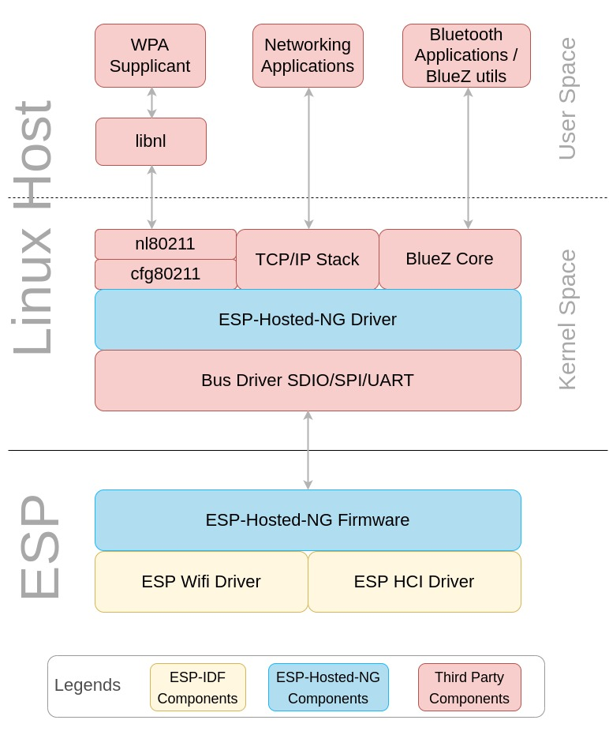

# ESP-Hosted-NG

- [1. Introduction](#1-introduction)
    + [1.1 Connectivity Feature](#11-connectivity-features)
    + [1.2 Supported ESP boards](#12-supported-esp-boards)
    + [1.3 Supported Hosts](#13-supported-hosts)
    + [1.4 Supported Transports](#14-supported-transports)
    + [1.5 Feature Matrix](#15-feature-matrix)
- [2. Hardware and Software setup and OTA](#2-hardware-and-software-setup-and-ota)
- [3. Get Started](#3-get-started)
  * [3.1 User Guide](#31-user-guide)
    + [3.1.1 Wi-Fi](#311-wi-fi)
      - [**Interface as station**](#station)
        - [**Scanning**](#scanning)
        - [**Connect to AP**](#connect-to-ap)
        - [**Disconnect from AP**](#disconnect-from-ap)
      - [**Interface as AP**](#access-point)
        - [**Configuring AP with hostapd**](#configuring-ap-with-hostapd)
        - [**Setting up DHCP and DNS**](#setting-up-dhcp-and-dns)
    + [3.1.2 Bluetooth/BLE](#312-bluetoothble)
- [4. Design](#4-design)
    + [4.1 System Architecture](#41-system-architecture)
    + [4.2 Transport Layer Protocol](#42-transport-layer-protocol)
    + [4.3 Porting Guide](#43-porting-guide)
- [5. Throughput Performance ](#5-throughput-performance)
- [6. Miscellaneous](#6-miscellaneous)
    + [6.1 Deassert CS for SPI](#61-deassert-cs-for-spi)
- [7. Coming soon](#7-coming-soon)
- [8. Want to support?](#8-want-to-support)

---


# 1. Introduction

This is a Next-Generation ESP-Hosted specifically designed for a sophisticated hosts that run Linux operating system. This flavour of the solution takes more standard approach while providing a network interface to the host. User space applications such as hostapd, wpa_supplicant, iw etc, can be used with this interface.

This solution offers following:

* 802.11 network interface which is a standard Wi-Fi interface on Linux host
* Configuration of Wi-Fi is supported through standard cfg80211 interface of Linux
* A standard HCI interface 


### 1.1 Connectivity Features

This solution provides following WLAN and BT/BLE features to the host:
- WLAN Features:
  - 802.11b/g/n
  - WLAN Station
  - Security Modes: Open, WPA, WPA2, WPA3
- BT/BLE
  - Classic Bluetooth
  - BLE 4.2
  - BLE 5.0


### 1.2 Supported ESP boards

ESP-Hosted-NG solution is supported on following ESP boards:

| Supported Targets | ESP32 | ESP32-S2 | ESP32-S3 | ESP32-C2 | ESP32-C3 | ESP32-C5 | ESP32-C6/C61 |
| ----------------- | ----- | -------- | -------- | -------- | -------- | -------- | -------- |


:warning: Note:
Looking for other chipset? Please do check [Coming Soon](#5-coming-soon) section.


### 1.3 Supported Hosts

- ESP-Hosted-NG solution showcase examples for following Linux based hosts out of the box.
  - Raspberry-Pi 3 Model B
  - Raspberry-Pi 3 Model B+
  - Raspberry-Pi 4 Model B
- This solution is aimed for Linux based hosts only. For microcontroller(MCU) based hosts (like STM32 etc), [ESP-Hosted-FG](../esp_hosted_fg) flavour should be used.
- Although we try to help in porting, We expect users to get the transport interfaces like SDIO/SPI/UART configured on your Linux platform. Device tree configuration and device drivers could be some times tricky as every Linux platform has it different.
- It is relatively easy to port this solution to other Linux based platforms. Please refer [Porting Guide](docs/porting_guide.md) for the common steps. 


### 1.4 Supported Transports

* SDIO Only
    * Wi-Fi and Bluetooth, traffic for both runs over SDIO
* SDIO+UART
    * Wi-Fi runs over SDIO and Bluetooth runs over UART
* SPI Only
    * Wi-Fi and Bluetooth, traffic for both runs over SPI
* SPI+UART
    * Wi-Fi runs over SPI and Bluetooth runs over UART

### 1.5 Feature Matrix

The below table explains which feature is supported on which transport interface for Linux based host.

<table style="width:100%" align="center">
  <thead>
    <tr>
      <th style="text-align:center;">ESP device</th>
      <th style="text-align:center;">Transport Interface</th>
      <th style="text-align:center;">Wi-Fi support</th>
      <th style="text-align:center;">Bluetooth support</th>
    </tr>
  </thead>
  <tbody>
    <tr>
      <td rowspan="5" style="text-align:center;">ESP32</td>
      <td style="text-align:center;">SDIO</td>
      <td style="text-align:center;">&#10003;</td>
      <td style="text-align:center;">&#10003;</td>
    </tr>
    <tr>
      <td style="text-align:center;">SPI</td>
      <td style="text-align:center;">&#10003;</td>
      <td style="text-align:center;">&#10003;</td>
    </tr>
    <tr>
      <td style="text-align:center;">UART</td>
      <td style="text-align:center;">&#10005;</td>
      <td style="text-align:center;">&#10003;</td>
    </tr>
    <tr>
      <td style="text-align:center;">SDIO(WiFi) + UART(BT)</td>
      <td style="text-align:center;">&#10003;</td>
      <td style="text-align:center;">&#10003;</td>
    </tr>
    <tr>
      <td style="text-align:center;">SPI(WiFi) + UART(BT)</td>
      <td style="text-align:center;">&#10003;</td>
      <td style="text-align:center;">&#10003;</td>
    </tr>
    <tr>
      <td rowspan="3" style="text-align:center;">ESP32-S2</td>
      <tr></tr>
      <td style="text-align:center;">SPI</td>
      <td style="text-align:center;">&#10003;</td>
      <td style="text-align:center;">&#10005;</td>
    </tr>
    <tr>
      <td rowspan="3" style="text-align:center;">ESP32-S3</td>
      <td style="text-align:center;">SPI</td>
      <td style="text-align:center;">&#10003;</td>
      <td style="text-align:center;">&#10003;</td>
    </tr>
    <tr>
      <td style="text-align:center;">UART</td>
      <td style="text-align:center;">&#10005;</td>
      <td style="text-align:center;">&#10003;</td>
    </tr>
    <tr>
      <td style="text-align:center;">SPI(WiFi) + UART(BT)</td>
      <td style="text-align:center;">&#10003;</td>
      <td style="text-align:center;">&#10003;</td>
    </tr>
    <tr>
      <td rowspan="3" style="text-align:center;">ESP32-C2</td>
      <td style="text-align:center;">SPI</td>
      <td style="text-align:center;">&#10003;</td>
      <td style="text-align:center;">&#10003;</td>
    </tr>
    <tr>
      <td style="text-align:center;">UART</td>
      <td style="text-align:center;">&#10005;</td>
      <td style="text-align:center;">&#10003;</td>
    </tr>
    <tr>
      <td style="text-align:center;">SPI(WiFi) + UART(BT)</td>
      <td style="text-align:center;">&#10003;</td>
      <td style="text-align:center;">&#10003;</td>
    </tr>
    <tr>
      <td rowspan="3" style="text-align:center;">ESP32-C3</td>
      <td style="text-align:center;">SPI</td>
      <td style="text-align:center;">&#10003;</td>
      <td style="text-align:center;">&#10003;</td>
    </tr>
    <tr>
      <td style="text-align:center;">UART</td>
      <td style="text-align:center;">&#10005;</td>
      <td style="text-align:center;">&#10003;</td>
    </tr>
    <tr>
      <td style="text-align:center;">SPI(WiFi) + UART(BT)</td>
      <td style="text-align:center;">&#10003;</td>
      <td style="text-align:center;">&#10003;</td>
    </tr>
    <tr>
      <td rowspan="5" style="text-align:center;">ESP32-C6</td>
      <td style="text-align:center;">SDIO</td>
      <td style="text-align:center;">&#10003;</td>
      <td style="text-align:center;">&#10003;</td>
    </tr>
    <tr>
      <td style="text-align:center;">SPI</td>
      <td style="text-align:center;">&#10003;</td>
      <td style="text-align:center;">&#10003;</td>
    </tr>
    <tr>
      <td style="text-align:center;">UART</td>
      <td style="text-align:center;">&#10005;</td>
      <td style="text-align:center;">&#10003;</td>
    </tr>
    <tr>
      <td style="text-align:center;">SDIO(WiFi) + UART(BT)</td>
      <td style="text-align:center;">&#10003;</td>
      <td style="text-align:center;">&#10003;</td>
    </tr>
    <tr>
      <td style="text-align:center;">SPI(WiFi) + UART(BT)</td>
      <td style="text-align:center;">&#10003;</td>
      <td style="text-align:center;">&#10003;</td>
    </tr>
    <tr>
      <td rowspan="5" style="text-align:center;">ESP32-C5</td>
      <td style="text-align:center;">SPI</td>
      <td style="text-align:center;">&#10003;</td>
      <td style="text-align:center;">&#10003;</td>
    </tr>
    <tr>
      <td style="text-align:center;">UART</td>
      <td style="text-align:center;">&#10005;</td>
      <td style="text-align:center;">&#10003;</td>
    </tr>
    <tr>
      <td style="text-align:center;">SPI(WiFi) + UART(BT)</td>
      <td style="text-align:center;">&#10003;</td>
      <td style="text-align:center;">&#10003;</td>
    </tr>
    <tr>
      <td style="text-align:center;">SDIO</td>
      <td style="text-align:center;">&#10003;</td>
      <td style="text-align:center;">&#10003;</td>
    </tr>
    <tr>
      <td style="text-align:center;">SDIO(WiFi) + UART(BT)</td>
      <td style="text-align:center;">&#10003;</td>
      <td style="text-align:center;">&#10003;</td>
    </tr>
      <td rowspan="2" style="text-align:center;">ESP32-C61</td>
      <td style="text-align:center;">SPI</td>
      <td style="text-align:center;">&#10003;</td>
      <td style="text-align:center;">&#10003;</td>
    </tr>
    <tr>
      <td style="text-align:center;">SDIO</td>
      <td style="text-align:center;">&#10003;</td>
      <td style="text-align:center;">&#10003;</td>
    </tr>
  </tbody>
</table>


Apart from these features, following features are supported.
- Host sleep
  - We have tested this feature with imx8mm-lpddr4-evk. Please refer [host_sleep](docs/host_sleep.md) documentation.

---


# 2. Hardware and Software setup and OTA
This section describes how to set up and use ESP-Hosted-NG solution.
Please check [Hardware and Software setup and OTA](docs/setup.md).

---

# 3. Get Started

## 3.1 User Guide

This section explains how to setup and use Wi-Fi and BT/BLE. This section assumes the network interface name as wlan0, if wlanX is already available in host, next available number will be assigned.

### 3.1.1 Wi-Fi

User space tool such as hostapd/wpa_supplicant/iw is used to setup Wi-Fi.

`wlan0` interface can be used either as `Station(sta)` or `Access Point(AP)`.

> wlan0 can't function as both an AP (Access Point) and a Station at the same time, and there are no current plans to add that capability

##### Station
Following operations for station are supported as of now:

* Scanning
* Connect to AP
* Disconnect from AP

#### Scanning

- To scan nearby APs available, please use

  ```sh
  $ sudo iw dev wlan0 scan
  ```

#### Connect to AP
  Open below fold to connect from three possible ways

<details><summary>Open</summary>
<p>

> 
> ## Open mode connect
> Please configure AP in open mode and note the SSID
> ### Create config & Trigger connection
> * `wpa_supplicant` already running on host operating system can interfere in testing. Execute following commands to prevent this.
> ```sh
> $ sudo killall wpa_supplicant
> ```
>
> * Create wpa supplicant config using template below
> ```sh
> $ cat ~/open.conf
> network={
>     ssid="MY_OPEN_SSID"
>     key_mgmt=NONE
> }
> ```
> 
> :warning: Do not copy paste this config. Please replace `MY_OPEN_SSID` with AP's SSID
> 
> * Start the wpa supplicant for connection
> ```sh
> $ sudo wpa_supplicant -D nl80211 -i wlan0 -c ~/open.conf
> ```
>
> ---
> ### Verify connection
> * Verify the connection status using following command and verify `ESSID:<ssid>` in output
> 
> ```sh
> $ iwconfig wlan0
> wlan0     IEEE 802.11  ESSID:"MY_OPEN_SSID"
>           Mode:Managed  Frequency:2.437 GHz  Access Point: 00:0A:F5:14:33:5C
>           Retry short limit:7   RTS thr:off   Fragment thr:off
>           Power Management:on
> ```
> 
> ---
> ### Assign IP address
> * Use dhclient command to get IP. Please note, `dhclient` command may not be available on all Linux. Use DHCP client command supported on your Linux.
> 
> ```sh
> $ sudo dhclient -v wlan0
> Internet Systems Consortium DHCP Client 4.4.1
> Copyright 2004-2018 Internet Systems Consortium.
> All rights reserved.
> For info, please visit https://www.isc.org/software/dhcp/
> Listening on LPF/wlan0/24:6f:28:80:2c:34
> Sending on   LPF/wlan0/24:6f:28:80:2c:34
> Sending on   Socket/fallback
> .
> DHCPDISCOVER on wlan0 to 255.255.255.255 port 67 interval 7
> DHCPOFFER of 192.168.43.32 from 192.168.43.1
> DHCPREQUEST for 192.168.43.32 on wlan0 to 255.255.255.255 port 67
> DHCPACK of 192.168.43.32 from 192.168.43.1
> bound to 192.168.43.32 -- renewal in 1482 seconds.
>   
> ```
>
> ---
>
> ### Ping
> 
> ```sh
> $ ping <ip address of AP>
> ```
></p></details>
<details><summary>WPA/WPA2</summary>
<p>

> 
> ## WPA/WPA2 mode connect
> Configure and start the AP in WPA or WPA2 or WPA/WPA2 mode. WPA2 is preferred among these. Note the SSID & Password to connect.
> ### Create config & Trigger connection
> * `wpa_supplicant` already running on host operating system can interfere in testing. Execute following commands to prevent this.
> ```sh
> $ sudo killall wpa_supplicant
> ```
> 
> * Generate wpa_supplicant config
> ```sh
> $ wpa_passphrase <ssid> <password>  > ~/wpa2.conf
> ```
> 
> * Example config for WPA2
> ```sh
> $ wpa_passphrase "MY_WPA2_SSID" "Passphrase"  > ~/wpa2.conf
> $ cat ~/wpa2.conf
> network={
> 	ssid="MY_WPA2_SSID"
> 	#psk="Passphrase"
> 	psk=59e0d07fa4c7741797a4e394f38a5c321e3bed51d54ad5fcbd3f84bc7415d73d
> }
> ```
> :warning: Do not copy paste this config
> 
> * Start the wpa supplicant for connection
> ```sh
> $ sudo wpa_supplicant -D nl80211 -i wlan0 -c ~/wpa2.conf
> ```
>
> ---
> ### Verify connection
> * Verify the connection status using following command and verify `ESSID:<ssid>` in output
> ```sh
> $ iwconfig wlan0
> wlan0     IEEE 802.11  ESSID:"MY_OPEN_SSID"
>           Mode:Managed  Frequency:2.412 GHz  Access Point: XX:XX:XX:XX:XX:XX   
>           Bit Rate=XXX Mb/s   Tx-Power=XX dBm   
>           Retry short limit:X   RTS thr:off   Fragment thr:off
>           Power Management:on
>           Link Quality=70/70  Signal level=-20 dBm  
>           Rx invalid nwid:0  Rx invalid crypt:0  Rx invalid frag:0
>           Tx excessive retries:0  Invalid misc:25   Missed beacon:0
> ```
> 
> ---
> ### Assign IP address
> * Use dhclient command to get IP. Please note, `dhclient` command may not be available on all Linux. Use DHCP client command supported on your Linux.
>
> ```sh
> $ sudo dhclient -v wlan0
> Internet Systems Consortium DHCP Client 4.4.1
> Copyright 2004-2018 Internet Systems Consortium.
> All rights reserved.
> For info, please visit https://www.isc.org/software/dhcp/
> Listening on LPF/wlan0/24:6f:28:80:2c:34
> Sending on   LPF/wlan0/24:6f:28:80:2c:34
> Sending on   Socket/fallback
> .
> DHCPDISCOVER on wlan0 to 255.255.255.255 port 67 interval 7
> DHCPOFFER of 192.168.43.32 from 192.168.43.1
> DHCPREQUEST for 192.168.43.32 on wlan0 to 255.255.255.255 port 67
> DHCPACK of 192.168.43.32 from 192.168.43.1
> bound to 192.168.43.32 -- renewal in 1482 seconds.
> 
> ```
>
> ---
>
> ### Ping
>
> ```sh
> $ ping <ip address of AP>
> ```
></p></details>
<details><summary>WPA3</summary>
<p>

> 
> ## WPA3 mode connect
> Configure and start the AP in WPA3 mode. Note the SSID & Password to connect.
> ### Create config & Trigger connection
> * `wpa_supplicant` already running on host operating system can interfere in testing. Execute following commands to prevent this.
> ```sh
> $ sudo killall wpa_supplicant
> ```
> 
> * Generate wpa_supplicant config using below template
> ```sh
> $ cat ~/wpa3.conf
> update_config=1
> network={
>     ssid="MY_WPA3_SSID"
>     sae_password="MY_WPA3_Passphrase"
>     key_mgmt=SAE
>     ieee80211w=2
> }
> ```
> * Change `MY_WPA3_SSID` to AP's SSID and `MY_WPA3_Passphrase` to Passphrase to connect
> 
> * Start the wpa supplicant for connection
> ```sh
> $ sudo wpa_supplicant -D nl80211 -i wlan0 -c ~/wpa3.conf
> ```
>
> ---
> ### Verify connection
> * Verify the connection status using following command and verify `ESSID:<ssid>` in output
> ```sh
> $ iwconfig wlan0
>   wlan0     IEEE 802.11  ESSID:"MY_WPA3_SSID"
>             Mode:Managed  Frequency:2.412 GHz  Access Point: C4:41:1E:BE:F0:B2
>             Retry short limit:7   RTS thr:off   Fragment thr:off
>             Power Management:on
> ```
> 
> ---
> ### Assign IP address
> * Use dhclient command to get IP. Please note, `dhclient` command may not be available on all Linux. Use DHCP client command supported on your Linux.
>
> ```sh
> $ sudo dhclient -v wlan0
> Internet Systems Consortium DHCP Client 4.4.1
> Copyright 2004-2018 Internet Systems Consortium.
> All rights reserved.
> For info, please visit https://www.isc.org/software/dhcp/
> Listening on LPF/wlan0/24:6f:28:80:2c:34
> Sending on   LPF/wlan0/24:6f:28:80:2c:34
> Sending on   Socket/fallback
> .
> DHCPDISCOVER on wlan0 to 255.255.255.255 port 67 interval 7
> DHCPOFFER of 192.168.43.32 from 192.168.43.1
> DHCPREQUEST for 192.168.43.32 on wlan0 to 255.255.255.255 port 67
> DHCPACK of 192.168.43.32 from 192.168.43.1
> bound to 192.168.43.32 -- renewal in 1482 seconds.
> 
> ```
>
> ---
>
> ### Ping
>
> ```sh
> $ ping <ip address of AP>
> ```
></p></details>
<details><summary>WPA2/WPA3 Enterprise</summary>
<p>

>
> ## WPA2/WPA3 Enterprise mode connect
> Note the SSID, username, and password of the WPA2/WPA3 enterprise AP to connect.
>
> The ESP-Hosted-NG solution supports both WPA2 Enterprise and WPA3 Enterprise authentication modes through EAP (Extensible Authentication Protocol) when operating in Station mode.
> 
> ### Create config & Trigger connection
> * `wpa_supplicant` already running on host operating system can interfere in testing. Execute following commands to prevent this.
> ```sh
> $ sudo killall wpa_supplicant
> ```
>
> * Generate wpa_supplicant config using below template for PEAP/MSCHAPv2
> ```sh
> $ cat ~/wpa2_ent.conf
> ctrl_interface=/var/run/wpa_supplicant
> ap_scan=0
> network={
>     ssid="MY_ENTERPRISE_SSID"
>     key_mgmt=WPA-EAP
>     eap=PEAP
>     identity="user@domain.com"
>     password="user_password"
>     ca_cert="/path/to/ca-cert.pem"
>     phase2="auth=MSCHAPV2"
> }
> ```
> 
> * Alternative template for EAP-TLS
> ```sh
> $ cat ~/wpa2_tls.conf
> ctrl_interface=/var/run/wpa_supplicant
> ap_scan=0
> network={
>     ssid="MY_ENTERPRISE_SSID"
>     key_mgmt=WPA-EAP
>     eap=TLS
>     identity="user@domain.com"
>     client_cert="/path/to/client-cert.pem"
>     private_key="/path/to/private-key.pem"
>     ca_cert="/path/to/ca-cert.pem"
> }
> ```
> 
> * Change `MY_ENTERPRISE_SSID` to AP's SSID, `user@domain.com` to your username, and `user_password` to your password
> * Update certificate paths to match your enterprise environment
> 
> * Start the wpa supplicant for connection
> ```sh
> $ sudo wpa_supplicant -D nl80211 -i wlan0 -c ~/wpa2_ent.conf
> ```
>
> ---
> ### Verify connection
> * Verify the connection status using following command and verify `ESSID:<ssid>` in output
> ```sh
> $ iwconfig wlan0
>   wlan0     IEEE 802.11  ESSID:"MY_ENTERPRISE_SSID"
>             Mode:Managed  Frequency:2.412 GHz  Access Point: C4:41:1E:BE:F0:B2
>             Retry short limit:7   RTS thr:off   Fragment thr:off
>             Power Management:on
> ```
>
> ---
> ### Assign IP address
> * Use dhclient command to get IP. Please note, `dhclient` command may not be available on all Linux. Use DHCP client command supported on your Linux.
> ```sh
> $ sudo dhclient -v wlan0
> Internet Systems Consortium DHCP Client 4.4.1
> Copyright 2004-2018 Internet Systems Consortium.
> All rights reserved.
> For info, please visit https://www.isc.org/software/dhcp/
> Listening on LPF/wlan0/24:6f:28:80:2c:34
> Sending on   LPF/wlan0/24:6f:28:80:2c:34
> Sending on   Socket/fallback
> .
> DHCPDISCOVER on wlan0 to 255.255.255.255 port 67 interval 7
> DHCPOFFER of 192.168.43.32 from 192.168.43.1
> DHCPREQUEST for 192.168.43.32 on wlan0 to 255.255.255.255 port 67
> DHCPACK of 192.168.43.32 from 192.168.43.1
> bound to 192.168.43.32 -- renewal in 1482 seconds.
>
> ```
>
> ---
>
> ### Ping
>
> ```sh
> $ ping <ip address of AP>
> ```
></p></details>


#### Disconnect from AP

* Execute following command to disconnect from AP
  ```sh
  $ sudo iw dev wlan0 disconnect
  ```

* Verify status using
  ```sh
  $ iwconfig wlan0
  ```
##### Access Point

#### Following operations for softAP are supported as of now:

hostapd (Host Access Point Daemon) is a user-space daemon that enables a Linux-based machine to act as a wireless access point. When combined with dnsmasq, a lightweight DHCP and DNS server, it provides a complete solution for managing Wi-Fi networks, including IP address assignment and name resolution.

> make sure you have enabled `ap_support` with rpi_init.sh to user interface as Access point. Read [Hardware and Software Setup and OTA](docs/setup.md)

Supported Operations

- Configuring the AP with hostapd
- Managing connections (connect/disconnect)
- Setting up DHCP and DNS with dnsmasq

##### Configuring AP with hostapd
- Create a Configuration File for hostapd
```sh
$ nano ~/hostapd.conf
```

- Here’s a sample configuration:
```sh
interface=wlan0
driver=nl80211
ssid=MY_SSID
hw_mode=g
channel=6
wmm_enabled=0
macaddr_acl=0
auth_algs=1
ignore_broadcast_ssid=0
wpa=2
wpa_key_mgmt=WPA-PSK SAE
wpa_passphrase=MY_PASSPHRASE
rsn_pairwise=CCMP
sae_pwe=2
ieee80211w=2
``` 
Sample Configuration for AP on 5GHZ channel (ESP32C5)
```sh
interface=wlan0
driver=nl80211
ssid=MY_SSID
hw_mode=a
channel=36
wmm_enabled=0
macaddr_acl=0
auth_algs=1
ignore_broadcast_ssid=0
wpa=2
wpa_key_mgmt=WPA-PSK SAE
wpa_passphrase=MY_PASSPHRASE
rsn_pairwise=CCMP
sae_pwe=2
ieee80211w=2
```
>  Change `MY_SSID` to AP's SSID and `MY_PASSPHRASE` to Passphrase to connect
> Security can configured by keeping the values of `wpa_key_mgmt` to `SAE/WPA-PSK`.
###### Start hostapd

To start the access point, run:
```sh
    $ sudo hostapd ~/hostapd.conf
```

##### Setting up DHCP and DNS

To set up DHCP and DNS with dnsmasq, follow these steps:
- Installation

If dnsmasq is not already installed, you can install it using:


```sh
$ sudo apt-get install dnsmasq
```

- Configuration

Create a Configuration File for dnsmasq
Edit or create the dnsmasq configuration file:

```sh
$ sudo nano /etc/dnsmasq.conf
```

Sample configuration:

```sh
interface=wlan0          # Use the wireless interface
dhcp-range=192.168.1.2,192.168.1.100,255.255.255.0,24h  # DHCP range
domain-needed             # Don't forward short names
bogus-priv                # Never forward addresses in the non-routed address spaces
expand-hosts              # Use the expanded hostname
```
> Adjust the dhcp-range to fit your network needs.

Restart dnsmasq

After saving the configuration, restart the dnsmasq service:

```sh
    $ sudo systemctl restart dnsmasq
```

###### Assign an IP Address

With dnsmasq running, clients will automatically receive an IP address when they connect.

###### Test Connectivity

Test the connection to ensure it is working:
```sh
    $ ping <ip address of station>
```

This documentation provides a comprehensive guide for setting up hostapd and dnsmasq to create a wireless access point with DHCP and DNS capabilities. Adjust configurations as necessary for your network environment.
### 3.1.2 Bluetooth/BLE

* Refer [Bluetooth/BLE Guide](docs/bluetooth.md) which explains how one can setup and use Bluetooth/BLE.
---

Following operations for station are supported as of now:
# 4. Design

### 4.1 System Architecture

This section explains building blocks of the solution. Following is the detailed system architecture diagram:



Following are the key building blocks of the system:

- ESP-Hosted-NG Driver

- ESP-Hosted-NG Firmware

- Third party components


### 4.1.1 ESP-Hosted-NG Driver

This runs on host platform and it implements following.

- **Transport driver**
  - Implements transport layer over SDIO/SPI interface. \
  Communication protocol is explained in further section.
- **Network Interface**
  - Registers Wi-Fi interface `wlan0` with Linux kernel.
    - This allows exchange of network data packets between Linux kernel and ESP firmware.
  - Implements needed cfg80211_ops to support configuration through wpa_supplicant or iw utility
- **HCI Interface**
  - Applicable only when SDIO/SPI interface is being used for Bluetooth/BLE support
  - Registers HCI interface with the Bluetooth stack running on Linux host
    - This facilitates exchange of HCI packets between Linux kernel and ESP firmware

### 4.1.2 ESP-Hosted-NG Firmware

This implements ESP application that runs on ESP boards. It consists of the following.

- **ESP-Hosted-NG Application** \
  This implements following:
  - SDIO/SPI transport layer
  - Custom command/response implementation for configuration of Wi-Fi interface
  - Data path between Wi-Fi driver of ESP and Host platform
- **ESP-IDF Components** \
  ESP firmware mainly uses following components from ESP-IDF. Please check [ESP-IDF documentation](https://docs.espressif.com/projects/esp-idf/en/latest/esp32/get-started/index.html) for more details.
  - SDIO/SPI/UART slave driver
  - Wi-Fi driver
  - HCI controller driver

### 4.1.3 Third Party Components

Third components such as following are essential for end to end working of this solution. Implementation or porting of these third party component is not in scope of this project.

- TCP/IP stack
- Bluetooth/BLE stack
- nl80211/cfg80211 kernel module
- User space applications
- Linux UART driver

### 4.2 Transport Layer Protocol

This section explains transport layer protocol used for communication over SDIO/SPI bus. Please refer following to know more:

* [SDIO Transport Layer Design](docs/sdio_protocol.md)
* [SPI Transport Layer Design](docs/spi_protocol.md)


#### 4.2.1 Payload Format

This section explains the header that encapsulates the data packets exchanged over SDIO and SPI interfaces.

* Host and peripheral makes use of 12 byte payload header which precedes every data packet.
* This payload header provides additional meta data about the packet. Based on this header, host/peripheral consumes the transmitted data packet.
* Payload format is as below

|      Field       | Length  | Description                                                  |
| :--------------: | :-----: | :----------------------------------------------------------- |
|  Interface type  | 4 bits  | Possible values: STA(0), SoftAP(1), HCI (2), Priv interface(3). Rest all values are reserved |
| Interface number | 4 bits  | Unused                                                       |
|      Flags       | 1 byte  | Additional flags like `MORE_FRAGMENT` in fragmentation       |
|   Packet type    | 1 byte  | Type of packet Data(0), Command_req(1), Command_resp(2), Event(3), EAPOL_frame(4) |
|    Reserved1     | 1 byte  | Not in use                                                   |
|  Packet length   | 2 bytes | Actual length of data packet                                 |
| Offset to packet | 2 bytes | Offset to the start of the data payload                      |
|     Checksum     | 2 bytes | Unused as if now                                             |
|    Reserved2     | 1 byte  | Not in use                                                   |


### 4.3 Porting Guide

Refer [Porting Guide](docs/porting_guide.md) which explains how one can port the solution to other Linux host platforms.

---
# 5. Throughput Performance
Refer [RAW throughput guide](docs/Raw_TP_Testing.md) for verifying connection as well as throughput between host and ESP.
<table style="width:100%" align="center">
<thead>
<tr>
<th align="center">ESP device</th><th align="center">Transport Interface</th><th align="center">TCP Tx</th><th align="center">TCP Rx</th><th align="center">UDP Tx</th><th align="center">UDP Rx</th>
</tr>
</thead>
<tbody>
<tr>
<td rowspan=2 align="center">ESP32</td>
<td rowspan=1 align="center">SDIO</td>
<td align="center">22.9 Mbps</td>
<td align="center">15.6 Mbps</td>
<td align="center">45.6 Mbps</td>
<td align="center">20.4 Mbps</td>
</tr>
<tr>
<td align="center">SPI</td>
<td align="center">7.47 Mbps</td>
<td align="center">7.30 Mbps</td>
<td align="center">7.39 Mbps</td>
<td align="center">7.32 Mbps</td>
</tr>
<tr>
<td rowspan=1 align="center">ESP32-C3</td>
<td rowspan=1 align="center">SPI</td>
<td align="center">15.8 Mbps</td>
<td align="center">15.2 Mbps</td>
<td align="center">17.1 Mbps</td>
<td align="center">14.9 Mbps</td>
</tr>
<tr>
<td rowspan=2 align="center">ESP32-C5</td>
<td rowspan=1 align="center">SDIO 2.4 ghz</td>
<td align="center">11.2 Mbps</td>
<td align="center">19.4 Mbps</td>
<td align="center">37.8 Mbps</td>
<td align="center">25.9 Mbps</td>
</tr>
<tr>
<td align="center">SDIO 5 ghz</td>
<td align="center">19.7 Mbps</td>
<td align="center">18.4 Mbps</td>
<td align="center">53.5 Mbps</td>
<td align="center">30.4 Mbps</td>
</tr>
<tr>
<td rowspan=2 align="center">ESP32-C6</td>
<td align="center">SDIO</td>
<td align="center">22.4 Mbps</td>
<td align="center">25.6 Mbps</td>
<td align="center">55.1 Mbps</td>
<td align="center">29.8 Mbps</td>
</tr>
<tr>
<td align="center">SPI</td>
<td align="center">16.2 Mbps</td>
<td align="center">16.9 Mbps</td>
<td align="center">17.5 Mbps</td>
<td align="center">17.2 Mbps</td>
</tr>
<tr>
<td rowspan=2 align="center">ESP32-C61</td>
<td align="center">SDIO</td>
<td align="center">13.6 Mbps</td>
<td align="center">21.1 Mbps</td>
<td align="center">52.3 Mbps</td>
<td align="center">32.9 Mbps</td>
</tr>
<tr>
<td align="center">SPI</td>
<td align="center">13.3 Mbps</td>
<td align="center">13.6 Mbps</td>
<td align="center">13.9 Mbps</td>
<td align="center">14 Mbps</td>
</tr>
</tbody>
</table>

---

# 6. Miscellaneous

## 6.1 Deassert CS for SPI

**Problem:** Some hosts, after completing an SPI transaction, introduce a delay before de-asserting the Chip Select (CS) line. The ESP SPI slave, seeing that the CS is still asserted, might start the next transaction prematurely, leading to data loss or corruption because the host is not ready.

**Solution:** To address this, the ESP firmware provides a Kconfig option, `ESP_SPI_DEASSERT_HS_ON_CS`. When this option is enabled, the firmware changes its behavior. Instead of de-asserting the Handshake (HS) signal at the end of a transaction, it waits for the CS line to be de-asserted by the host. This ensures that a new transaction doesn't start until the host has properly finished the previous one.

**How to Enable:**

You can enable this option using the `idf.py menuconfig` tool within the `esp_hosted_ng` project.

1.  Navigate to the ESP firmware directory:
    ```sh
    cd esp_hosted_ng/esp/esp_driver/network_adapter
    ```

2.  Launch the configuration menu:
    ```sh
    idf.py menuconfig
    ```

3.  In the menu, navigate to the following path:
    `Example Configuration` -> `SPI Configuration`

4.  Inside the `SPI Configuration` menu, you will find the option `De-assert HS on CS`.

5.  Select this option to enable it (set it to `true`).

6.  Save the configuration and exit `menuconfig`.

7.  Rebuild the firmware for the changes to take effect.

This option is defined in the Kconfig file located at `main/Kconfig.projbuild` within the `network_adapter` directory.

---

# 7. Coming soon

Tremendous work to be done ahead! Below is glimpse of upcoming release:

---

- Functionality
	- Wifi Enterprise support
---

# 8. Want to support?
That's right. Being open source, we really appreciate the pull requests. Already raised pull request? Please be patient. We will review and merge your commit into the master.
