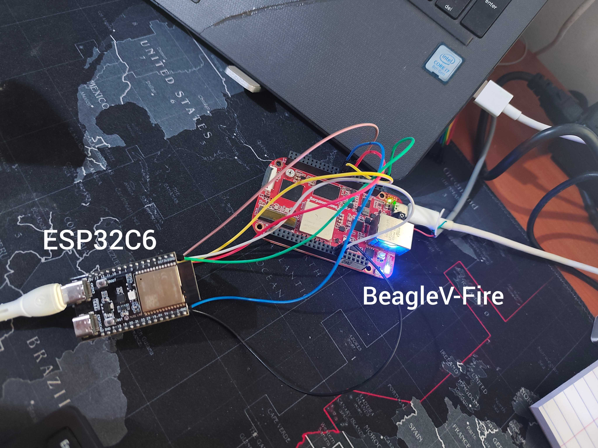
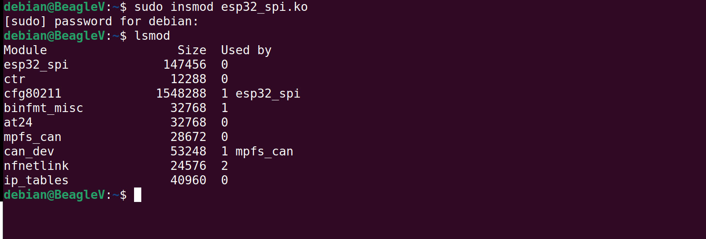
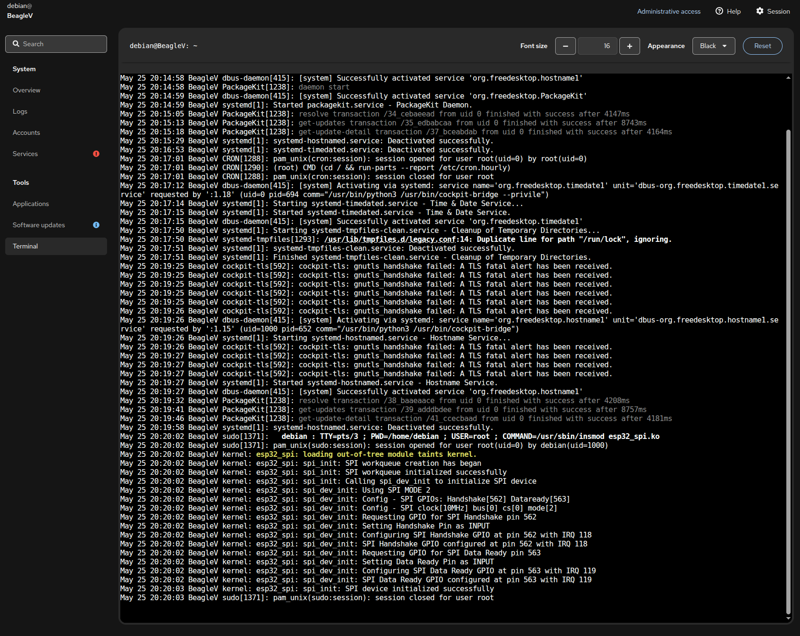
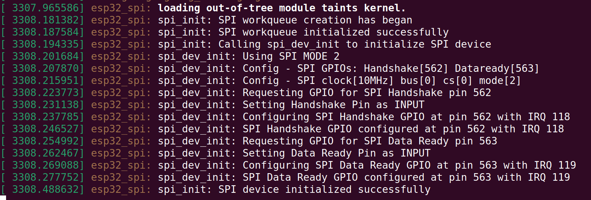
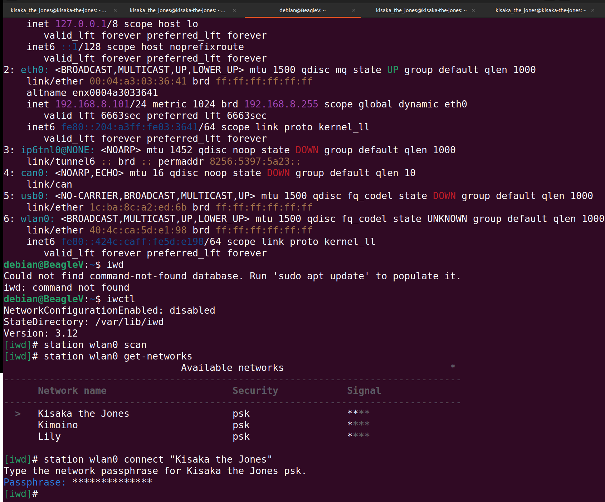
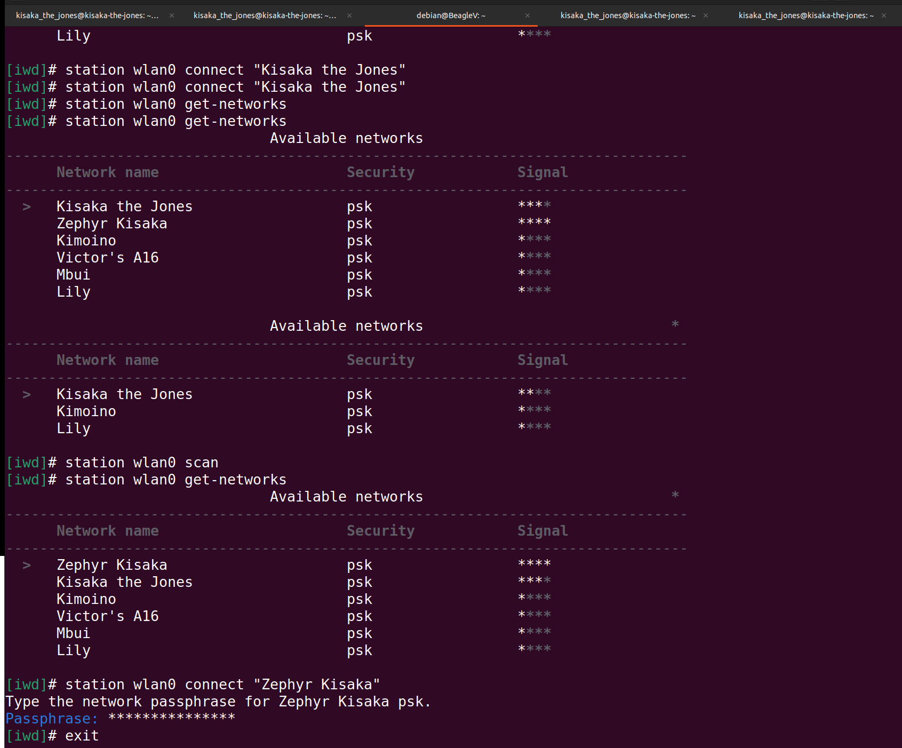
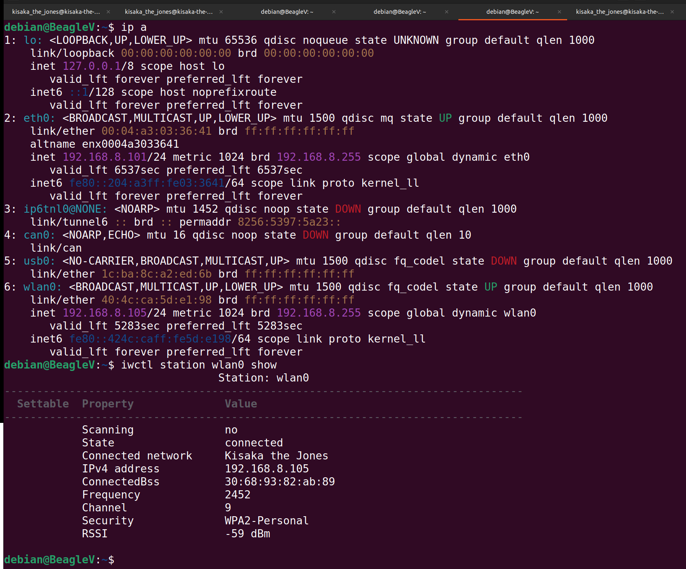
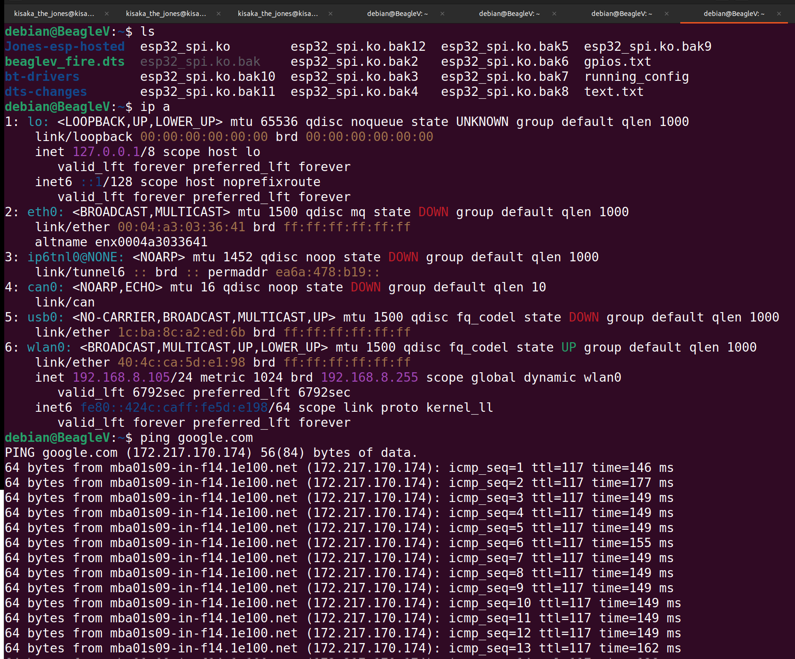
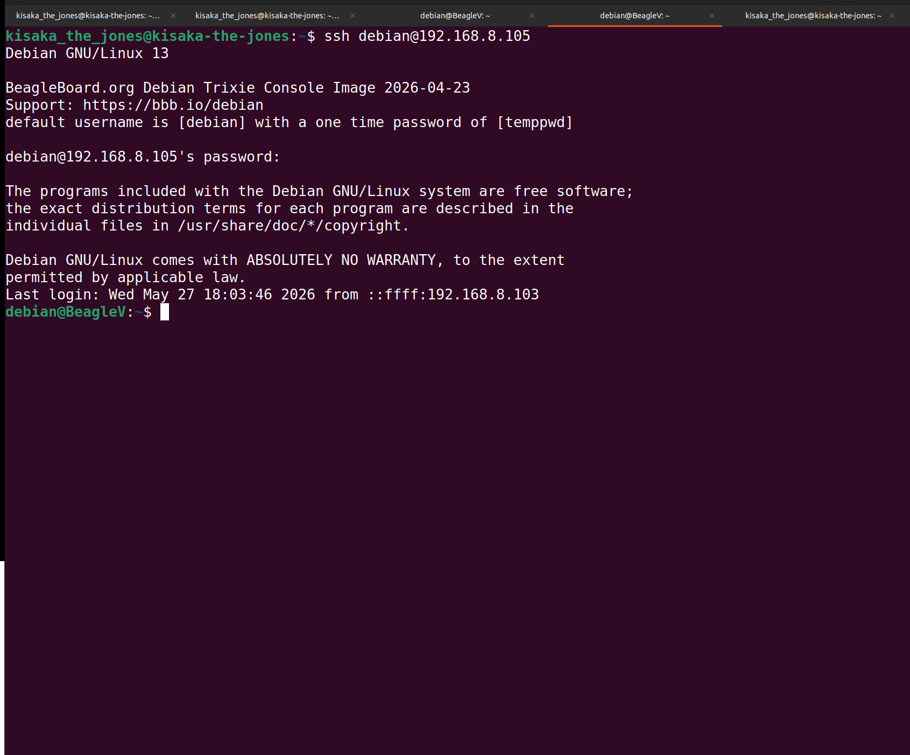

# Porting ESP_HOSTED to the BeagleV-Fire with the ESP32C6

## Procedure

- Modify host driver code.
- Pin connection setup.
- Update Headers on BeagleV Fire for the build and load process.
- Build the driver code to get the driver `.ko` file through cross-compiling.
- Transfer to BeagleV Fire using `scp` and load the driver using `insmod` command while following logs on either `dmesg` or `journalctl`.
- Establish a wlan interface and connect to a network.
- Test the connection.

## Modifying host-side driver code

Most changes are on the Beagle Fire, which is the host side of ESP_HOSTED.
This is in ESP_HOSTED_NG.
We will use SPI for connection.

Navigate to the directory `esp-hosted/esp_hosted_ng/host/spi`

In esp_spi.c:

- Change the `SPI_INITIAL_CLK_MHZ` from `10MHz` to `5MHz`.

In esp_spi.h:

- Change the GPIOs being used. `HANDSHAKE_PIN` to `562` and `SPI_DATA_READY_PIN` to `563`
  gpio562 on the BeagleV Fire coresponds to `P8_15` and serves as the `HANDSHAKE_PIN`
  gpio563 on the BeagleV Fire coresponds to `P8_16` and serves as the `SPI_DATA_READY_PIN`

In this setup, the reset pin wasn't used as manual resetting was being done on the esp.

## Pin Connections

| ESP32C6 | BEAGLEV-FIRE | Function   |
| ------- | ------------ | ---------- |
| IO10    | P9_17        | CS 0       |
| IO6     | P9_22        | SCLK       |
| IO2     | P9_21        | MISO       |
| IO7     | P9_18        | MOSI       |
| IO3     | P8_15        | Handshake  |
| IO4     | P8_16        | Data Ready |
| GND     | P9_1         | Ground     |



## Check BeagleV Fire Kernel headers for the build and load process

It is necessary to update the headers on your BeagleV. The same kernel you use to build the modules be the same one loading the module on BeagleV Fire.

- Check the current linux headers you have using the command:

```bash
uname -r
```

- Use this same kernel to build and also load the module to the BeagleV Fire. In this case, since we cross-compiling we had:

```bash
debian@BeagleV:~$ uname -r
6.12.48-linux4microchip+fpga-2025.10-20260423+
```

## Cross Compiling on your PC

So the kernel used to build the driver with in your PC should be the same as the one that is used to load it.
In this case for example, the kernel used has this header `6.12.48-linux4microchip+fpga-2025.10-20260423+`
The Linux Kernel used to build it is [Linux4microchip](https://github.com/linux4microchip/linux).

- Clone the repo to your PC and have it. Make sure to have the correct branch, which is `linux-6.12-mchp` or to whichever that is currently in your BeagleV Fire.
- Install the correct gnu on your PC, which is `riscv64-linux-gnu-gcc`. If not install using:

```bash
sudo apt install riscv64-linux-gnu-gcc
```

## Building the driver

To build the driver through Cross compiling, use the below command make while in the directory `esp-hosted/esp_hosted_ng/host/`

```bash
make target=spi ARCH=riscv CROSS_COMPILE=riscv64-linux-gnu- KERNEL=< path-to-linux-repo-from-linux4microchip >
```

This generates the `esp32_spi.ko` file which is the driver.

## Transfer to BeagleV-Fire

After the build process, transfer the file to BeagleV-Fire using the `scp` command or whichever command you want to use.

```bash
scp esp-hosted/esp_hosted_ng/host/esp32_spi.ko debian@< beaglevfire-ip >:~/
```

Load the driver using insmod:

```bash
sudo insmod esp32_spi.ko
```



## Monitoring logs

To monitor the logs use `dmesg` or `journalctl` using the commands:

```bash
journalctl -f
```


or

```bash
dmesg -w
```



This helps when monitoring the state of the driver while loading and also in operation. This also helps in debugging.

## Post Driver Loading

After the driver is loaded, reset the ESP32C6 manually, and observe the logs on BeagleV Fire and ESP32C6 using `idf.py monitor`

Check whether the ESP has been registered and the wlan interface created using command `ip a`

Expected results:

```bash
debian@BeagleV:~$ ip a
1: lo: <LOOPBACK,UP,LOWER_UP> mtu 65536 qdisc noqueue state UNKNOWN group default qlen 1000
    link/loopback 00:00:00:00:00:00 brd 00:00:00:00:00:00
    inet 127.0.0.1/8 scope host lo
       valid_lft forever preferred_lft forever
    inet6 ::1/128 scope host noprefixroute
       valid_lft forever preferred_lft forever
2: eth0: <BROADCAST,MULTICAST,UP,LOWER_UP> mtu 1500 qdisc mq state UP group default qlen 1000
    link/ether 00:04:a3:03:36:41 brd ff:ff:ff:ff:ff:ff
    altname enx0004a3033641
    inet 192.168.8.103/24 metric 1024 brd 192.168.8.255 scope global dynamic eth0
       valid_lft 5980sec preferred_lft 5980sec
    inet6 fe80::204:a3ff:fe03:3641/64 scope link proto kernel_ll
       valid_lft forever preferred_lft forever
3: ip6tnl0@NONE: <NOARP> mtu 1452 qdisc noop state DOWN group default qlen 1000
    link/tunnel6 :: brd :: permaddr 5672:3959:9632::
4: can0: <NOARP,ECHO> mtu 16 qdisc noop state DOWN group default qlen 10
    link/can
5: usb0: <NO-CARRIER,BROADCAST,MULTICAST,UP> mtu 1500 qdisc fq_codel state DOWN group default qlen 1000
    link/ether 1c:ba:8c:a2:ed:6b brd ff:ff:ff:ff:ff:ff
6: wlan0: <BROADCAST,MULTICAST,UP,LOWER_UP> mtu 1500 qdisc fq_codel state UP group default qlen 1000
    link/ether 40:4c:ca:5d:e1:98 brd ff:ff:ff:ff:ff:ff
    inet 192.168.8.105/24 metric 1024 brd 192.168.8.255 scope global dynamic wlan0
       valid_lft 7191sec preferred_lft 7191sec
    inet6 fe80::424c:caff:fe5d:e198/64 scope link proto kernel_ll
       valid_lft forever preferred_lft forever
```



## Scanning and connecting to WiFi

Scan for WiFi networks using `iwctl`.

- Use the command `iwctl` which enters you to an interactive tty.

```bash
debian@BeagleV:~$ iwctl
NetworkConfigurationEnabled: disabled
StateDirectory: /var/lib/iwd
Version: 3.12
[iwd]# station wlan0 scan
[iwd]#
```

- To list the networks available after scanning,

```bash
[iwd]# station wlan0 get-networks
```

- To connect to a network:

```bash
[iwd]# station wlan0 connect "your-wifi-ssid"
```

Key in the password thereafter to connect fully.



- Verify connection

To verify that you are connected to your network:

```bash
[iwd]# station wlan0 show
```

- To exit the iwctl tty

```bash
[iwd]# exit
```



## Test the new connection

To test whether BeagleV Fire is connected, run:

```bash
ping google.com
```

Expected Results:

```bash
debian@BeagleV:~$ ping google.com
PING google.com (172.217.170.174) 56(84) bytes of data.
64 bytes from mba01s09-in-f14.1e100.net (172.217.170.174): icmp_seq=1 ttl=117 time=106 ms
64 bytes from mba01s09-in-f14.1e100.net (172.217.170.174): icmp_seq=2 ttl=117 time=6.67 ms
64 bytes from mba01s09-in-f14.1e100.net (172.217.170.174): icmp_seq=3 ttl=117 time=373 ms
64 bytes from mba01s09-in-f14.1e100.net (172.217.170.174): icmp_seq=4 ttl=117 time=6.93 ms
64 bytes from mba01s09-in-f14.1e100.net (172.217.170.174): icmp_seq=5 ttl=117 time=42.1 ms
64 bytes from mba01s09-in-f14.1e100.net (172.217.170.174): icmp_seq=6 ttl=117 time=6.53 ms
^C
--- google.com ping statistics ---
6 packets transmitted, 6 received, 0% packet loss, time 5008ms
rtt min/avg/max/mdev = 6.531/90.162/372.532/131.142 ms

```



You can also test the new connection by ssh-ing to the BeagleV Fire using the wlan ip by running this command from your PC terminal:

```bash
ssh debian@<your_generated_beaglev_wlan_ip >
```



That is how to connect the BeagleV Fire to the ESP32C6 and establish a wlan interface.
Enjoy:-)
