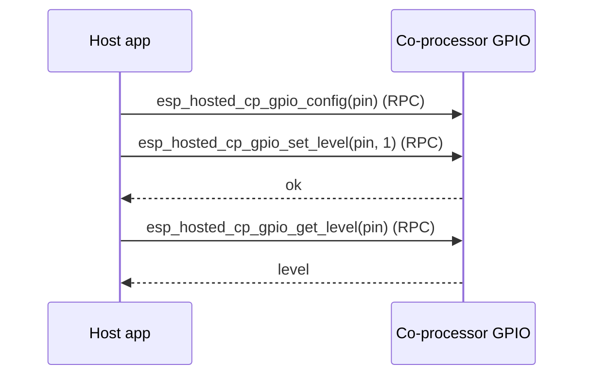

# gpio_expander (`examples/gpio_expander/`)

Drives CP-side GPIOs from the host as if the coprocessor were a remote
GPIO expander. The host calls `esp_hosted_cp_gpio_*` (configure / set
level / get level / reset) over RPC; the CP applies each call to its
own `gpio_*` peripheral. Useful when the host MCU runs out of pins and
the coprocessor has spare ones.

## Support

| Host                              | Folder                              | Status |
| --------------------------------- | ----------------------------------- | :----: |
| MCU host (ESP-IDF)                | `mcu_host/`                         |   Y   |
| Linux user-space (C)              | `linux_802_3_host/c_app/`           |   Y   |
| Linux kmod                        | `linux_802_3_host/kmod/`            |   Y   |
| Linux user-space (Python ctypes)  | `linux_802_3_host/py_app/`          |   Y   |

| Coprocessor                            | Status |
| -------------------------------------- | :----: |
| any Espressif chip (default ESP32-C6)  |   Y   |

<table width="100%">
  <tr>
    <td width="50%" align="center" bgcolor="#e6f2ff">
      <h3><a href="#linux-host-setup"> Linux Host Setup</a></h3>
      <p><a href="#linux-cp">1. Coprocessor</a><br><a href="#linux-host">2. Linux Host</a></p>
    </td>
    <td width="50%" align="center" bgcolor="#f2ffe6">
      <h3><a href="#mcu-host-setup"> MCU Host Setup</a></h3>
      <p><a href="#mcu-cp">1. Coprocessor</a><br><a href="#mcu-host">2. MCU Host</a></p>
    </td>
  </tr>
</table>

---

## Scenario

The host drives and reads the co-processor's GPIOs remotely over the control path (RPC).



> [!IMPORTANT]
> **New here? Get a base example working first.** Follow **[Getting Started: Linux](../../docs/getting-started-linux.md)** or **[Getting Started: MCU](../../docs/getting-started-mcu.md)** to wire the boards, install tools, choose a transport, and confirm the host↔co-processor handshake. The steps below only add what is specific to this example.

<h2 id="linux-host-setup"> Linux Host Setup</h2>

<h3 id="linux-cp">1. Coprocessor</h3>

Set up the tools once (from the repo root):

```bash
cd /path/to/esp_hosted
./install.sh      # install.fish for the fish shell
. ./export.sh     # . ./export.fish for the fish shell
```

GPIO-expander support is enabled by the co-processor's `sdkconfig.defaults`
(`ESP_HOSTED_CP_FEAT_GPIO_EXP`) — no extra option to enable. Select the
transport via `eh.py menuconfig`:

```bash
cd examples/gpio_expander/cp
eh.py set-target esp32c6
eh.py menuconfig
```

```text
Component config
└── ESP-Hosted
     └── Configure coprocessor
          └── CP transport
               ├── Communication bus (co-processor <== bus ==> host)
               │    ├── ( ) SPI Full Duplex
               │    ├── (X) SDIO                    <── default
               │    ├── ( ) SPI Half Duplex         ← MCU host only
               │    └── ( ) UART                    ← MCU host only
               └── SDIO Configuration               ← clock, GPIOs, checksum (defaults OK)
```

The CP-side pin under test (default GPIO 2) is set in code via
`SLAVE_GPIO_PIN`. Each bus has its own settings submenu (pins, clock,
checksum) — defaults are fine for bring-up.

The CP dependency config is **pre-set in `sdkconfig.defaults`** (do not remove):

```text
CONFIG_ESP_HOSTED_CP_FEAT_GPIO_EXP=y           # CP GPIO-expander feature
CONFIG_BT_ENABLED=n                            # BT off (unused by this example)
```

Then flash and monitor:

```bash
eh.py -p <cp_usb_serial_port> flash monitor
```

<h3 id="linux-host">2. Linux Host</h3>

> [!NOTE]
> Base wiring, OS setup, and transport bring-up live in [Getting Started: Linux](../../docs/getting-started-linux.md). This section assumes that already works.

Set up the tools once (from the repo root):

```bash
cd /path/to/esp_hosted
./install.sh      # install.fish for the fish shell
. ./export.sh     # . ./export.fish for the fish shell
```

**Kernel module** (creates `ethsta0` / `ethap0` and `/dev/esps0`):

```bash
cd examples/gpio_expander/linux_802_3_host/kmod
./build.sh --bus sdio --reload --reset-gpio 518 --clock-mhz 50
# SPI instead: ./build.sh --bus spi --reload --reset-gpio 518 --clock-mhz 10 --spi-mode 3
```

`--reload` builds, unloads, and reloads with the given module params. On SPI, start at `--clock-mhz 10`; once stable, raise it in steps to the co-processor's max SPI clock (see [Performance](../../docs/design/performance.md)).

**Native C app:**

```bash
cd examples/gpio_expander/linux_802_3_host/c_app
eh.py set-target linux
eh.py menuconfig
```

```text
Example Configuration
└── [ ] Use legacy esp_hosted_* compat-surface main    <── default off
```

The Host dependency config is **pre-set in `sdkconfig.defaults`** (do not remove):

```text
CONFIG_ESP_HOSTED_HOST_FEAT_GPIO_EXP=y         # host GPIO-expander feature
CONFIG_ESP_HOSTED_HOST_FEAT_RPC=y              # RPC control path
CONFIG_ESP_HOSTED_HOST_FEAT_RPC_EXT_V2=y       # required RPC ext-v2
```

Then build and run:

```bash
eh.py build
eh.py run
```

**Python app** — same RPC surface, driven from `main/main.py`:

```bash
cd examples/gpio_expander/linux_802_3_host/py_app
eh.py set-target linux
eh.py build
eh.py run
```

### 3. Verify

- Each demo step toggles the same CP pin through every mode supported
  by the `gpio_exp` feature: input, input-pullup, output, open-drain.

- The Linux variants exercise exactly the same RPC surface from
  user-space C, kernel-space, and Python.

---

<h2 id="mcu-host-setup"> MCU Host Setup</h2>

<h3 id="mcu-cp">1. Coprocessor</h3>

Set up the tools once (from the repo root):

```bash
cd /path/to/esp_hosted
./install.sh      # install.fish for the fish shell
. ./export.sh     # . ./export.fish for the fish shell
```

GPIO-expander support is enabled by the co-processor's `sdkconfig.defaults`
(`ESP_HOSTED_CP_FEAT_GPIO_EXP`) — no extra option to enable. Select the
transport via `eh.py menuconfig`:

```bash
cd examples/gpio_expander/cp
eh.py set-target esp32c6
eh.py menuconfig
```

```text
Component config
└── ESP-Hosted
     └── Configure coprocessor
          └── CP transport
               ├── Communication bus (co-processor <== bus ==> host)
               │    ├── ( ) SPI Full Duplex
               │    ├── (X) SDIO                    <── default
               │    ├── ( ) SPI Half Duplex         ← MCU host only
               │    └── ( ) UART                    ← MCU host only
               └── SDIO Configuration               ← clock, GPIOs, checksum (defaults OK)
```

The CP-side pin under test (default GPIO 2) is set in code via
`SLAVE_GPIO_PIN`. Each bus has its own settings submenu (pins, clock,
checksum) — defaults are fine for bring-up.

The CP dependency config is **pre-set in `sdkconfig.defaults`** (do not remove):

```text
CONFIG_ESP_HOSTED_CP_FEAT_GPIO_EXP=y           # CP GPIO-expander feature
CONFIG_BT_ENABLED=n                            # BT off (unused by this example)
```

Then flash and monitor:

```bash
eh.py -p <cp_usb_serial_port> flash monitor
```

<h3 id="mcu-host">2. MCU Host</h3>

Set up the tools once (from the repo root):

```bash
cd /path/to/esp_hosted
./install.sh      # install.fish for the fish shell
. ./export.sh     # . ./export.fish for the fish shell
```

Select the transport (must match the co-processor):

```bash
cd examples/gpio_expander/mcu_host
eh.py set-target esp32p4
eh.py menuconfig
```

```text
Component config
└── ESP-Hosted
     └── Configure host
          └── Host transport
               ├── Communication bus (co-processor <== bus ==> host)
               │    ├── ( ) SPI Full Duplex
               │    ├── (X) SDIO                    <── default (match the co-processor)
               │    ├── ( ) SPI Half Duplex
               │    └── ( ) UART
               └── SDIO Configuration               ← slot, bus width, GPIOs (defaults OK)
```

The host GPIO-expander feature is enabled by `sdkconfig.defaults`
(`ESP_HOSTED_HOST_FEAT_GPIO_EXP`); this host has no example-specific menu.
The CP-side pin under test (default GPIO 2) is set in code via
`SLAVE_GPIO_PIN`.

The Host dependency config is **pre-set in `sdkconfig.defaults`** (do not remove):

```text
CONFIG_ESP_HOSTED_HOST_FEAT_GPIO_EXP=y         # host GPIO-expander feature
CONFIG_ESP_HOSTED_HOST_FEAT_RPC=y              # RPC control path
CONFIG_ESP_HOSTED_HOST_FEAT_RPC_EXT_V2=y       # required RPC ext-v2
CONFIG_ESP_HOSTED_HOST_FEAT_SYSTEM=y           # system RPC calls
```

Then flash and monitor:

```bash
eh.py -p <host_usb_serial_port> flash monitor
```

### 3. Verify

- Each demo step toggles the same CP pin through every mode supported
  by the `gpio_exp` feature: input, input-pullup, output, open-drain.

- The Linux variants exercise exactly the same RPC surface from
  user-space C, kernel-space, and Python.

