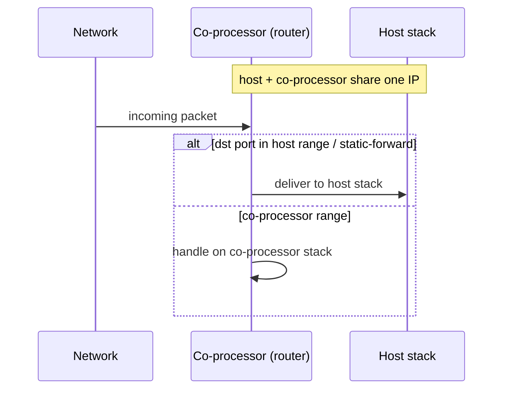

# network_split / station (`examples/network_split/station/`)

Bare-bones Wi-Fi station with the network-split netif backend wired in.
Wi-Fi sits on the coprocessor; the host runs its own LWIP / Linux-kernel
TCP/IP stack and the CP forwards 802.3 frames into the host netif. The
two stacks share one IP but split the port space — host owns 49152–61439,
CP owns 61440–65535. Use this when you want the smallest possible
connect-and-go to validate the split.

## Support

| Host                       | Folder                       | Status |
| -------------------------- | ---------------------------- | :----: |
| MCU host (ESP-IDF)         | `mcu_host/`                  |   Y    |
| Linux user-space (C)       | `linux_802_3_host/c_app/`    |   Y    |
| Linux user-space (Python)  | `linux_802_3_host/py_app/`   |   Y    |
| Linux kmod                 | `linux_802_3_host/kmod/`     |   Y    |

| Coprocessor                                       | Folder         | Status |
| ------------------------------------------------- | -------------- | :----: |
| any Espressif chip with Wi-Fi (default ESP32-C6)  | `cp/` |   Y    |

<table width="100%">
  <tr>
    <td width="50%" align="center" bgcolor="#e6f2ff">
      <h3><a href="#linux-host-setup"> Linux Host Setup</a></h3>
      <p><a href="#linux-cp">1. Coprocessor</a><br><a href="#linux-host">2. Linux Host</a></p>
    </td>
    <td width="50%" align="center" bgcolor="#f2ffe6">
      <h3><a href="#mcu-host-setup"> MCU Host Setup</a></h3>
      <p><a href="#mcu-cp">1. Coprocessor</a><br><a href="#mcu-host">2. MCU Host</a></p>
    </td>
  </tr>
</table>

---

## Scenario

Host and co-processor share one IP; the co-processor's router decides, per packet, which stack should handle it.



> [!IMPORTANT]
> **New here? Get a base example working first.** Follow **[Getting Started: Linux](../../../docs/getting-started-linux.md)** or **[Getting Started: MCU](../../../docs/getting-started-mcu.md)** to wire the boards, install tools, choose a transport, and confirm the host↔co-processor handshake. The steps below only add what is specific to this example.

<h2 id="linux-host-setup"> Linux Host Setup</h2>

<h3 id="linux-cp">1. Coprocessor</h3>

Set up the tools once (from the repo root):

```bash
cd /path/to/esp_hosted
./install.sh      # install.fish for the fish shell
. ./export.sh     # . ./export.fish for the fish shell
```

Enable **Network Split** and select the transport via `eh.py menuconfig`:

```bash
cd examples/network_split/station/cp
eh.py set-target esp32c6
eh.py menuconfig
```

```text
Component config
└── ESP-Hosted
     └── Configure coprocessor
          └── CP transport
               ├── Communication bus (co-processor <== bus ==> host)
               │    ├── ( ) SPI Full Duplex
               │    ├── (X) SDIO                    <── default
               │    ├── ( ) SPI Half Duplex         ← MCU host only
               │    └── ( ) UART                    ← MCU host only
               └── SDIO Configuration               ← clock, GPIOs, checksum (defaults OK)
```

The shipped defaults leave Network Split commented out — enable it and
its port / routing rules under **Features**:

```text
Component config
└── ESP-Hosted
     └── Configure coprocessor
          └── Features
               └── [*] Network Split
                    ├── [*] Auto-initialise Network Split at boot
                    ├── [*] Auto-connect WiFi on STA_START (network split)
                    ├── Default network stack for unfiltered packets
                    │    ├── (X) Coprocessor network stack                              <── default
                    │    ├── ( ) Host network stack
                    │    └── ( ) Replicate the packet towards both network stacks (Non recommended)
                    ├── Default DHCP client location
                    │    ├── ( ) Use DHCP at co-processor
                    │    ├── ( ) Use DHCP at Host
                    │    └── (X) Use DHCP at Both sides                                 <── default
                    ├── Slave side (local) LWIP port range (static)
                    │    ├── (61440) Slave TCP start port
                    │    ├── (65535) Slave TCP end port
                    │    ├── (61440) Slave UDP start port
                    │    └── (65535) Slave UDP end port
                    ├── Host side (remote) LWIP port range (static)
                    │    ├── (49152) Host TCP start port
                    │    ├── (61439) Host TCP end port
                    │    ├── (49152) Host UDP start port
                    │    └── (61439) Host UDP end port
                    ├── [*] Configure extra ports dedicated for host network stack
                    └── Host only ports
                         ├── ()        Host reserved TCP source ports
                         ├── (22,8554) Host reserved TCP destination ports
                         ├── ()        Host reserved UDP source ports
                         └── ()        Host reserved UDP destination ports
```

Each bus has its own settings submenu (pins, clock, checksum) — defaults are fine for bring-up.

The CP dependency config is **pre-set in `sdkconfig.defaults`** (do not remove) — note Network Split itself is *not* pre-set and must be enabled in menuconfig:

```text
CONFIG_ESP_HOSTED_CP_FEAT_WIFI=y               # Wi-Fi radio on the CP
CONFIG_BT_ENABLED=n                            # BT off
# CONFIG_ESP_HOSTED_CP_FEAT_NW_SPLIT=y         # NOT pre-set — enable in menuconfig
```

Then flash and monitor:

```bash
eh.py -p <cp_usb_serial_port> flash monitor
```

<h3 id="linux-host">2. Linux Host</h3>

> [!NOTE]
> Base wiring, OS setup, and transport bring-up live in [Getting Started: Linux](../../../docs/getting-started-linux.md). This section assumes that already works.

Set up the tools once (from the repo root):

```bash
cd /path/to/esp_hosted
./install.sh      # install.fish for the fish shell
. ./export.sh     # . ./export.fish for the fish shell
```

**Kernel module** (creates `ethsta0` / `ethap0` and `/dev/esps0`):

```bash
cd examples/network_split/station/linux_802_3_host/kmod
./build.sh --bus sdio --reload --reset-gpio 518 --clock-mhz 50
# SPI instead: ./build.sh --bus spi --reload --reset-gpio 518 --clock-mhz 10 --spi-mode 3
```

`--reload` builds, unloads, and reloads with the given module params. On SPI, start at `--clock-mhz 10`; once stable, raise it in steps to the co-processor's max SPI clock (see [Performance](../../../docs/design/performance.md)).

**Native C app:**

```bash
cd examples/network_split/station/linux_802_3_host/c_app
eh.py set-target linux
eh.py menuconfig
```

```text
Example Configuration
└── [ ] Use legacy esp_hosted_* compat-surface main    <── default off
```

The host Network-Split feature is enabled by `sdkconfig.defaults`; netif
ownership and host / CP port ranges live under **Features**:

```text
Component config
└── ESP-Hosted
     └── Configure host
          └── Features
               └── [*] Network Split
                    ├── [*] Auto-initialize Network-Split feature at boot
                    ├── Host-side STA netif ownership + IP source
                    │    ├── (X) External: app owns the netif                          <── default
                    │    ├── ( ) Internal + DHCP: nw_split creates netif, host runs DHCP
                    │    └── ( ) Internal + static: nw_split creates netif, CP provides IP
                    └── LWIP port config
                         ├── Host side (local) LWIP port config
                         │    ├── (49152) Host TCP start port
                         │    ├── (61439) Host TCP end port
                         │    ├── (49152) Host UDP start port
                         │    └── (61439) Host UDP end port
                         └── CP side (remote) LWIP port config
                              ├── (61440) CP TCP start port
                              ├── (65535) CP TCP end port
                              ├── (61440) CP UDP start port
                              └── (65535) CP UDP end port
```

The Host dependency config is **pre-set in `sdkconfig.defaults`** (do not remove):

```text
CONFIG_ESP_HOSTED_HOST_FEAT_NW_SPLIT=y         # host network-split netif backend
CONFIG_ESP_HOSTED_HOST_FEAT_WIFI=y             # host Wi-Fi control
CONFIG_ESP_HOSTED_HOST_FEAT_RPC=y              # RPC control path
CONFIG_ESP_HOSTED_HOST_FEAT_RPC_EXT_V2=y       # required RPC ext-v2
```

Then build and run:

```bash
eh.py build
eh.py run
```

**Python app** — same feature set, driven from `main/main.py`:

```bash
cd examples/network_split/station/linux_802_3_host/py_app
eh.py set-target linux
eh.py build
eh.py run
```

### 3. Verify

- Defaults: `CONFIG_COMPILER_OPTIMIZATION_PERF=y`, LWIP TCPIP task at
  prio 23, watchdogs off, `CONFIG_FREERTOS_HZ=1000`, SoftAP disabled.

- 4 MB flash with OTA-capable partition table
  (`partitions_eh_cp_ota_4m.csv`).

- Once associated, host-side sockets in 49152–61439 land in the host
  LWIP stack; outbound traffic from the CP uses 61440–65535. See
  `eh_host_feat_nw_split` for the netif backend and
  `nw_split_router.c` on the CP side for the dispatcher.

---

<h2 id="mcu-host-setup"> MCU Host Setup</h2>

<h3 id="mcu-cp">1. Coprocessor</h3>

Set up the tools once (from the repo root):

```bash
cd /path/to/esp_hosted
./install.sh      # install.fish for the fish shell
. ./export.sh     # . ./export.fish for the fish shell
```

Enable **Network Split** and select the transport via `eh.py menuconfig`:

```bash
cd examples/network_split/station/cp
eh.py set-target esp32c6
eh.py menuconfig
```

```text
Component config
└── ESP-Hosted
     └── Configure coprocessor
          └── CP transport
               ├── Communication bus (co-processor <== bus ==> host)
               │    ├── ( ) SPI Full Duplex
               │    ├── (X) SDIO                    <── default
               │    ├── ( ) SPI Half Duplex         ← MCU host only
               │    └── ( ) UART                    ← MCU host only
               └── SDIO Configuration               ← clock, GPIOs, checksum (defaults OK)
```

The shipped defaults leave Network Split commented out — enable it and
its port / routing rules under **Features**:

```text
Component config
└── ESP-Hosted
     └── Configure coprocessor
          └── Features
               └── [*] Network Split
                    ├── [*] Auto-initialise Network Split at boot
                    ├── [*] Auto-connect WiFi on STA_START (network split)
                    ├── Default network stack for unfiltered packets
                    │    ├── (X) Coprocessor network stack                              <── default
                    │    ├── ( ) Host network stack
                    │    └── ( ) Replicate the packet towards both network stacks (Non recommended)
                    ├── Default DHCP client location
                    │    ├── ( ) Use DHCP at co-processor
                    │    ├── ( ) Use DHCP at Host
                    │    └── (X) Use DHCP at Both sides                                 <── default
                    ├── Slave side (local) LWIP port range (static)
                    │    ├── (61440) Slave TCP start port
                    │    ├── (65535) Slave TCP end port
                    │    ├── (61440) Slave UDP start port
                    │    └── (65535) Slave UDP end port
                    ├── Host side (remote) LWIP port range (static)
                    │    ├── (49152) Host TCP start port
                    │    ├── (61439) Host TCP end port
                    │    ├── (49152) Host UDP start port
                    │    └── (61439) Host UDP end port
                    ├── [*] Configure extra ports dedicated for host network stack
                    └── Host only ports
                         ├── ()        Host reserved TCP source ports
                         ├── (22,8554) Host reserved TCP destination ports
                         ├── ()        Host reserved UDP source ports
                         └── ()        Host reserved UDP destination ports
```

Each bus has its own settings submenu (pins, clock, checksum) — defaults are fine for bring-up.

The CP dependency config is **pre-set in `sdkconfig.defaults`** (do not remove) — note Network Split itself is *not* pre-set and must be enabled in menuconfig:

```text
CONFIG_ESP_HOSTED_CP_FEAT_WIFI=y               # Wi-Fi radio on the CP
CONFIG_BT_ENABLED=n                            # BT off
# CONFIG_ESP_HOSTED_CP_FEAT_NW_SPLIT=y         # NOT pre-set — enable in menuconfig
```

Then flash and monitor:

```bash
eh.py -p <cp_usb_serial_port> flash monitor
```

<h3 id="mcu-host">2. MCU Host</h3>

Set up the tools once (from the repo root):

```bash
cd /path/to/esp_hosted
./install.sh      # install.fish for the fish shell
. ./export.sh     # . ./export.fish for the fish shell
```

Select the transport (must match the co-processor):

```bash
cd examples/network_split/station/mcu_host
eh.py set-target esp32p4
eh.py menuconfig
```

```text
Component config
└── ESP-Hosted
     └── Configure host
          └── Host transport
               ├── Communication bus (co-processor <== bus ==> host)
               │    ├── ( ) SPI Full Duplex
               │    ├── (X) SDIO                    <── default (match the co-processor)
               │    ├── ( ) SPI Half Duplex
               │    └── ( ) UART
               └── SDIO Configuration               ← slot, bus width, GPIOs (defaults OK)
```

Set the AP credentials — the `mcu_host` app pulls them from
`protocol_examples_common`:

```text
Example WiFi Configuration
└── Uses EXAMPLE_WIFI_* symbols from protocol_examples_common
     (EXAMPLE_WIFI_SSID / EXAMPLE_WIFI_PASSWORD — defaults "myssid" / "mypassword")
```

The host Network-Split feature is enabled by `sdkconfig.defaults`; netif
ownership and host / CP port ranges live under **Features**:

```text
Component config
└── ESP-Hosted
     └── Configure host
          └── Features
               └── [*] Network Split
                    ├── [*] Auto-initialize Network-Split feature at boot
                    ├── Host-side STA netif ownership + IP source
                    │    ├── (X) External: app owns the netif                          <── default
                    │    ├── ( ) Internal + DHCP: nw_split creates netif, host runs DHCP
                    │    └── ( ) Internal + static: nw_split creates netif, CP provides IP
                    └── LWIP port config
                         ├── Host side (local) LWIP port config
                         │    ├── (49152) Host TCP start port
                         │    ├── (61439) Host TCP end port
                         │    ├── (49152) Host UDP start port
                         │    └── (61439) Host UDP end port
                         └── CP side (remote) LWIP port config
                              ├── (61440) CP TCP start port
                              ├── (65535) CP TCP end port
                              ├── (61440) CP UDP start port
                              └── (65535) CP UDP end port
```

The Host dependency config is **pre-set in `sdkconfig.defaults`** (do not remove):

```text
CONFIG_ESP_HOSTED_HOST_FEAT_NW_SPLIT=y         # host network-split netif backend
CONFIG_ESP_HOSTED_HOST_FEAT_WIFI=y             # host Wi-Fi control
CONFIG_ESP_HOSTED_HOST_FEAT_RPC=y              # RPC control path
CONFIG_ESP_HOSTED_HOST_FEAT_RPC_EXT_V2=y       # required RPC ext-v2
CONFIG_ESP_HOSTED_HOST_FEAT_SYSTEM=y           # system RPC calls
```

Then flash and monitor:

```bash
eh.py -p <host_usb_serial_port> flash monitor
```

### 3. Verify

- Defaults: `CONFIG_COMPILER_OPTIMIZATION_PERF=y`, LWIP TCPIP task at
  prio 23, watchdogs off, `CONFIG_FREERTOS_HZ=1000`, SoftAP disabled.

- 4 MB flash with OTA-capable partition table
  (`partitions_eh_cp_ota_4m.csv`).

- Once associated, host-side sockets in 49152–61439 land in the host
  LWIP stack; outbound traffic from the CP uses 61440–65535. See
  `eh_host_feat_nw_split` for the netif backend and
  `nw_split_router.c` on the CP side for the dispatcher.

