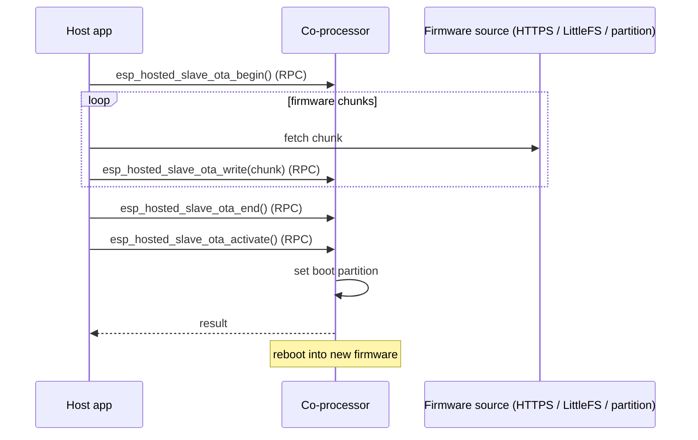

# ota / coprocessor_ota (`examples/ota/coprocessor_ota/`)

Pushes a new CP firmware image from the host through the OTA
begin / write / end / activate RPC chain. The host can source the image
from one of three places — HTTPS, an on-host LittleFS partition, or a
dedicated raw flash partition — selected at build time.

## Support

| Host                       | Folder                       | Status |
| -------------------------- | ---------------------------- | :----: |
| MCU host (ESP-IDF)         | `mcu_host/`                  |   Y    |
| Linux user-space (C)       | `linux_802_3_host/c_app/`    |   Y    |
| Linux user-space (Python)  | `linux_802_3_host/py_app/`   |   Y    |
| Linux kmod                 | `linux_802_3_host/kmod/`     |   Y    |

| Coprocessor                                       | Folder         | Status |
| ------------------------------------------------- | -------------- | :----: |
| any Espressif chip with Wi-Fi (default ESP32-C6)  | `cp/` |   Y    |

<table width="100%">
  <tr>
    <td width="50%" align="center" bgcolor="#e6f2ff">
      <h3><a href="#linux-host-setup"> Linux Host Setup</a></h3>
      <p><a href="#linux-cp">1. Coprocessor</a><br><a href="#linux-host">2. Linux Host</a></p>
    </td>
    <td width="50%" align="center" bgcolor="#f2ffe6">
      <h3><a href="#mcu-host-setup"> MCU Host Setup</a></h3>
      <p><a href="#mcu-cp">1. Coprocessor</a><br><a href="#mcu-host">2. MCU Host</a></p>
    </td>
  </tr>
</table>

---

## Scenario

The host streams new co-processor firmware over the control path using the four-call OTA RPC chain — `begin` → `write` (looped) → `end` → `activate`. (`activate` is a distinct RPC, needed on CP firmware v2.6.0+.) API names below are the example's compat surface (`esp_hosted_slave_ota_*`); the native equivalents are `eh_host_cp_ota_*`.



> [!IMPORTANT]
> **New here? Get a base example working first.** Follow **[Getting Started: Linux](../../../docs/getting-started-linux.md)** or **[Getting Started: MCU](../../../docs/getting-started-mcu.md)** to wire the boards, install tools, choose a transport, and confirm the host↔co-processor handshake. The steps below only add what is specific to this example.

<h2 id="linux-host-setup"> Linux Host Setup</h2>

<h3 id="linux-cp">1. Coprocessor</h3>

Set up the tools once (from the repo root):

```bash
cd /path/to/esp_hosted
./install.sh      # install.fish for the fish shell
. ./export.sh     # . ./export.fish for the fish shell
```

OTA runs on the co-processor's **System** feature (OTA / heartbeat / FW version), pre-enabled in `cp/sdkconfig.defaults` — you only select the transport:

```bash
cd examples/ota/coprocessor_ota/cp
eh.py set-target esp32c6
eh.py menuconfig
```

```text
Component config
└── ESP-Hosted
     └── Configure coprocessor
          └── CP transport
               ├── Communication bus (co-processor <== bus ==> host)
               │    ├── ( ) SPI Full Duplex
               │    ├── (X) SDIO                    <── default
               │    ├── ( ) SPI Half Duplex         ← MCU host only
               │    └── ( ) UART                    ← MCU host only
               └── SDIO Configuration               ← clock, GPIOs, checksum (defaults OK)
```

Each bus has its own settings submenu (pins, clock, checksum) — defaults are fine for bring-up.

CP dependency config is **pre-set in `cp/sdkconfig.defaults`** (do not remove):

```text
CONFIG_ESP_HOSTED_CP_FEAT_WIFI=y     # Wi-Fi — HTTPS OTA download path
CONFIG_BT_ENABLED=n
```

The System feature (OTA, heartbeat, FW version) is always enabled on the co-processor, so it needs no config.

Then flash and monitor:

```bash
eh.py -p <cp_usb_serial_port> flash monitor
```

<h3 id="linux-host">2. Linux Host</h3>

> [!NOTE]
> Base wiring, OS setup, and transport bring-up live in [Getting Started: Linux](../../../docs/getting-started-linux.md). This section assumes that already works.

Set up the tools once (from the repo root):

```bash
cd /path/to/esp_hosted
./install.sh      # install.fish for the fish shell
. ./export.sh     # . ./export.fish for the fish shell
```

**Kernel module** (creates `ethsta0` / `ethap0` and `/dev/esps0`):

```bash
cd examples/ota/coprocessor_ota/linux_802_3_host/kmod
./build.sh --bus sdio --reload --reset-gpio 518 --clock-mhz 50
# SPI instead: ./build.sh --bus spi --reload --reset-gpio 518 --clock-mhz 10 --spi-mode 3
```

`--reload` builds, unloads, and reloads with the given module params. On SPI, start at `--clock-mhz 10`; once stable, raise it in steps to the co-processor's max SPI clock (see [Performance](../../../docs/design/performance.md)).

**Native C app** — pick the OTA method:

```bash
cd examples/ota/coprocessor_ota/linux_802_3_host/c_app
eh.py set-target linux
eh.py menuconfig
```

```text
ESP-Hosted Coprocessor OTA Config
├── Select OTA Method
│     ├── (X) HTTP OTA                                   <── default
│     ├── ( ) LittleFS OTA
│     └── ( ) Partition OTA
│
├── WiFi Connection                                       ⎫
│     ├── (MyWiFiSSID) WiFi SSID                          │
│     └── (········)   WiFi Password                      │
├── HTTPS OTA Configuration                               ⎬  HTTP OTA method
│     ├── (…/firmware.bin) OTA Server URL                 │
│     ├── (30000) HTTPS connection timeout (ms)           │
│     └── [ ] Use self-signed certificate (testing only)  ⎭
│
├── (slave_fw) Partition Label                            ←  Partition OTA method
├── [*] Delete OTA file after flashing                    ←  LittleFS OTA method
│
└── OTA Verification Options
      ├── [*] Host-Slave version compatibility check
      └── [*] Skip OTA if slave firmware versions match
```

Host dependency config is **pre-set in `linux_802_3_host/c_app/sdkconfig.defaults`** (do not remove):

```text
CONFIG_ESP_HOSTED_HOST_FEAT_RPC=y
CONFIG_ESP_HOSTED_HOST_FEAT_RPC_EXT_V2=y
CONFIG_ESP_HOSTED_HOST_FEAT_SYSTEM=y   # host System feature (FW version / heartbeat / OTA)
```

Then build and run:

```bash
eh.py build
eh.py run
```

**Python app** — same OTA options, set in `main/main.py`:

```bash
cd examples/ota/coprocessor_ota/linux_802_3_host/py_app
eh.py set-target linux
eh.py build
eh.py run
```

### 3. Verify

- **8 MB flash + custom partition table** (`partitions.csv`):
  ota_0/ota_1 host slots, a `storage` LittleFS partition staging the CP
  image for the LittleFS method, and a `slave_fw` raw partition for the
  Partition method.

- Host runs `eh_host_sys_get_cp_fw_version()` against the live CP and
  warns on major.minor mismatch before pushing.

- Set `CONFIG_EH_USE_LEGACY_API=y` to build from `main/legacy/main.c`
  (preserves the `esp_hosted_*` compat surface) instead of the native
  `eh_host_*` main.

- For HTTPS in testing, drop the server cert into
  `certs/server_cert.pem` and enable `Use self-signed certificate
  (Testing Only)`.

---

<h2 id="mcu-host-setup"> MCU Host Setup</h2>

<h3 id="mcu-cp">1. Coprocessor</h3>

Set up the tools once (from the repo root):

```bash
cd /path/to/esp_hosted
./install.sh      # install.fish for the fish shell
. ./export.sh     # . ./export.fish for the fish shell
```

OTA runs on the co-processor's **System** feature (OTA / heartbeat / FW version), pre-enabled in `cp/sdkconfig.defaults` — you only select the transport:

```bash
cd examples/ota/coprocessor_ota/cp
eh.py set-target esp32c6
eh.py menuconfig
```

```text
Component config
└── ESP-Hosted
     └── Configure coprocessor
          └── CP transport
               ├── Communication bus (co-processor <== bus ==> host)
               │    ├── ( ) SPI Full Duplex
               │    ├── (X) SDIO                    <── default
               │    ├── ( ) SPI Half Duplex         ← MCU host only
               │    └── ( ) UART                    ← MCU host only
               └── SDIO Configuration               ← clock, GPIOs, checksum (defaults OK)
```

Each bus has its own settings submenu (pins, clock, checksum) — defaults are fine for bring-up.

CP dependency config is **pre-set in `cp/sdkconfig.defaults`** (do not remove):

```text
CONFIG_ESP_HOSTED_CP_FEAT_WIFI=y     # Wi-Fi — HTTPS OTA download path
CONFIG_BT_ENABLED=n
```

The System feature (OTA, heartbeat, FW version) is always enabled on the co-processor, so it needs no config.

Then flash and monitor:

```bash
eh.py -p <cp_usb_serial_port> flash monitor
```

<h3 id="mcu-host">2. MCU Host</h3>

Set up the tools once (from the repo root):

```bash
cd /path/to/esp_hosted
./install.sh      # install.fish for the fish shell
. ./export.sh     # . ./export.fish for the fish shell
```

Select the transport (must match the co-processor) and pick the OTA method:

```bash
cd examples/ota/coprocessor_ota/mcu_host
eh.py set-target esp32p4
eh.py menuconfig
```

```text
Component config
└── ESP-Hosted
     └── Configure host
          └── Host transport
               ├── Communication bus (co-processor <== bus ==> host)
               │    ├── ( ) SPI Full Duplex
               │    ├── (X) SDIO                    <── default (match the co-processor)
               │    ├── ( ) SPI Half Duplex
               │    └── ( ) UART
               └── SDIO Configuration               ← slot, bus width, GPIOs (defaults OK)
```

```text
ESP-Hosted Coprocessor OTA Config
├── Select OTA Method
│     ├── (X) HTTP OTA                                   <── default
│     ├── ( ) LittleFS OTA
│     └── ( ) Partition OTA
│
├── WiFi Connection                                       ⎫
│     ├── (MyWiFiSSID) WiFi SSID                          │
│     └── (········)   WiFi Password                      │
├── HTTPS OTA Configuration                               ⎬  HTTP OTA method
│     ├── (…/firmware.bin) OTA Server URL                 │
│     ├── (30000) HTTPS connection timeout (ms)           │
│     └── [ ] Use self-signed certificate (testing only)  ⎭
│
├── (slave_fw) Partition Label                            ←  Partition OTA method
├── [*] Delete OTA file after flashing                    ←  LittleFS OTA method
│
└── OTA Verification Options
      ├── [*] Host-Slave version compatibility check
      └── [*] Skip OTA if slave firmware versions match
```

Host dependency config is **pre-set in `mcu_host/sdkconfig.defaults`** (do not remove):

```text
CONFIG_ESP_HOSTED_HOST_FEAT_WIFI=y   # Wi-Fi — HTTPS OTA download path
```

Then flash and monitor:

```bash
eh.py -p <host_usb_serial_port> flash monitor
```

### 3. Verify

- **For the Partition / LittleFS methods: ensure sufficient flash + a custom partition table** (`partitions.csv`):
  ota_0/ota_1 host slots, a `storage` LittleFS partition staging the CP
  image for the LittleFS method, and a `slave_fw` raw partition for the
  Partition method.

- Host runs `eh_host_sys_get_cp_fw_version()` against the live CP and
  warns on major.minor mismatch before pushing.

- For HTTPS in testing, drop the server cert into
  `certs/server_cert.pem` and enable `Use self-signed certificate
  (Testing Only)`.
