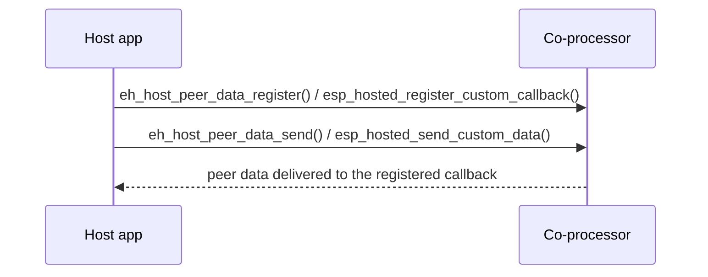

# peer_data_transfer (`examples/peer_data_transfer/`)

<!-- common-start -->
Demonstrates the `peer_data` custom-RPC channel: the host sends
arbitrary application-defined messages identified by a `uint32_t`
message ID, the CP echoes them back on a paired response ID, and the
host verifies the payload round-tripped intact. The example exercises
the full supported size range (1 byte → 8166 bytes) and also fires a
deliberately-unregistered ID to confirm the framework rejects it
gracefully.

Message-ID pairs used by the demo:

- `MSG_ID_CAT` / `MSG_ID_MEOW` — 1–1000 bytes (small).
- `MSG_ID_DOG` / `MSG_ID_WOOF` — 1000–4000 bytes (medium).
- `MSG_ID_HUMAN` / `MSG_ID_HELLO` — 4000–8166 bytes (large).
- `MSG_ID_GHOST` — exceeds the configured callback table; expected
  to fail.

## Supported Platforms and Transports

### Supported Coprocessors

| Coprocessor | ESP32 | ESP32-C Series | ESP32-S Series |
| :----------: | :---: | :------------: | :------------: |
| Support     | Yes   | Yes            | Yes            |

### Supported Host Devices

| Host Device | ESP32-P4 | ESP32-H2 | Other MCUs | Linux |
| :---------: | :------: | :------: | :--------: | :---: |
| Support     | Yes | Yes | [Yes](https://github.com/espressif/esp-hosted/blob/master/docs/getting-started-mcu.md) | [Yes](https://github.com/espressif/esp-hosted/blob/master/docs/getting-started-linux.md) |

### Supported Connection buses

| Connection bus | SDIO | SPI Full-Duplex | SPI Half-Duplex | UART |
| :------------- | :--: | :-------------: | :-------------: | :--: |
| Linux host     | Yes  | Yes             | No              | No   |
| MCU host       | Yes  | Yes             | Yes             | Yes  |
<!-- common-stop -->

## Directory layout

```text
peer_data_transfer/
├── cp/                     ESP coprocessor firmware
├── mcu_host/               ESP-IDF MCU host app
└── linux_802_3_host/       Linux host
     ├── c_app/             native C app
     ├── kmod/              kernel module
     └── py_app/            Python (ctypes) app
```

<table width="100%">
  <tr>
    <td width="50%" align="center" bgcolor="#e6f2ff">
      <h3><a href="#linux-host-setup"> Linux Host Setup</a></h3>
      <p><a href="#linux-cp">1. Coprocessor</a><br><a href="#linux-host">2. Linux Host</a></p>
    </td>
    <td width="50%" align="center" bgcolor="#f2ffe6">
      <h3><a href="#mcu-host-setup"> MCU Host Setup</a></h3>
      <p><a href="#mcu-cp">1. Coprocessor</a><br><a href="#mcu-host">2. MCU Host</a></p>
    </td>
  </tr>
</table>

---

<!-- common-start -->
## Scenario

The host registers a receive callback, sends application-defined data to the co-processor over the custom-data channel, and receives peer data back through the callback.


<!-- common-stop -->

> [!IMPORTANT]
> **New here? Get a base example working first.** Follow **[Getting Started: Linux](../../docs/getting-started-linux.md)** or **[Getting Started: MCU](../../docs/getting-started-mcu.md)** to wire the boards, install tools, choose a transport, and confirm the host↔co-processor handshake. The steps below only add what is specific to this example.

<h2 id="linux-host-setup"> Linux Host Setup</h2>

<h3 id="linux-cp">1. Coprocessor</h3>

Set up the tools once (from the repo root):

```bash
cd /path/to/esp_hosted
./install.sh      # install.fish for the fish shell
. ./export.sh     # . ./export.fish for the fish shell
```

Peer-Data support is enabled by the co-processor's `sdkconfig.defaults`
(`ESP_HOSTED_CP_FEAT_PEER_DATA`) — no extra option to enable. Select the
transport via `eh.py menuconfig`:

```bash
cd examples/peer_data_transfer/cp
eh.py set-target esp32c6
eh.py menuconfig
```

```text
Component config
└── ESP-Hosted
     └── Configure coprocessor
          └── CP transport
               ├── Communication bus (co-processor <== bus ==> host)
               │    ├── ( ) SPI Full Duplex
               │    ├── (X) SDIO                    <── default
               │    ├── ( ) SPI Half Duplex         ← MCU host only
               │    └── ( ) UART                    ← MCU host only
               └── SDIO Configuration               ← clock, GPIOs, checksum (defaults OK)
```

Each bus has its own settings submenu (pins, clock, checksum) — defaults are fine for bring-up.

The CP dependency config is **pre-set in `sdkconfig.defaults`** (do not remove):

```text
CONFIG_ESP_HOSTED_CP_FEAT_PEER_DATA=y          # CP peer-data (custom RPC) feature
CONFIG_BT_ENABLED=n                            # BT off (unused by this example)
```

Then flash and monitor:

```bash
eh.py -p <cp_usb_serial_port> flash monitor
```

<h3 id="linux-host">2. Linux Host</h3>

> [!NOTE]
> Base wiring, OS setup, and transport bring-up live in [Getting Started: Linux](../../docs/getting-started-linux.md). This section assumes that already works.

Set up the tools once (from the repo root):

```bash
cd /path/to/esp_hosted
./install.sh      # install.fish for the fish shell
. ./export.sh     # . ./export.fish for the fish shell
```

**Kernel module** (creates `ethsta0` / `ethap0` and `/dev/esps0`):

```bash
cd examples/peer_data_transfer/linux_802_3_host/kmod
./build.sh --bus sdio --reload --reset-gpio 518 --clock-mhz 50
# SPI instead: ./build.sh --bus spi --reload --reset-gpio 518 --clock-mhz 10 --spi-mode 3
```

`--reload` builds, unloads, and reloads with the given module params. On SPI, start at `--clock-mhz 10`; once stable, raise it in steps to the co-processor's max SPI clock (see [Performance](../../docs/design/performance.md)).

**Native C app:**

```bash
cd examples/peer_data_transfer/linux_802_3_host/c_app
eh.py set-target linux
eh.py menuconfig
```

```text
Example Configuration
└── [ ] Use legacy esp_hosted_* compat-surface main    <── default off
```

The host Peer-Data feature is enabled by `sdkconfig.defaults`; the
callback-table size lives under **Features**:

```text
Component config
└── ESP-Hosted
     └── Configure host
          └── Features
               └── [*] Peer Data Transfer
                    ├── [*] Auto-initialize Peer-Data feature at boot
                    └── (3) Maximum custom message handlers      (range 1–32)
```

The Host dependency config is **pre-set in `sdkconfig.defaults`** (do not remove):

```text
CONFIG_ESP_HOSTED_HOST_FEAT_PEER_DATA=y        # host peer-data (custom RPC) feature
CONFIG_ESP_HOSTED_HOST_FEAT_RPC=y              # RPC control path
CONFIG_ESP_HOSTED_HOST_FEAT_RPC_EXT_V2=y       # required RPC ext-v2
```

Then build and run:

```bash
eh.py build
eh.py run
```

**Python app** — same RPC surface, driven from `main/main.py`:

```bash
cd examples/peer_data_transfer/linux_802_3_host/py_app
eh.py set-target linux
eh.py build
eh.py run
```

### 3. Verify

- The host registers its receive callbacks with a static `user` ptr
  (a struct describing the "animal" / payload owner). The framework
  returns that pointer verbatim on each invocation — no globals
  needed in the callback.

- `PEER_DATA_MAX_PAYLOAD_SIZE = 8166` is the empirical cap given the
  RPC frame overhead; exceeding it returns an error at send time.

---

<h2 id="mcu-host-setup"> MCU Host Setup</h2>

<h3 id="mcu-cp">1. Coprocessor</h3>

Set up the tools once (from the repo root):

```bash
cd /path/to/esp_hosted
./install.sh      # install.fish for the fish shell
. ./export.sh     # . ./export.fish for the fish shell
```

<!-- coprocessor-start -->
Peer-Data support is enabled by the co-processor's `sdkconfig.defaults`
(`ESP_HOSTED_CP_FEAT_PEER_DATA`) — no extra option to enable. Select the
transport via `eh.py menuconfig`:

```bash
cd examples/peer_data_transfer/cp
eh.py set-target esp32c6
eh.py menuconfig
```

```text
Component config
└── ESP-Hosted
     └── Configure coprocessor
          └── CP transport
               ├── Communication bus (co-processor <== bus ==> host)
               │    ├── ( ) SPI Full Duplex
               │    ├── (X) SDIO                    <── default
               │    ├── ( ) SPI Half Duplex         ← MCU host only
               │    └── ( ) UART                    ← MCU host only
               └── SDIO Configuration               ← clock, GPIOs, checksum (defaults OK)
```

Each bus has its own settings submenu (pins, clock, checksum) — defaults are fine for bring-up.

The CP dependency config is **pre-set in `sdkconfig.defaults`** (do not remove):

```text
CONFIG_ESP_HOSTED_CP_FEAT_PEER_DATA=y          # CP peer-data (custom RPC) feature
CONFIG_BT_ENABLED=n                            # BT off (unused by this example)
```

Then flash and monitor:

```bash
eh.py -p <cp_usb_serial_port> flash monitor
```
<!-- coprocessor-stop -->

<h3 id="mcu-host">2. MCU Host</h3>

Set up the tools once (from the repo root):

```bash
cd /path/to/esp_hosted
./install.sh      # install.fish for the fish shell
. ./export.sh     # . ./export.fish for the fish shell
```

<!-- esp_host-start -->
Select the transport (must match the co-processor):

```bash
cd examples/peer_data_transfer/mcu_host
eh.py set-target esp32p4
eh.py menuconfig
```

```text
Component config
└── ESP-Hosted
     └── Configure host
          └── Host transport
               ├── Communication bus (co-processor <== bus ==> host)
               │    ├── ( ) SPI Full Duplex
               │    ├── (X) SDIO                    <── default (match the co-processor)
               │    ├── ( ) SPI Half Duplex
               │    └── ( ) UART
               └── SDIO Configuration               ← slot, bus width, GPIOs (defaults OK)
```

```text
Example Configuration
└── [ ] Use legacy esp_hosted_* compat-surface main    <── default off
```

The host Peer-Data feature is enabled by `sdkconfig.defaults`; the
callback-table size lives under **Features**:

```text
Component config
└── ESP-Hosted
     └── Configure host
          └── Features
               └── [*] Peer Data Transfer
                    ├── [*] Auto-initialize Peer-Data feature at boot
                    └── (3) Maximum custom message handlers      (range 1–32)
```

The Host dependency config is **pre-set in `sdkconfig.defaults`** (do not remove):

```text
CONFIG_ESP_HOSTED_HOST_FEAT_PEER_DATA=y        # host peer-data (custom RPC) feature
```

(RPC + SYSTEM host features are default-on and need no explicit entry.)

Then flash and monitor:

```bash
eh.py -p <host_usb_serial_port> flash monitor
```
<!-- esp_host-stop -->

### 3. Verify

- The host registers its receive callbacks with a static `user` ptr
  (a struct describing the "animal" / payload owner). The framework
  returns that pointer verbatim on each invocation — no globals
  needed in the callback.

- `PEER_DATA_MAX_PAYLOAD_SIZE = 8166` is the empirical cap given the
  RPC frame overhead; exceeding it returns an error at send time.

