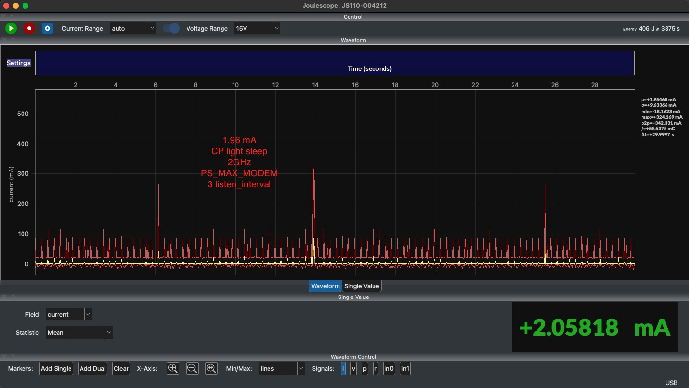
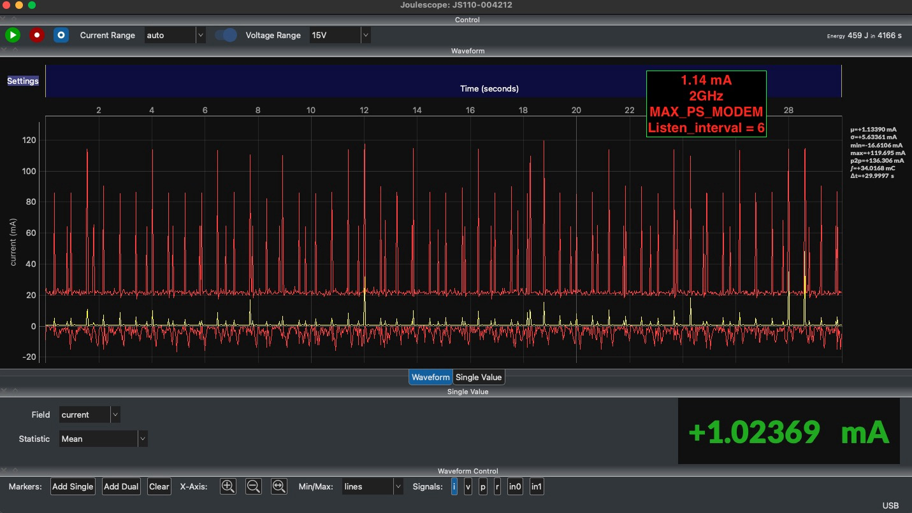
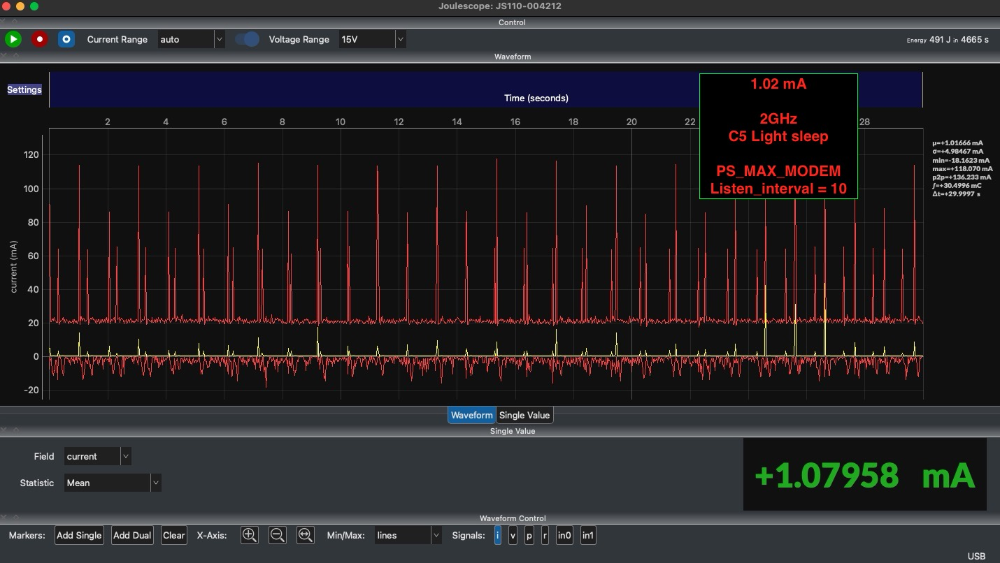
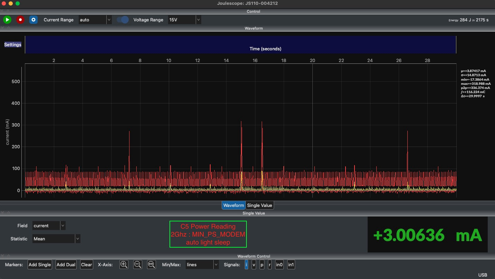

# Light-sleep power

Host in **deep sleep**, coprocessor (CP) in **light sleep**, network-split. The
CP keeps the Wi-Fi association alive while the host sleeps and wakes it on
host-bound traffic. This page shows the measured parked current.

Bench: ESP32-P4 host + ESP32-C5 CP, 2.4 GHz AP, JS110 Joulescope on the C5 rail.

## Modem power-save current

Steady parked current at two averaging windows: the **30 s** Joulescope marker
(µ, the value annotated on each graph) and the **full run** (each capture ran
≥30 min — the longer runs converge to the same value).
`WIFI_PS_MAX_MODEM` wakes every N listen intervals; `WIFI_PS_MIN_MODEM` wakes on
the AP's DTIM, so the listen interval does not apply to it.

| power-save mode     | listen interval | 30 s marker | full run (≥30 min) |
|---------------------|:---------------:|:-----------:|:------------------:|
| `WIFI_PS_MAX_MODEM` | 3               | 1.95 mA     | 2.06 mA            |
| `WIFI_PS_MAX_MODEM` | 6               | 1.13 mA     | 1.02 mA            |
| `WIFI_PS_MAX_MODEM` | 10              | 1.02 mA     | 1.08 mA            |
| `WIFI_PS_MIN_MODEM` | n/a (DTIM)      | 3.87 mA     | 3.00 mA            |

A longer listen interval lowers MAX_MODEM current; MIN_MODEM wakes far more often
(every DTIM) and draws the most.









## Across transports

All four transports (SDIO, SPI full-/half-duplex, UART) light-sleep at similar
levels — parked around 2–3 mA, settling to a ~1.3 mA floor. The transport does
not materially change the parked current.

## Try it

Build and flash the example (see the [readme](README.md)), connect to your AP,
and put the host to sleep. To read the parked current you need a current meter
in the coprocessor's supply rail; the numbers above were taken with a Joulescope
JS110.

For an automated build → flash → sleep/wake → verify loop, the `test/` folder
has a soak harness:

```bash
python test/hw_ps_soak.py --help
```

### Measuring current (optional)

A Joulescope is **only** needed for the current numbers — without it the soak
still runs and verifies every sleep/wake cycle (just no power reading).

To measure:

1. Put the JS110 **in series with the coprocessor (C5) supply rail** — its
   `IN`/`OUT` terminals carry all of the C5's current (on the P4+C5 core board,
   use the current-measurement jumper/header for that rail).
2. Connect the JS110 to this machine over USB (close the Joulescope desktop app —
   only one process can claim the device).
3. Install the `joulescope` Python package in your test venv, then add `--power`:

   ```bash
   python test/hw_ps_soak.py --transports sdio --cycles 50 --dwell 30 --power \
       --ssid <SSID> --password <PW> \
       --host-port /dev/<P4_PORT> --cp-port /dev/<C5_PORT>
   ```
