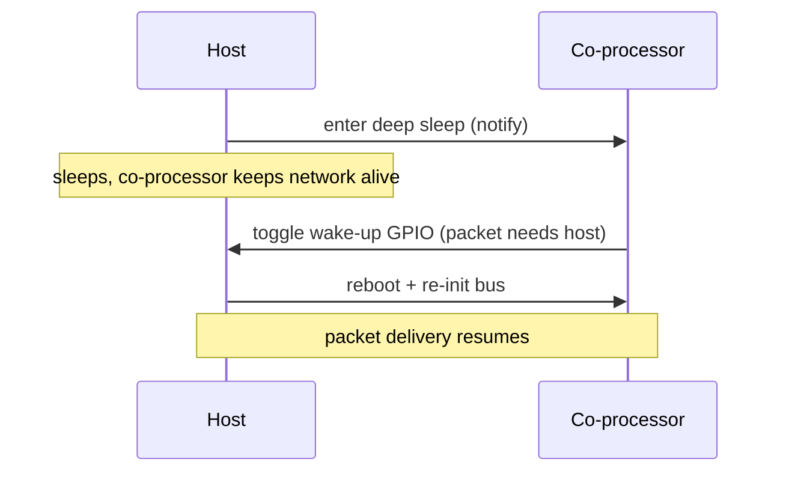

# power_save / host / network_split__host_deep_sleep (`examples/power_save/host/network_split__host_deep_sleep/`)

<!-- common-start -->
Network split lets the CP keep Wi-Fi alive and own low-port traffic
(61440–65535) while the host enters **deep sleep**. The CP wakes the
host over a dedicated GPIO only when a packet hits a host-owned port
(49152–61439) or when a slave-side `wake-up-host` is issued. Drops
host idle current to RTC-only levels.

The host project lives under `esp_host/` rather than `mcu_host/` —
the deep-sleep wiring (esp_pm, RTC GPIO wake source, wifi-cmd + iperf
managed components) is ESP-IDF-only.

## Supported Platforms and Transports

### Supported Coprocessors

| Coprocessor | ESP32 | ESP32-C Series | ESP32-S Series |
| :----------: | :---: | :------------: | :------------: |
| Support     | Yes   | Yes            | Yes            |

### Supported Host Devices

| Host Device | ESP32-P4 | ESP32-H2 | Other MCUs | Linux |
| :---------: | :------: | :------: | :--------: | :---: |
| Support     | Yes | Yes | [Yes](https://github.com/espressif/esp-hosted/blob/master/docs/getting-started-mcu.md) | [Yes](https://github.com/espressif/esp-hosted/blob/master/docs/getting-started-linux.md) |

### Supported Connection buses

| Connection bus | SDIO | SPI Full-Duplex | SPI Half-Duplex | UART |
| :------------- | :--: | :-------------: | :-------------: | :--: |
| Linux host     | Yes  | Yes             | No              | No   |
| MCU host       | Yes  | Yes             | Yes             | Yes  |
<!-- common-stop -->

## Directory layout

```text
power_save/host/network_split__host_deep_sleep/
├── cp/                  ESP coprocessor firmware
└── esp_host/            ESP-IDF MCU host app
```

<table width="100%">
  <tr>
    <td width="100%" align="center" bgcolor="#f2ffe6">
      <h3><a href="#mcu-host-setup"> MCU Host Setup</a></h3>
      <p><a href="#mcu-cp">1. Coprocessor</a><br><a href="#mcu-host">2. MCU Host</a></p>
    </td>
  </tr>
</table>

---

<!-- common-start -->
## Scenario

The host sleeps while the co-processor keeps the link alive, and is woken over a GPIO only when a packet needs it.


<!-- common-stop -->

> [!IMPORTANT]
> **New here? Get a base example working first.** Follow **[Getting Started: MCU](../../../../docs/getting-started-mcu.md)** to wire the boards, install tools, choose a transport, and confirm the host↔co-processor handshake. The steps below only add what is specific to this example.

<h2 id="mcu-host-setup"> MCU Host Setup</h2>

<h3 id="mcu-cp">1. Coprocessor</h3>

Set up the tools once (from the repo root):

```bash
cd /path/to/esp_hosted
./install.sh      # install.fish for the fish shell
. ./export.sh     # . ./export.fish for the fish shell
```

<!-- coprocessor-start -->
Select the transport and enable the CP-side Host Power Save feature so the CP wakes the host over a GPIO:

```bash
cd examples/power_save/host/network_split__host_deep_sleep/cp
eh.py set-target esp32c6
eh.py menuconfig
```

```text
Component config
└── ESP-Hosted
     └── Configure coprocessor
          └── CP transport
               ├── Communication bus (co-processor <== bus ==> host)
               │    ├── ( ) SPI Full Duplex
               │    ├── (X) SDIO                    <── default
               │    ├── ( ) SPI Half Duplex         ← MCU host only
               │    └── ( ) UART                    ← MCU host only
               └── SDIO Configuration               ← clock, GPIOs, checksum (defaults OK)
```

```text
Component config
└── ESP-Hosted
     └── Configure coprocessor
          └── Features
               └── [*] Host Power Save
                    └── [*] Allow host to enter deep sleep. Slave will wakeup host using GPIO when needed
                         └── Host deep sleep - wakeup config
                              ├── (2)  Slave out: Host wakeup GPIO     ← ESP32-C6 default
                              └── Host Wakeup GPIO Level
                                   ├── (X) High                        <── default
                                   └── ( ) Low
```

The host netif gets its IP from a CP-side DhcpDnsStatus event
(`CONFIG_ESP_HOSTED_HOST_FEAT_NW_SPLIT_NETIF_INTERNAL_STATIC=y`), and
`wifi-cmd` is the single connect owner — Hosted auto-connect /
auto-reconnect hooks are off in this example.

CP dependency config is **pre-set in `sdkconfig.defaults`** (do not remove):

```text
CONFIG_ESP_HOSTED_CP_FEAT_WIFI=y  # Wi-Fi stack on the CP, kept alive while the host sleeps
CONFIG_ESP_HOSTED_CP_FEAT_NW_SPLIT=y  # network-split backend — CP owns low-port (61440–65535) traffic
CONFIG_ESP_HOSTED_CP_FEAT_NW_SPLIT_WIFI_AUTO_CONNECT_ON_STA_START=n  # wifi-cmd is the single connect owner
CONFIG_ESP_HOSTED_CP_FEAT_HOST_PS=y  # Host Power Save — CP wakes the host over a GPIO
CONFIG_ESP_HOSTED_CP_FEAT_HOST_PS_DEEP_SLEEP=y  # let the host enter deep sleep
```

The **wake-up GPIO** pair is the key power-save dependency: the *Slave out: Host wakeup GPIO* takes its Kconfig default (GPIO 2 on ESP32-C6, shown above) and must be physically wired to the host-side *Host in: Host Wakeup GPIO*, with both `Host Wakeup GPIO Level` settings matching.

Then flash and monitor:

```bash
eh.py -p <cp_usb_serial_port> flash monitor
```
<!-- coprocessor-stop -->

<h3 id="mcu-host">2. MCU Host</h3>

Set up the tools once (from the repo root):

```bash
cd /path/to/esp_hosted
./install.sh      # install.fish for the fish shell
. ./export.sh     # . ./export.fish for the fish shell
```

<!-- esp_host-start -->
Select the transport (must match the co-processor) and enable host power save with deep sleep:

```bash
cd examples/power_save/host/network_split__host_deep_sleep/esp_host
eh.py set-target esp32p4
eh.py menuconfig
```

```text
Component config
└── ESP-Hosted
     └── Configure host
          └── Host transport
               ├── Communication bus (co-processor <== bus ==> host)
               │    ├── ( ) SPI Full Duplex
               │    ├── (X) SDIO                    <── default (match the co-processor)
               │    ├── ( ) SPI Half Duplex
               │    └── ( ) UART
               └── SDIO Configuration               ← slot, bus width, GPIOs (defaults OK)
```

```text
Component config
└── ESP-Hosted
     └── Configure host
          └── Features
               └── [*] Allow host to power save
                    └── [*] Allow host to enter deep sleep. Slave will wakeup host using GPIO
                         ├── (6) Host in: Host Wakeup GPIO             ← ESP32-P4 EV-board default
                         └── Host Wakeup GPIO Level
                              ├── (X) High                             <── default
                              └── ( ) Low
```

The host-side `Host Wakeup GPIO Level` must match the slave-side setting above. Network-split port ranges (host 49152–61439 / CP 61440–65535) and the Wi-Fi extensions are preset in `sdkconfig.defaults`.

Host dependency config is **pre-set in `sdkconfig.defaults`** (do not remove):

```text
CONFIG_ESP_HOSTED_HOST_FEAT_WIFI=y  # host-side Wi-Fi (remote) API
CONFIG_ESP_HOSTED_HOST_FEAT_NW_SPLIT=y  # network-split on the host netif
CONFIG_ESP_HOSTED_HOST_FEAT_NW_SPLIT_NETIF_INTERNAL_STATIC=y  # host IP comes from the CP DhcpDnsStatus event
CONFIG_ESP_HOSTED_HOST_FEAT_POWER_SAVE=y  # host power-save feature
CONFIG_ESP_HOSTED_HOST_FEAT_POWER_SAVE_DEEP_SLEEP_ALLOWED=y  # allow host deep sleep (RTC-GPIO wake)
CONFIG_ESP_HOSTED_HOST_FEAT_WIFI_STA_AUTO_CONNECT_ON_START=n  # wifi-cmd owns connect (no auto-connect)
CONFIG_ESP_HOSTED_HOST_FEAT_WIFI_STA_AUTO_RECONNECT_ON_DISCONNECT=n  # no Hosted auto-reconnect
CONFIG_ESP_HOSTED_HOST_FEAT_WIFI_EXT_ITWT=y  # Wi-Fi iTWT extension
CONFIG_ESP_HOSTED_HOST_FEAT_WIFI_EXT_DPP=y  # Wi-Fi DPP extension
CONFIG_ESP_HOSTED_HOST_FEAT_WIFI_EXT_ENT=y  # Wi-Fi enterprise (EAP) extension
```

The host-side *Host in: Host Wakeup GPIO* (Kconfig default GPIO 6 on the ESP32-P4 EV-board, shown above) is the other half of the wake-up pair — wire it to the CP *Slave out* GPIO.

Then flash and monitor:

```bash
eh.py -p <host_usb_serial_port> flash monitor
```
<!-- esp_host-stop -->

### 3. Verify

- Driven from an iperf REPL (`iperf>`); `sta_connect <SSID> <PASS>`
  associates, `host-power-save` puts the host into deep sleep, and
  `wake-up-host` (from CP CLI) or any TCP/UDP packet to a host port
  wakes it.

- Wake-up GPIO **polarity**: slave-side `Host Wakeup GPIO Level` and
  host-side `Host wakeup GPIO active low` must agree — if the slave
  drives the line high to wake, set host to active-high (uncheck the
  active-low Kconfig).

- Watchdogs are off, FreeRTOS at 1 kHz, LWIP IRAM optimisation on,
  iperf tasks at prio 23/24 — same throughput-hardening recipe as the
  plain network_split example.

- For a Light Sleep variant on the CP side (instead of deep sleep on
  the host), see [`esp_host/README_light_sleep.md`](esp_host/README_light_sleep.md);
  for the throughput-test playbook see
  [`esp_host/README_iperf.md`](esp_host/README_iperf.md).

