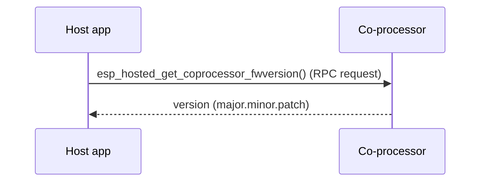

# get_cp_fw_version (`examples/system/get_cp_fw_version/`)

<!-- common-start -->
Smallest end-to-end ESP-Hosted scenario: bring up the host stack, open
a transport to the coprocessor, fetch the CP firmware version via
`eh_host_sys_get_cp_fw_version` (RPC `system` feature), print
`major.minor.patch` + revision / prerelease / build, exit. Used as
the bring-up smoke test for new ports — exercises every layer that
moves a single RPC round-trip, with no Wi-Fi / BT / OTA moving parts.

## Supported Platforms and Transports

### Supported Coprocessors

| Coprocessor | ESP32 | ESP32-C Series | ESP32-S Series |
| :----------: | :---: | :------------: | :------------: |
| Support     | Yes   | Yes            | Yes            |

### Supported Host Devices

| Host Device | ESP32-P4 | ESP32-H2 | Other MCUs | Linux |
| :---------: | :------: | :------: | :--------: | :---: |
| Support     | Yes | Yes | [Yes](https://github.com/espressif/esp-hosted/blob/master/docs/getting-started-mcu.md) | [Yes](https://github.com/espressif/esp-hosted/blob/master/docs/getting-started-linux.md) |

### Supported Connection buses

| Connection bus | SDIO | SPI Full-Duplex | SPI Half-Duplex | UART |
| :------------- | :--: | :-------------: | :-------------: | :--: |
| Linux host     | Yes  | Yes             | No              | No   |
| MCU host       | Yes  | Yes             | Yes             | Yes  |
<!-- common-stop -->

## Directory layout

```text
system/get_cp_fw_version/
├── cp/                  ESP coprocessor firmware
├── mcu_host/            ESP-IDF MCU host app
└── linux_802_3_host/    Linux host
     ├── c_app/          native C app
     ├── kmod/           kernel module
     └── py_app/         Python (ctypes) app
```

<table width="100%">
  <tr>
    <td width="50%" align="center" bgcolor="#e6f2ff">
      <h3><a href="#linux-host-setup"> Linux Host Setup</a></h3>
      <p><a href="#linux-cp">1. Coprocessor</a><br><a href="#linux-host">2. Linux Host</a></p>
    </td>
    <td width="50%" align="center" bgcolor="#f2ffe6">
      <h3><a href="#mcu-host-setup"> MCU Host Setup</a></h3>
      <p><a href="#mcu-cp">1. Coprocessor</a><br><a href="#mcu-host">2. MCU Host</a></p>
    </td>
  </tr>
</table>

---

<!-- common-start -->
## Scenario

The simplest control-path round trip — a single RPC request and its response. It is the transport-health gate: if this works, the link is up.


<!-- common-stop -->

> [!IMPORTANT]
> **New here? Get a base example working first.** Follow **[Getting Started: Linux](../../../docs/getting-started-linux.md)** or **[Getting Started: MCU](../../../docs/getting-started-mcu.md)** to wire the boards, install tools, choose a transport, and confirm the host↔co-processor handshake. The steps below only add what is specific to this example.

<h2 id="linux-host-setup"> Linux Host Setup</h2>

<h3 id="linux-cp">1. Coprocessor</h3>

Set up the tools once (from the repo root):

```bash
cd /path/to/esp_hosted
./install.sh      # install.fish for the fish shell
. ./export.sh     # . ./export.fish for the fish shell
```

The co-processor firmware needs no example-specific options — just select the transport:

```bash
cd examples/system/get_cp_fw_version/cp
eh.py set-target esp32c6
eh.py menuconfig
```

```text
Component config
└── ESP-Hosted
     └── Configure coprocessor
          └── CP transport
               ├── Communication bus (co-processor <== bus ==> host)
               │    ├── ( ) SPI Full Duplex
               │    ├── (X) SDIO                    <── default
               │    ├── ( ) SPI Half Duplex         ← MCU host only
               │    └── ( ) UART                    ← MCU host only
               └── SDIO Configuration               ← clock, GPIOs, checksum (defaults OK)
```

Each bus has its own settings submenu (pins, clock, checksum) — defaults are fine for bring-up.

CP dependency config is **pre-set in `sdkconfig.defaults`** (do not remove):

```text
CONFIG_ESP_HOSTED_CP_FEAT_WIFI=y   # Wi-Fi feature on the coprocessor (default)
CONFIG_BT_ENABLED=n                # BT controller off — not needed here
```

Then flash and monitor:

```bash
eh.py -p <cp_usb_serial_port> flash monitor
```

<h3 id="linux-host">2. Linux Host</h3>

> [!NOTE]
> Base wiring, OS setup, and transport bring-up live in [Getting Started: Linux](../../../docs/getting-started-linux.md). This section assumes that already works.

Set up the tools once (from the repo root):

```bash
cd /path/to/esp_hosted
./install.sh      # install.fish for the fish shell
. ./export.sh     # . ./export.fish for the fish shell
```

**Kernel module** (creates `ethsta0` / `ethap0` and `/dev/esps0`):

```bash
cd examples/system/get_cp_fw_version/linux_802_3_host/kmod
./build.sh --bus sdio --reload --reset-gpio 518 --clock-mhz 50
# SPI instead: ./build.sh --bus spi --reload --reset-gpio 518 --clock-mhz 10 --spi-mode 3
```

`--reload` builds, unloads, and reloads with the given module params. On SPI, start at `--clock-mhz 10`; once stable, raise it in steps to the co-processor's max SPI clock (see [Performance](../../../docs/design/performance.md)).

**Native C app** — the only example knob is the legacy compat-surface toggle:

```bash
cd examples/system/get_cp_fw_version/linux_802_3_host/c_app
eh.py set-target linux
eh.py menuconfig
```

```text
Example Configuration
└── [ ] Use legacy esp_hosted_* compat-surface main    <── default off
```

Host dependency config is **pre-set in `sdkconfig.defaults`** (do not remove):

```text
CONFIG_ESP_HOSTED_HOST_FEAT_RPC=y              # RPC control path
CONFIG_ESP_HOSTED_HOST_FEAT_RPC_EXT_V2=y       # RPC ext-v2 (required)
CONFIG_ESP_HOSTED_HOST_AUTO_FEAT_INIT=y        # auto-init hosted features at startup
CONFIG_ESP_HOSTED_HOST_FEAT_SYSTEM=y   # host System feature (FW version / heartbeat / OTA)
```

Then build and run:

```bash
eh.py build
eh.py run
```

**Python app** — same round-trip, no build-time options:

```bash
cd examples/system/get_cp_fw_version/linux_802_3_host/py_app
eh.py set-target linux
eh.py build
eh.py run
```

### 3. Verify

- The C demo prints `Coprocessor firmware version: <maj>.<min>.<pat>`
  on success. Non-zero exit = transport bring-up or RPC round-trip
  failed; see host log.

- The Linux C app optionally registers a handler for
  `ESP_HOSTED_EVENT_CP_INIT` to demonstrate the standard IDF event
  flow on top of the same round-trip — no event subscription is
  required for the version read itself.

---

<h2 id="mcu-host-setup"> MCU Host Setup</h2>

<h3 id="mcu-cp">1. Coprocessor</h3>

Set up the tools once (from the repo root):

```bash
cd /path/to/esp_hosted
./install.sh      # install.fish for the fish shell
. ./export.sh     # . ./export.fish for the fish shell
```

<!-- coprocessor-start -->
The co-processor firmware needs no example-specific options — just select the transport:

```bash
cd examples/system/get_cp_fw_version/cp
eh.py set-target esp32c6
eh.py menuconfig
```

```text
Component config
└── ESP-Hosted
     └── Configure coprocessor
          └── CP transport
               ├── Communication bus (co-processor <== bus ==> host)
               │    ├── ( ) SPI Full Duplex
               │    ├── (X) SDIO                    <── default
               │    ├── ( ) SPI Half Duplex         ← MCU host only
               │    └── ( ) UART                    ← MCU host only
               └── SDIO Configuration               ← clock, GPIOs, checksum (defaults OK)
```

Each bus has its own settings submenu (pins, clock, checksum) — defaults are fine for bring-up.

CP dependency config is **pre-set in `sdkconfig.defaults`** (do not remove):

```text
CONFIG_ESP_HOSTED_CP_FEAT_WIFI=y   # Wi-Fi feature on the coprocessor (default)
CONFIG_BT_ENABLED=n                # BT controller off — not needed here
```

Then flash and monitor:

```bash
eh.py -p <cp_usb_serial_port> flash monitor
```
<!-- coprocessor-stop -->

<h3 id="mcu-host">2. MCU Host</h3>

Set up the tools once (from the repo root):

```bash
cd /path/to/esp_hosted
./install.sh      # install.fish for the fish shell
. ./export.sh     # . ./export.fish for the fish shell
```

<!-- esp_host-start -->
Select the transport (must match the co-processor):

```bash
cd examples/system/get_cp_fw_version/mcu_host
eh.py set-target esp32p4
eh.py menuconfig
```

```text
Component config
└── ESP-Hosted
     └── Configure host
          └── Host transport
               ├── Communication bus (co-processor <== bus ==> host)
               │    ├── ( ) SPI Full Duplex
               │    ├── (X) SDIO                    <── default (match the co-processor)
               │    ├── ( ) SPI Half Duplex
               │    └── ( ) UART
               └── SDIO Configuration               ← slot, bus width, GPIOs (defaults OK)
```

```text
Example Configuration
└── [ ] Use legacy esp_hosted_* compat-surface main    <── default off
```

Host dependency config is **pre-set in `sdkconfig.defaults`** (do not remove):

```text
CONFIG_ESP_HOSTED_HOST_FEAT_RPC=y          # RPC control path
CONFIG_ESP_HOSTED_HOST_FEAT_RPC_EXT_V2=y   # RPC ext-v2 (required)
CONFIG_ESP_HOSTED_HOST_FEAT_SYSTEM=y       # system feature — serves the CP fw-version query
```

Then flash and monitor:

```bash
eh.py -p <host_usb_serial_port> flash monitor
```
<!-- esp_host-stop -->

### 3. Verify

- The demo prints `Coprocessor firmware version: <maj>.<min>.<pat>` on the host console once the transport and RPC round-trip succeed; if it does not appear, check the host log for transport / RPC bring-up errors.
- Optionally the app registers a handler for `ESP_HOSTED_EVENT_CP_INIT` to show the standard IDF event flow on top of the same round-trip — not required for the version read itself.
