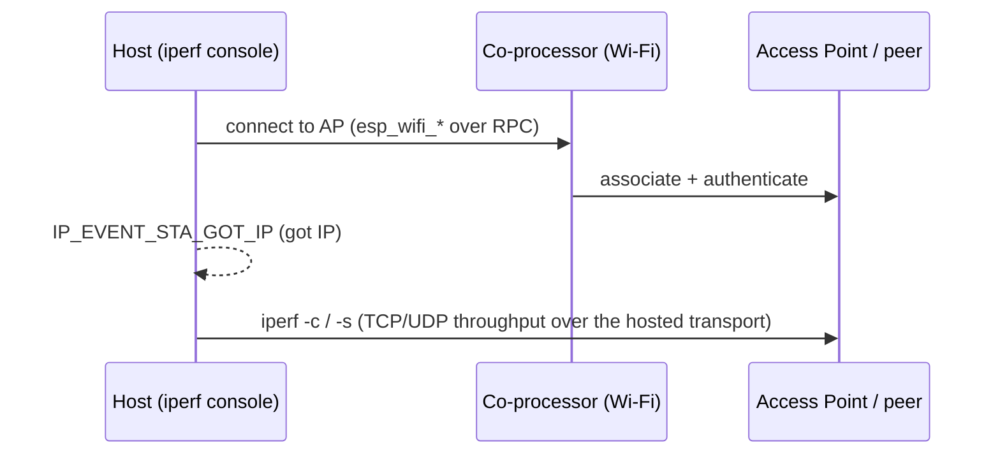

# Wi-Fi iperf (`wifi/iperf`)

<!-- common-start -->
Wi-Fi throughput benchmark. The Wi-Fi radio runs on the **coprocessor**; the **host** runs the upstream IDF `wifi/iperf` console app, with its `esp_wifi_*` calls routed to the coprocessor over ESP-Hosted. Associate with an AP, then drive TCP/UDP iperf from the console to measure end-to-end throughput across the hosted transport.

`mcu_host/main/iperf_example_main.c` is the upstream IDF `wifi/iperf` example, unchanged; the hosted layer adds only dependency wiring and throughput-tuned host `sdkconfig.defaults`.

## Supported Platforms and Transports

### Supported Coprocessors

| Coprocessor | ESP32 | ESP32-C Series | ESP32-S Series |
| :----------: | :---: | :------------: | :------------: |
| Support     | Yes   | Yes            | Yes            |

### Supported Host Devices

| Host Device | ESP32-P4 | ESP32-H2 | Other MCUs | Linux |
| :---------: | :------: | :------: | :--------: | :---: |
| Support     | Yes | Yes | [Yes](https://github.com/espressif/esp-hosted/blob/master/docs/getting-started-mcu.md) | [Yes](https://github.com/espressif/esp-hosted/blob/master/docs/getting-started-linux.md) |

### Supported Connection buses

| Connection bus | SDIO | SPI Full-Duplex | SPI Half-Duplex | UART |
| :------------- | :--: | :-------------: | :-------------: | :--: |
| Linux host     | Yes  | Yes             | No              | No   |
| MCU host       | Yes  | Yes             | Yes             | Yes  |
<!-- common-stop -->

## Directory layout

```text
wifi/iperf/
├── cp/            ESP coprocessor firmware
└── mcu_host/      ESP-IDF MCU host app
```

<table width="100%">
  <tr>
    <td width="100%" align="center" bgcolor="#f2ffe6">
      <h3><a href="#mcu-host-setup"> MCU Host Setup</a></h3>
      <p><a href="#mcu-cp">1. Coprocessor</a><br><a href="#mcu-host">2. MCU Host</a></p>
    </td>
  </tr>
</table>

---

<!-- common-start -->
## Scenario

The host associates as a Wi-Fi station through the coprocessor, obtains an IP over the hosted netif, then drives iperf/ping from its console to benchmark the link.


<!-- common-stop -->

> [!IMPORTANT]
> **New here? Get a base example working first.** Follow **[Getting Started: MCU](../../../docs/getting-started-mcu.md)** to wire the boards, install tools, choose a transport, and confirm the host↔co-processor handshake. The steps below only add what is specific to this example.

<h2 id="mcu-host-setup"> MCU Host Setup</h2>

<h3 id="mcu-cp">1. Coprocessor</h3>

Set up the tools once (from the repo root):

```bash
cd /path/to/esp_hosted
./install.sh      # install.fish for the fish shell
. ./export.sh     # . ./export.fish for the fish shell
```

<!-- coprocessor-start -->
The Wi-Fi radio runs on the co-processor firmware (`CONFIG_ESP_HOSTED_CP_FEAT_WIFI=y`, preset in `cp/sdkconfig.defaults`) — no extra option to enable. Select the transport (**SDIO** gives the best throughput):

```bash
cd examples/wifi/iperf/cp
eh.py set-target esp32c5
eh.py menuconfig
```

```text
Component config
└── ESP-Hosted
     └── Configure coprocessor
          └── CP transport
               ├── Communication bus (co-processor <== bus ==> host)
               │    ├── ( ) SPI Full Duplex
               │    ├── (X) SDIO                    <── default
               │    ├── ( ) SPI Half Duplex         ← MCU host only
               │    └── ( ) UART                    ← MCU host only
               └── SDIO Configuration               ← clock, GPIOs, checksum (defaults OK)
```

The CP dependency config is **pre-set in `cp/sdkconfig.defaults`** (do not remove):

```text
CONFIG_ESP_HOSTED_CP_FEAT_WIFI=y               # Wi-Fi (default CP feature)
CONFIG_BT_ENABLED=n                            # BT off (unused by this example)
```

Then flash and monitor:

```bash
eh.py -p <cp_usb_serial_port> flash monitor
```
<!-- coprocessor-stop -->

<h3 id="mcu-host">2. MCU Host</h3>

Set up the tools once (from the repo root):

```bash
cd /path/to/esp_hosted
./install.sh      # install.fish for the fish shell
. ./export.sh     # . ./export.fish for the fish shell
```

<!-- esp_host-start -->
Select the transport (must match the co-processor). Wi-Fi credentials are entered at runtime on the console, not in menuconfig:

```bash
cd examples/wifi/iperf/mcu_host
eh.py set-target esp32p4
eh.py menuconfig
```

```text
Component config
└── ESP-Hosted
     └── Configure host
          └── Host transport
               ├── Communication bus (co-processor <== bus ==> host)
               │    ├── ( ) SPI Full Duplex
               │    ├── (X) SDIO                    <── default (match the co-processor)
               │    ├── ( ) SPI Half Duplex
               │    └── ( ) UART
               └── SDIO Configuration               ← slot, bus width, GPIOs (defaults OK)
```

The host dependency + throughput config is **pre-set in `mcu_host/sdkconfig.defaults`** (do not remove):

```text
CONFIG_ESP_HOSTED_HOST_FEAT_RPC=y          # RPC control path to the CP
CONFIG_ESP_HOSTED_HOST_FEAT_RPC_EXT_V2=y   # RPC ext-v2 wire (required)
CONFIG_ESP_HOSTED_HOST_FEAT_SYSTEM=y       # system RPCs
CONFIG_ESP_HOSTED_HOST_FEAT_WIFI=y         # host Wi-Fi feature — routes esp_wifi_* to the CP
```

The defaults also raise Wi-Fi AMPDU windows and LWIP TCP/UDP buffers for throughput — keep them for representative numbers. Then flash and monitor:

```bash
eh.py -p <host_usb_serial_port> flash monitor
```
<!-- esp_host-stop -->

### 3. Verify

The host boots into a console built from the upstream `wifi_cmd`, `iperf_cmd` and `ping_cmd` components — type `help` for the full command list. Typical flow:

- associate with your AP using the `wifi_cmd` station command, wait for `got IP`;
- run `iperf` as server on one side and client on the other to benchmark throughput;
- use `ping` for a quick latency / reachability check.
