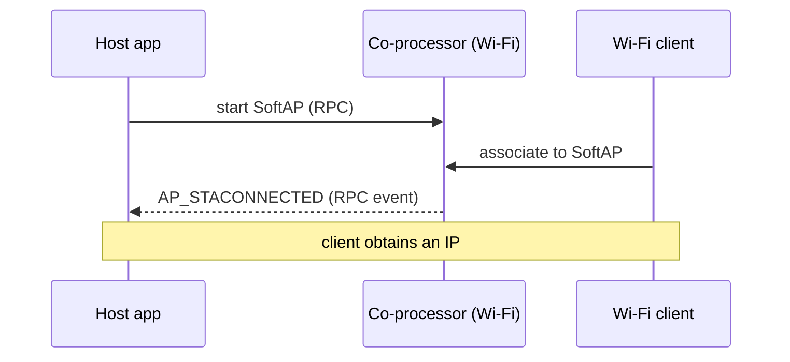

# Wi-Fi softap (`wifi/softap`)

<!-- common-start -->
Run a Wi-Fi **SoftAP** (access point) with the radio on the **coprocessor** and the application on the **host**. `mcu_host/main/softap_example_main.c` is a byte-for-byte copy of upstream IDF `wifi/getting_started/softAP`. Starting the AP netif auto-spawns a DHCP server (dnsmasq / udhcpd) on `192.168.4.1/24` so client STAs get an address out of the box.

## Supported Platforms and Transports

### Supported Coprocessors

| Coprocessor | ESP32 | ESP32-C Series | ESP32-S Series |
| :----------: | :---: | :------------: | :------------: |
| Support     | Yes   | Yes            | Yes            |

### Supported Host Devices

| Host Device | ESP32-P4 | ESP32-H2 | Other MCUs | Linux |
| :---------: | :------: | :------: | :--------: | :---: |
| Support     | Yes | Yes | [Yes](https://github.com/espressif/esp-hosted/blob/master/docs/getting-started-mcu.md) | [Yes](https://github.com/espressif/esp-hosted/blob/master/docs/getting-started-linux.md) |

### Supported Connection buses

| Connection bus | SDIO | SPI Full-Duplex | SPI Half-Duplex | UART |
| :------------- | :--: | :-------------: | :-------------: | :--: |
| Linux host     | Yes  | Yes             | No              | No   |
| MCU host       | Yes  | Yes             | Yes             | Yes  |
<!-- common-stop -->

## Directory layout

```text
wifi/softap/
├── cp/                  ESP coprocessor firmware
├── mcu_host/            ESP-IDF MCU host app
└── linux_802_3_host/    Linux host
     ├── c_app/          native C app
     └── kmod/           kernel module
```

<table width="100%">
  <tr>
    <td width="50%" align="center" bgcolor="#e6f2ff">
      <h3><a href="#linux-host-setup"> Linux Host Setup</a></h3>
      <p><a href="#linux-cp">1. Coprocessor</a><br><a href="#linux-host">2. Linux Host</a></p>
    </td>
    <td width="50%" align="center" bgcolor="#f2ffe6">
      <h3><a href="#mcu-host-setup"> MCU Host Setup</a></h3>
      <p><a href="#mcu-cp">1. Coprocessor</a><br><a href="#mcu-host">2. MCU Host</a></p>
    </td>
  </tr>
</table>

---

<!-- common-start -->
## Scenario

The host starts a SoftAP on the co-processor's radio; clients associate to it and the host is notified per client.


<!-- common-stop -->

> [!IMPORTANT]
> **New here? Get a base example working first.** Follow **[Getting Started: Linux](../../../docs/getting-started-linux.md)** or **[Getting Started: MCU](../../../docs/getting-started-mcu.md)** to wire the boards, install tools, choose a transport, and confirm the host↔co-processor handshake. The steps below only add what is specific to this example.

<h2 id="linux-host-setup"> Linux Host Setup</h2>

<h3 id="linux-cp">1. Coprocessor</h3>

Set up the tools once (from the repo root):

```bash
cd /path/to/esp_hosted
./install.sh      # install.fish for the fish shell
. ./export.sh     # . ./export.fish for the fish shell
```

The Wi-Fi radio runs on the co-processor firmware — no extra option to enable. Select the transport:

```bash
cd examples/wifi/softap/cp
eh.py set-target esp32c6
eh.py menuconfig
```

```text
Component config
└── ESP-Hosted
     └── Configure coprocessor
          └── CP transport
               ├── Communication bus (co-processor <== bus ==> host)
               │    ├── ( ) SPI Full Duplex
               │    ├── (X) SDIO                    <── default
               │    ├── ( ) SPI Half Duplex         ← MCU host only
               │    └── ( ) UART                    ← MCU host only
               └── SDIO Configuration               ← clock, GPIOs, checksum (defaults OK)
```

Each bus has its own settings submenu (pins, clock, checksum) — defaults are fine for bring-up.

Wi-Fi is the default CP feature — no extra dependency config (`CONFIG_ESP_HOSTED_CP_FEAT_WIFI=y` is already set in `cp/sdkconfig.defaults`). Then flash and monitor:

```bash
eh.py -p <cp_usb_serial_port> flash monitor
```

<h3 id="linux-host">2. Linux Host</h3>

> [!NOTE]
> Base wiring, OS setup, and transport bring-up live in [Getting Started: Linux](../../../docs/getting-started-linux.md). This section assumes that already works.

Set up the tools once (from the repo root):

```bash
cd /path/to/esp_hosted
./install.sh      # install.fish for the fish shell
. ./export.sh     # . ./export.fish for the fish shell
```

**Kernel module** (creates `ethsta0` / `ethap0` and `/dev/esps0`):

```bash
cd examples/wifi/softap/linux_802_3_host/kmod
./build.sh --bus sdio --reload --reset-gpio 518 --clock-mhz 50
# SPI instead: ./build.sh --bus spi --reload --reset-gpio 518 --clock-mhz 10 --spi-mode 3
```

`--reload` builds, unloads, and reloads with the given module params. On SPI, start at `--clock-mhz 10`; once stable, raise it in steps to the co-processor's max SPI clock (see [Performance](../../../docs/design/performance.md)).

**Native C app** — set the SoftAP credentials:

```bash
cd examples/wifi/softap/linux_802_3_host/c_app
eh.py set-target linux
eh.py menuconfig
```

```text
Example Configuration
├── [ ] Use legacy esp_hosted_* compat-surface main
├── (myssid) WiFi SoftAP SSID
├── (mypassword) WiFi SoftAP Password
├── (1) WiFi SoftAP Channel
└── (4) Max station connections
```

Host dependency config is **pre-set in `linux_802_3_host/c_app/sdkconfig.defaults`** (do not remove):

```text
CONFIG_ESP_HOSTED_HOST_FEAT_RPC=y              # RPC control path to the CP
CONFIG_ESP_HOSTED_HOST_FEAT_RPC_EXT_V2=y       # RPC ext-v2 wire (required)
CONFIG_ESP_HOSTED_HOST_FEAT_WIFI=y             # host Wi-Fi feature
CONFIG_ESP_HOSTED_HOST_AUTO_FEAT_INIT=y        # auto-init features at boot (Linux host)
CONFIG_ESP_HOSTED_HOST_FEAT_SYSTEM=y   # host System feature (FW version / heartbeat / OTA)
CONFIG_ESP_HOSTED_HOST_FEAT_WIFI_AUTO_INIT=y   # auto-init Wi-Fi feature
```

Then build and run:

```bash
eh.py build
eh.py run
```

### 3. Verify

- The Linux C app exists in two flavours sharing `main/`: native (`main.c`, `eh_host_*`) and legacy esp_hosted compat (`legacy/main.c`), selected by `CONFIG_EH_USE_LEGACY_API`.
- AP DHCP server is auto-spawned on the host the moment the AP netif starts; no extra commands needed.
- `linux_802_3_host/py_app/` ctypes binding still needs a `make_ap_config()` helper before it can set SoftAP SSID / auth — tracked as a follow-up.

---

<h2 id="mcu-host-setup"> MCU Host Setup</h2>

<h3 id="mcu-cp">1. Coprocessor</h3>

Set up the tools once (from the repo root):

```bash
cd /path/to/esp_hosted
./install.sh      # install.fish for the fish shell
. ./export.sh     # . ./export.fish for the fish shell
```

<!-- coprocessor-start -->
The Wi-Fi radio runs on the co-processor firmware — no extra option to enable. Select the transport:

```bash
cd examples/wifi/softap/cp
eh.py set-target esp32c6
eh.py menuconfig
```

```text
Component config
└── ESP-Hosted
     └── Configure coprocessor
          └── CP transport
               ├── Communication bus (co-processor <== bus ==> host)
               │    ├── ( ) SPI Full Duplex
               │    ├── (X) SDIO                    <── default
               │    ├── ( ) SPI Half Duplex         ← MCU host only
               │    └── ( ) UART                    ← MCU host only
               └── SDIO Configuration               ← clock, GPIOs, checksum (defaults OK)
```

Each bus has its own settings submenu (pins, clock, checksum) — defaults are fine for bring-up.

Wi-Fi is the default CP feature — no extra dependency config (`CONFIG_ESP_HOSTED_CP_FEAT_WIFI=y` is already set in `cp/sdkconfig.defaults`). Then flash and monitor:

```bash
eh.py -p <cp_usb_serial_port> flash monitor
```
<!-- coprocessor-stop -->

<h3 id="mcu-host">2. MCU Host</h3>

Set up the tools once (from the repo root):

```bash
cd /path/to/esp_hosted
./install.sh      # install.fish for the fish shell
. ./export.sh     # . ./export.fish for the fish shell
```

<!-- esp_host-start -->
Select the transport (must match the co-processor) and set the SoftAP credentials:

```bash
cd examples/wifi/softap/mcu_host
eh.py set-target esp32p4
eh.py menuconfig
```

```text
Component config
└── ESP-Hosted
     └── Configure host
          └── Host transport
               ├── Communication bus (co-processor <== bus ==> host)
               │    ├── ( ) SPI Full Duplex
               │    ├── (X) SDIO                    <── default (match the co-processor)
               │    ├── ( ) SPI Half Duplex
               │    └── ( ) UART
               └── SDIO Configuration               ← slot, bus width, GPIOs (defaults OK)
```

```text
Example Configuration
├── (myssid) WiFi SSID
├── (mypassword) WiFi Password
├── (1) WiFi Channel
├── (4) Maximal STA connections
├── [*] Enable GTK Rekeying
└── (600) GTK rekey interval                  ← when GTK rekeying enabled
```

Host dependency config is **pre-set in `mcu_host/sdkconfig.defaults`** (do not remove):

```text
CONFIG_ESP_HOSTED_HOST_FEAT_RPC=y          # RPC control path to the CP
CONFIG_ESP_HOSTED_HOST_FEAT_RPC_EXT_V2=y   # RPC ext-v2 wire (required)
CONFIG_ESP_HOSTED_HOST_FEAT_SYSTEM=y       # system RPCs
CONFIG_ESP_HOSTED_HOST_FEAT_WIFI=y         # host Wi-Fi feature — routes esp_wifi_* to the CP
```

Then flash and monitor:

```bash
eh.py -p <host_usb_serial_port> flash monitor
```
<!-- esp_host-stop -->

### 3. Verify

- The host boots and receives the co-processor init event.
- The SoftAP starts with the configured SSID / auth; a client can associate.
- The host auto-spawns the AP DHCP server when the AP netif comes up, so associated clients get a lease with no extra commands.
