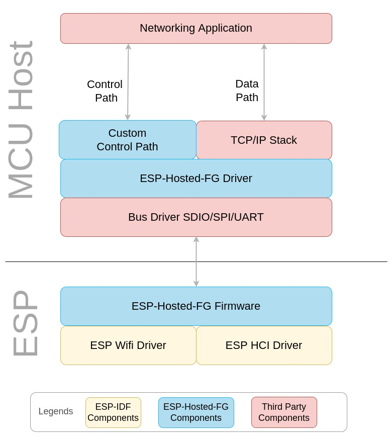
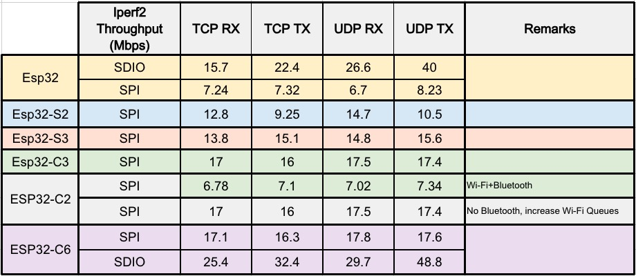

# ESP-Hosted-FG

# Index
<details>
<summary>Table of Contents</summary>

* [**1. Introduction**](#1-introduction)
	* [Connectivity Features](#11-connectivity-features)
	* [Supported ESP boards](#12-supported-esp-boards)
	* [Supported Hosts](#13-supported-hosts)
	* [Supported Transports](#14-supported-transports)
	* [Feature Matrix](#15-feature-matrix)
* [**2. Coprocessor Setup**](#2-coprocessor-setup)
	* [ESP-IDF Setup](#21-esp-idf-setup)
	* [Building Coprocessor Examples](#22-building-coprocessor-examples)
	* [Flashing the Coprocessor](#23-flashing-the-coprocessor)
* [**3. Host Setup**](#3-host-setup)
	* [MCU Host Setup](#31-mcu-host-setup)
	* [Linux Host Setup](#32-linux-host-setup)
* [**4. Control Path and Demo Applications**](#4-control-path-and-demo-applications)
	* [Control Path Design](#41-control-path-design)
	* [Host Setup: Kernel Module and User Applications](#42-host-setup-kernel-module-and-user-applications)
	* [Control Path APIs](#43-control-path-apis)
	* [Demo Applications](#44-demo-applications)
	* [Quick Start Evaluation](#45-quick-start-evaluation)
* [**5. Design**](#5-design)
	* [System Architecture](#51-system-architecture)
	* [Transport layer communication protocol](#52-transport-layer-communication-protocol)
	* [Integration Guide](#53-integration-guide)
* [**6. Throughput performance**](#6-throughput-performance)

</details>

---


# 1. Introduction

This version of ESP-Hosted provides:
* A standard 802.3 network interface for transmitting and receiving 802.3 frames
* A standard HCI interface over which Bluetooth/BLE is supported
* A control interface to configure and control Wi-Fi on ESP board

ESP-Hosted-FG solution makes use of host's existing `TCP/IP and/or Bluetooth/BLE software stack` and `hardware peripheral like SPI/SDIO/UART` to connect to ESP firmware with very thin layer of software.

Although the project doesn't provide a standard 802.11 interface to the host, it provides a easy way, *i.e.* [control path](docs/common/contrl_path.md), to configure Wi-Fi. For the control path between the host and ESP board, ESP-Hosted-FG makes use of [Protobuf](https://developers.google.com/protocol-buffers), which is a language independent data serialization mechanism.

### 1.1 Connectivity Features

ESP-Hosted-FG solution provides following WLAN and BT/BLE features to the host:
- WLAN Features:
	- 802.11b/g/n
	- WLAN Station
	- WLAN Soft AP
- BT/BLE Features:
	- ESP32 supports BR/EDR and BLE with v4.2
	- ESP32-C2/C3/S3 supports BLE v4.2 and v5.0
	- ESP32-C6 supports BLE 5.3

### 1.2 Supported ESP boards

ESP-Hosted-FG solution is supported on following ESP boards:

| Supported Targets | ESP32 | ESP32-S2 | ESP32-S3 | ESP32-C2 | ESP32-C3 | ESP32-C5 | ESP32-C6 |
| ----------------- | ----- | -------- | -------- | -------- | -------- | -------- | -------- |

### 1.3 Supported Hosts

* As mentioned earlier, this version of the solution is primarily targeted to work with MCU based hosts.
* Though this solution works with Linux hosts, we recommend other [ESP-Hosted-NG](../esp_hosted_ng) flavour for Linux hosts.
* ESP-Hosted-FG solution showcase examples for following Linux based and MCU based hosts out of the box.
	* MCU Based Hosts
	  * STM32 Discovery Board (STM32F469I-DISCO)
	  * STM32F412ZGT6-Nucleo 144
	* Linux Based Hosts
		* Raspberry-Pi 3 Model B
		* Raspberry-Pi 3 Model B+
		* Raspberry-Pi 4 Model B
* You can port this solution to other Linux and MCU platforms using [porting guide](docs/Linux_based_host/porting_guide.md)

### 1.4 Supported Transports

* SDIO Only
    * Wi-Fi and Bluetooth, traffic for both runs over SDIO
* SDIO+UART
    * Wi-Fi runs over SDIO and Bluetooth runs over UART
* SPI Only
    * Wi-Fi and Bluetooth, traffic for both runs over SPI
* SPI+UART
    * Wi-Fi runs over SPI and Bluetooth runs over UART

Different ESP chipset support different set of peripherals. Below is features supported matrix for Linux & MCU.
In this matrix, Each feature is by default enabled & supported with every transport in left.
Any Unwanted feature can be turned off with config change.

### 1.5 Feature Matrix
##### 1.5.1 Linux Host
The below table explains which feature is supported on which transport interface for Linux based host.

| ESP Chipset | Transport options | Linux Features supported |
| -------: | :-------: | :-------: |
| <a></a> | <a></a><br/><a></a><br/><a></a><br/><a></a> | <a></a><br/><a></a><br/><a></a> |
| <a></a> | <a></a><br/><a></a><br/><a></a><br/><a></a> | <a></a><br/><a></a> |
| <a></a> | <a></a><br/><a></a><br/><a></a><br/><a></a><br/> | <a></a><br/><a></a><br/><a></a> |
| <a></a> | <a></a> | <a></a> |
| <a></a><br/><a></a><br/><a></a> | <a></a><br/><a></a> | <a></a><br/><a></a> |


> [!NOTE]
> - ESP-Hosted-FG related BR/EDR 4.2 and BLE 4.2 functionalities are tested with bluez 5.43+. Whereas, BLE 5.0 functionalities are tested with bluez 5.45+.
> - Suggested to use latest stable bluez version.
> - bluez 5.45 on-wards BLE 5.0 HCI commands are supported.
> - BLE 5.0 has backward compatibility of BLE 4.2.

##### 1.5.2 MCU Host

> [!CAUTION]
>
> MCU support in ESP-Hosted-FG is now deprecated. For all MCU-based applications, please use the dedicated [ESP-Hosted-MCU repository](https://github.com/espressif/esp-hosted-mcu) instead. The information below is kept for backward compatibility only.

The below table explains which feature is supported on which transport interface for MCU based host.

| ESP Chipset | Transport options | MCU Features supported |
| -------: | :-------: | :-------: |
| <a></a> | <a></a><br/><a></a><br/><a></a><br/><a></a> | <a></a><br/><a></a><br/><a></a> |
| <a></a> | <a></a><br/><a></a> | <a></a><br/><a></a> |
| <a></a> | <a></a> | <a></a> |
| <a></a><br/><a></a><br/><a></a> | <a></a><br/><a></a> | <a></a><br/><a></a> |


Note:
-  Bluetooth at MCU
  - UART is supported from ESP slave side. But not verified from MCU as Host (Works fine with Linux as host)
  - If you have ported Bluetooth host stack on MCU, you can use ESP32 bluetooth controller in slave mode.
  - BT/BLE over SPI/SDIO
    - BT/BLE support over SPI/SDIO is not readily available. In order to implement it, one needs to:
    - Port BT/BLE stack to MCU
    - Add a new virtual serial interface using the serial interface API's provided in host driver of ESP-Hosted-FG solution.
    - HCI implementation in Linux Driver `esp_hosted_fg/host/linux/kmod` could be used as reference. Search keyword: `ESP_HCI_IF`
    - Register this serial interface with BT/BLE stack as a HCI interface.
  - BT/BLE over UART
    - BT/BLE support over UART is not readily available. In order to implement this, one needs to:
    - Port BT/BLE stack to MCU
    - Register the UART serial interface as a HCI interface with BT/BLE stack
    - With the help of this UART interface, BT/BLE stack can directly interact with BT controller present on ESP bypassing host driver and firmware
    - ESP Hosted host driver and a firmware plays no role in this communication
- OTA
  - Linux hosts support OTA update (Over The Air ESP firmware update) in C and python
  - MCU hosts can refer to the same for their development
  - For detailed documentation, please read [ota_update.md](docs/Linux_based_host/ota_update.md).


---

# 2. Coprocessor Setup

The ESP coprocessor (slave) setup is the first step in using ESP-Hosted-FG. This section covers setting up the ESP-IDF environment and building the coprocessor firmware.

### 2.1 ESP-IDF Setup

1. **Install ESP-IDF**: Follow the [ESP-IDF Getting Started Guide](https://docs.espressif.com/projects/esp-idf/en/latest/esp32/get-started/index.html) for your platform.

2. **Setup ESP-IDF for ESP-Hosted**:
   ```bash
   cd esp_hosted_fg/coprocessor/sdk_esp_idf_setup
   ./setup-idf.sh
   ```

   For Windows users, see [Windows Setup Guide](coprocessor/sdk_esp_idf_setup/setup_windows11.md).

### 2.2 Building Coprocessor Examples

ESP-Hosted-FG provides several coprocessor examples:

```
coprocessor/examples/
├── minimal/ (Recommended for most users)
│   ├── wifi/           # WiFi-only
│   └── bt/             # Bluetooth-only
└── extensions/ (Advanced features)
    ├── custom_rpc_msg/ # Custom RPC
    └── network_split/  # Network Split
```

**Build Steps:**
```bash
cd esp_hosted_fg/coprocessor/examples/minimal/wifi
idf.py set-target esp32c3  # or your target chip
idf.py build
```

### 2.3 Flashing the Coprocessor

```bash
idf.py flash monitor
```

For detailed build instructions, see the README in each example directory.

# 3. Host Setup

Once the coprocessor is flashed and running, set up the host side.

### 3.1 MCU Host Setup

> [!CAUTION]
>
> MCU support in ESP-Hosted-FG is now deprecated. For all MCU-based applications, please use the dedicated [ESP-Hosted-MCU repository](https://github.com/espressif/esp-hosted-mcu) instead. The information below is kept for reference purposes only.

### 3.2 Linux Host Setup
Please refer to the [Linux Host Setup Guide](docs/Linux_based_host/Linux_based_readme.md).

---

# 4. Control Path and Demo Applications

Once ESP-Hosted-FG transport is set up, getting control path working is the first step to verify if the transport is set up correctly. Control path works over ESP-Hosted-FG transport (*i.e.* SPI or SDIO) and leverages a way to control and manage ESP from host.

### 4.1 Control Path Design

The control path uses a layered architecture with the `esp_hosted_rpc_lib` (Hosted Control Library) as the core component:

```
┌─────────────────────────────────────────────────────────────┐
│                    Demo Applications                        │
│  ┌─────────────────┐  ┌─────────────────┐  ┌─────────────┐  │
│  │   test.out      │  │ hosted_shell.out│  │   test.py   │  │
│  │   (C Demo)      │  │ (Interactive)   │  │ (Python)    │  │
│  └─────────────────┘  └─────────────────┘  └─────────────┘  │
└─────────────────────────────────────────────────────────────┘
                              │
                              ▼
┌─────────────────────────────────────────────────────────────┐
│                   Control Path APIs                         │
│                    (ctrl_api.h)                             │
└─────────────────────────────────────────────────────────────┘
                              │
                              ▼
┌─────────────────────────────────────────────────────────────┐
│              esp_hosted_rpc_lib                             │
│            (Hosted Control Library)                         │
│  • Protobuf encoding/decoding                               │
│  • Request/Response handling                                │
│  • Event subscription management                            │
└─────────────────────────────────────────────────────────────┘
                              │
                              ▼
┌─────────────────────────────────────────────────────────────┐
│              Virtual Serial Interface                       │
│            (Platform Independent)                           │
└─────────────────────────────────────────────────────────────┘
                              │
                              ▼
┌─────────────────────────────────────────────────────────────┐
│                Serial Driver                                │
│            (Platform Specific)                              │
└─────────────────────────────────────────────────────────────┘
                              │
                              ▼
┌─────────────────────────────────────────────────────────────┐
│            ESP-Hosted Transport                             │
│              (SPI/SDIO/UART)                                │
└─────────────────────────────────────────────────────────────┘
```

**Key Components:**
- **esp_hosted_rpc_lib**: Core library that handles protobuf serialization, RPC communication, and event management
- **Control Path APIs**: High-level APIs exposed to applications for ESP configuration and control
- **Virtual Serial Interface**: Platform-independent abstraction layer
- **Serial Driver**: Platform-specific implementation for transport communication

For detailed design information, see [Control Path Design](docs/common/contrl_path.md).

### 4.2 Host Setup: Kernel Module and User Applications

#### 4.2.1 Kernel Module Building and Loading

The host setup involves building and loading the ESP-Hosted kernel module:

```bash
# Navigate to Linux scripts directory
cd esp_hosted_fg/host/linux/scripts/

# Build and load kernel module (choose transport and options)
./esp_kmod_up.sh wifi=spi resetpin=6    # For SPI transport
./esp_kmod_up.sh wifi=sdio resetpin=6   # For SDIO transport

# With Bluetooth support
./esp_kmod_up.sh wifi=spi bt=spi resetpin=6        # Wi-Fi + BT over SPI
./esp_kmod_up.sh wifi=spi bt=uart_2pins resetpin=6 # Wi-Fi over SPI, BT over UART
```

This script:
- Compiles the kernel module for your transport (SPI/SDIO)
- Loads the module into the kernel with specified parameters
- Creates network interfaces (`ethsta0`, `ethap0`)
- Sets up the control path communication channel

**Key Parameters:**
- `wifi=spi|sdio|-` - Wi-Fi transport (use `-` to disable)
- `bt=spi|sdio|uart_2pins|uart_4pins|-` - Bluetooth transport (use `-` to disable)
- `resetpin=<gpio>` - GPIO pin for ESP reset (mandatory)
- `clockspeed=<mhz>` - SPI/SDIO clock frequency (optional)

#### 4.2.2 User Applications: Building and Running

After the kernel module is loaded, build and run the user applications:

##### C Applications

```bash
# Navigate to Linux scripts directory
cd esp_hosted_fg/host/linux/scripts/

# Build all C applications using the build script
./c_app_build.sh

# This creates binaries in: esp_hosted_fg/host/linux/scripts/bin/
# Available applications:
# - test.out: Basic demo application
# - hosted_shell.out: Interactive shell (requires replxx library)
# - hosted_daemon.out: Background network management daemon
# - stress.out: Stress testing application
```

**Manual Building (Alternative):**
```bash
# Navigate to C demo app directory
cd esp_hosted_fg/host/linux/user_space/c_demo_app/

# Install replxx library for interactive shell (optional)
git clone https://github.com/AmokHuginnsson/replxx.git
cd replxx && make && sudo make install

# Build applications
cd esp_hosted_fg/host/linux/user_space/c_demo_app/
make clean && make
```

##### Python Applications

```bash

# Install Python dependencies
bash ../user_space/python_demo_app/setup_python.sh
OR,
sudo python3 -m pip install prompt_toolkit fire argparse docstring_parser requests

# Or use virtual environment if you get externally-managed-environment error:
python3 -m venv my-venv
my-venv/bin/pip install prompt_toolkit fire argparse docstring_parser requests

# Navigate to Linux scripts directory
cd esp_hosted_fg/host/linux/scripts/

# Build Python applications (builds required RPC library)
./py_app_build.sh
# Run Python applications
sudo LD_LIBRARY_PATH=./build_py/control_lib_build python3 ../user_space/python_demo_app/test.py
```

**Alternative Python Setup:**
```bash
# Navigate to Python demo app directory
cd esp_hosted_fg/host/linux/user_space/python_demo_app/

# Use the setup script
./setup_python.sh

# Run applications
sudo python3 test.py          # Interactive mode
sudo python3 test.py --help   # See available commands
```

### 4.3 Control Path APIs

The control path provides comprehensive APIs for ESP configuration and management:

- **Wi-Fi Management**: Station mode, SoftAP mode, scanning, power management
- **Bluetooth Control**: Enable/disable BT, HCI interface management
- **System Control**: Firmware version, OTA updates, driver control
- **Network Configuration**: DHCP, DNS, country code settings
- **Custom RPC**: Application-specific communication between host and ESP

These Control APIs are common for both **Linux** and **MCU** based solutions and are documented in detail at [Control Path APIs](docs/common/ctrl_apis.md).

### 4.4 Demo Applications

#### 4.4.1 C Demo Applications


- Build all apps using script
```
cd esp_hosted_fg/host/linux/scripts
./c_app_build.sh
```

**Interactive Shell (hosted_shell.out)**
```bash
# Start interactive shell
sudo ./bin/hosted_shell.out

# In the shell, use tab completion and help
hosted> help
hosted> connect_ap --help
hosted> connect_ap --ssid "MyNetwork" --password "MyPassword"
```

**Basic Demo (test.out)**

- Config
Change `../user_space/c_demo_app/ctrl_config.h` as per your environment.

- Rebuild for change
./c_app_build.sh

# Run basic commands
```
sudo ./bin/test.out # list all supported commands
sudo ./bin/test.out get_wifi_mode
sudo ./bin/test.out get_ap_scan_list
sudo ./bin/test.out sta_connect
sudo ./bin/test.out softap_start
...
...

```

**Network Daemon (hosted_daemon.out)**
This is helpful to run the C app as daemon. This is typically helpful to auto IP retrival from coprocessor, so you do not need to fire any command and IP would be set on `ethsta0` when used with [Network Split mode](docs/Linux_based_host/Network_Split.md). See [Auto Network Setup](docs/Linux_based_host/Auto_Network_Setup.md) for details.

```bash
# Run as background daemon
sudo ./hosted_daemon.out

# Run in foreground for debugging
sudo ./hosted_daemon.out -f
```

For detailed C demo documentation, see [C Demo App Guide](docs/common/c_demo.md).

#### 4.4.2 Python Demo Applications

**Interactive Mode**
Works in CLI mode, with rich set of command history, auto command and auto arguments suggestions.

```bash
sudo python3 test.py

hosted > help
hosted > connect_ap --ssid SaveEarth --pwd PlantMoreTrees123
hosted > get_connected_ap_info
hosted > exit
```

**Shell Mode (Single Command)**
```bash
sudo python3 test.py connect_ap --ssid SaveEarth --pwd PlantMoreTrees123
sudo python3 test.py get_available_ap
sudo python3 test.py ota_update "http://192.168.1.100:8000/firmware.bin"
```

For detailed Python demo documentation, see [Python Demo App Guide](docs/common/python_demo.md).

### 4.5 Quick Start Evaluation

**Impatient to evaluate?** Follow our intuitive [Python based CLI](docs/common/python_demo.md#modes-supported) to quickly set up and test the control path:

1. **Hardware Setup**: Set up hardware connections (see transport setup guides)
2. **ESP Firmware**: Flash ESP coprocessor firmware
3. **Host Kernel Module**: Build and load host kernel module:
   ```bash
   cd esp_hosted_fg/host/linux/scripts/
   ./esp_kmod_up.sh wifi=spi resetpin=6    # Adjust resetpin for your setup
   ```
4. **User Applications**: Build applications using the build scripts:
   ```bash
   # Build C applications and RPC library
   ./c_app_build.sh

   # Build Python applications and dependencies
   ./py_app_build.sh

   # Install Python packages
   cd ../user_space/python_demo_app/
   sudo python3 -m pip install prompt_toolkit fire argparse docstring_parser requests
   ```
5. **Test Control Path**: Run Python demo and try commands:
   ```bash
   # Run Python demo (library path handled by build system)
   sudo python3 test.py

   hosted > get_wifi_mode
   hosted > get_available_ap
   hosted > connect_ap --ssid "YourNetwork" --password "YourPassword"
   ```

> **Important Build Order**: Always build the kernel module first (`./esp_kmod_up.sh`), then build the user applications (`./c_app_build.sh` and `./py_app_build.sh`). The Python apps depend on the RPC library built by the build scripts.

---

# 5. Design
This section describes the overall design of ESP-Hosted-FG solution. There are 3 aspects to it:
* System Architecture
* Transport layer communication protocol
* Integration Guide

### 5.1 System Architecture

This section discusses building blocks of the ESP-Hosted-FG solution for the supported host platforms.



Following are the key building blocks of the system:

- ESP-Hosted-FG Driver and Custom Control Path

- ESP-Hosted-FG Firmware

- Third party components


##### 5.1.1 ESP-Hosted-FG Driver

The ESP-Hosted-FG driver consists of several key components:

**Core Components:**
- **Kernel Module**: Transport layer driver (SPI/SDIO/UART) that creates network interfaces
- **esp_hosted_rpc_lib**: User-space control library for RPC communication and protobuf handling
- **Virtual Serial Interface**: Platform-independent abstraction for serial communication
- **Demo Applications**: Reference implementations showing how to use the control APIs

The components of ESP-Hosted-FG driver are dependent on host platform that is being used. Please refer to the following documents:

1. [System Architecture: Linux based host](docs/Linux_based_host/Linux_based_architecture.md)
2. [System Architecture: MCU based host](docs/MCU_based_host/MCU_based_architecture.md)


##### 5.1.2 ESP-Hosted-FG Firmware
This implements ESP-Hosted-FG solution part that runs on ESP boards. ESP-Hosted-FG firmware is agnostic of the host platform. It consists of the following.

* ESP Application
	This implements:
	* SDIO transport layer
	* SPI transport layer
	* Virtual serial interface driver
	* Control interface command implementation
	* Bridges data path between Wi-Fi, HCI controller driver of ESP and Host platform
* ESP-IDF Components
	ESP firmware mainly uses following components from ESP-IDF. Please check [ESP-IDF documentation](https://docs.espressif.com/projects/esp-idf/en/latest/esp32/get-started/index.html) for more details.
	* SDIO Slave driver
	* SPI Slave driver
	* Wi-Fi driver
	* HCI controller driver
	* Protocomm Layer


##### 5.1.3 Third Party Components
Third components such as following are essential for end to end working of ESP-Hosted-FG Solution. Implementation or porting of these third party component is not in scope of this project.
* TCP/IP and TLS stack
* BT/BLE stack
* UART driver
* Protobuf


### 5.2 Transport layer communication protocol
This section describes the data communication protocol used at the transport layer. This protocol is agnostic of host platforms that is being used. Please refer to the following links to get more information on communication protocol per transport interface type.
* [SDIO Communication Protocol](docs/sdio_protocol.md)
* [SPI Communication Protocol](docs/spi_protocol.md)

##### 5.2.1 Payload Format
This section explains the payload format used for data transfer on SDIO and SPI interfaces.

* Host and peripheral makes use of 12 byte payload header which precedes every data packet.
* This payload header provides additional information about the data packet. Based on this header, host/peripheral consumes the transmitted data packet.
* Payload format is as below

| Field | Length | Description |
|:-------:|:---------:|:--------|
| Interface type | 4 bits | Possible values: STA(0), SoftAP(1), Serial interface(2), HCI (3), Priv interface(4). Rest all values are reserved |
| Interface number | 4 bits | Unused |
| Flags | 1 byte | Additional flags like `MORE_FRAGMENT` in fragmentation |
| Packet length | 2 bytes | Actual length of data packet |
| Offset to packet | 2 bytes | Offset of actual data packet |
| Checksum | 2 bytes | checksum for complete packet (Includes header and payload) |
| Reserved2 | 1 byte | Not in use |
| seq_num | 2 bytes | Sequence number for serial interface |
| Packet type | 1 byte | reserved when interface type is 0, 1 and 2. Applicable only for interface type 3 and 4 |

### 5.3 Integration Guide

##### 5.3.1 Porting
Porting for MPU *i.e.* Linux based hosts is explained [here](docs/Linux_based_host/porting_guide.md)

##### 5.3.2 APIs for MCU Based ESP-Hosted-FG Solution
Below document explains the APIs provided for MCU based ESP-Hosted-FG solution
* [API's for MCU based host](docs/MCU_based_host/mcu_api.md)

# 6. Throughput performance
* Station & Soft-AP both the Wi-Fi modes support both, 20 MHz & 40 MHz bandwidth
* Throughput performance is measured with iperf inside the RF shielded box
* Following are ESP-Hosted-FG iperf throughput numbers for Wi-Fi (station mode - 20MHz), considering common use-case


