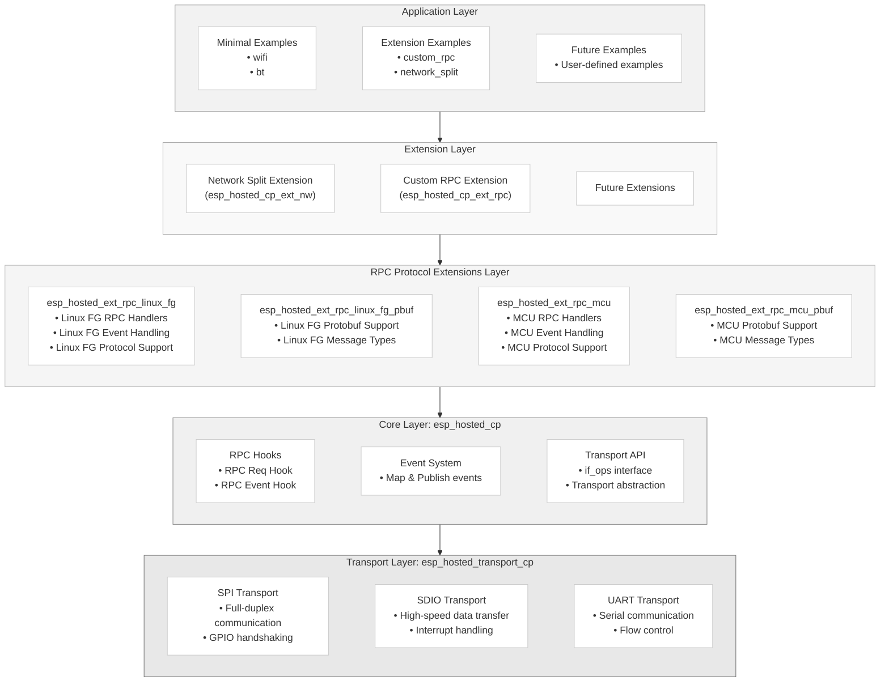

# ESP-Hosted Coprocessor

This directory contains the ESP coprocessor (slave) side implementation of ESP-Hosted-FG. The coprocessor runs on ESP32 series chips and provides WiFi and Bluetooth functionality to a host system via SPI, SDIO, or UART interfaces.

## Quick Start

### 1. Setup Host Hardware & Software
If not already done, please follow the [Linux Host Setup Guide](../docs/Linux_based_host/Linux_based_readme.md) which has step-wise instructions to set up your host, including the transport connection between host and coprocessor.

### 2. Setup ESP-IDF
```bash
cd sdk_esp_idf_setup
./setup-idf.sh
source esp-idf/export.sh
```

### 3. Build and Flash a Coprocessor Example
```bash
cd examples/minimal/wifi
idf.py set-target esp32c3
idf.py build flash monitor
```

## Directory Structure

```
coprocessor/
├── components/                          # ESP-IDF components
│   ├── esp_hosted_cp/                   # Core coprocessor component
│   └── esp_hosted_transport_cp/         # Transport layer abstraction (SPI/SDIO/UART)
├── examples/                        # Example applications
│   ├── minimal/                      # Basic examples (recommended)
│   │   ├── wifi/                     # WiFi-only coprocessor
│   │   └── bt/                       # Bluetooth-only coprocessor
│   └── extensions/                  # Advanced feature examples
│       ├── custom_rpc_msg/           # Custom RPC message handling
│       └── network_split/            # Host-managed network configuration
├── extensions/                       # Optional extension components
│   ├── esp_hosted_ext_rpc_linux_fg/      # Linux FG RPC protocol extension
│   ├── esp_hosted_ext_rpc_linux_fg_pbuf/ # Linux FG protobuf support extension
│   ├── esp_hosted_ext_rpc_mcu/           # MCU RPC protocol extension
│   ├── esp_hosted_ext_rpc_mcu_pbuf/      # MCU protobuf support extension
│   ├── esp_hosted_ext_network_split/     # Network split functionality extension
│   └── esp_hosted_ext_power_save/        # Power save functionality extension
└── sdk_esp_idf_setup/                # ESP-IDF setup scripts and docs
```

## Architecture Overview


## Choosing the Right Example

Select your coprocessor example based on your requirements:

| Use Case | Recommended Example | Description |
|----------|-------------------|-------------|
| **WiFi Only** | [`examples/minimal/wifi`](./examples/minimal/wifi/) | Basic WiFi coprocessor functionality |
| **Bluetooth Only** | [`examples/minimal/bt`](./examples/minimal/bt/) | Basic Bluetooth coprocessor functionality |
| **Custom Communication** | [`examples/extensions/custom_rpc_msg`](./examples/extensions/custom_rpc_msg/) | Add custom RPC messages between host and ESP |
| **Advanced Networking** | [`examples/extensions/network_split`](./examples/extensions/network_split/) | ESP handles some network tasks independently |

### Quick Example Selection Guide

**New to ESP-Hosted?** → Start with `examples/minimal/wifi`
**Need Bluetooth only?** → Use `examples/minimal/bt`
**Advanced features?** → Explore `examples/extensions/`

Detailed examples information is available in [Examples readme](./examples/README.md).

## Supported Coprocessor Hardware

| Chip | WiFi | Bluetooth | SPI | SDIO | UART |
|------|------|-----------|-----|------|------|
| ESP32 | ✅ | BLE 4.2 + Classic | ✅ | ✅ | ✅ |
| ESP32-S2 | ✅ | ❌ | ✅ | ❌ | ❌ |
| ESP32-S3 | ✅ | BLE 4.2/5.0 | ✅ | ❌ | ✅ |
| ESP32-C2 | ✅ | BLE 4.2/5.0 | ✅ | ❌ | ✅ |
| ESP32-C3 | ✅ | BLE 4.2/5.0 | ✅ | ❌ | ✅ |
| ESP32-C5 | ✅ + Dual-band| BLE 5.3 | ✅ | ✅ | ✅ |
| ESP32-C6 | ✅ | BLE 5.3 | ✅ | ✅ | ✅ |

## Transport Interfaces

### SPI (Recommended)
- **Pros**: Universal support, reliable, moderate throughput
- **Cons**: Requires more GPIO pins than UART
- **Use case**: General purpose applications, easiest to evaluate
- **Setup**: [SPI Setup Guide](../docs/Linux_based_host/SPI_setup.md)

### SDIO (High Performance)
- **Pros**: Higher throughput than SPI
- **Cons**: Limited chip support (ESP32, ESP32-C6, ESP32-C5), complex wiring
- **Use case**: High-bandwidth applications
- **Setup**: [SDIO Setup Guide](../docs/Linux_based_host/SDIO_setup.md)

### UART (Bluetooth Only)
- **Pros**: Simple wiring, direct HCI interface
- **Cons**: Bluetooth only, no WiFi support
- **Use case**: Bluetooth-only applications
- **Setup**: [UART Setup Guide](../docs/Linux_based_host/UART_setup.md)

### SPI/SDIO + UART
- SPI/SDIO used for RPC, to control co-processor from host
- UART dedicated for Bluetooth

## Components

### Core Components

**[esp_hosted_cp](components/esp_hosted_cp/)**
- Core ESP-Hosted Network Co-processor functionality
- RPC channel implementation and hooks
- Control interface and event system
- Extensible to work with any protobuf implementation
- Transport-agnostic via `if_ops` interface

**[esp_hosted_transport_cp](components/esp_hosted_transport_cp/)**
- Transport layer implementations (SPI/SDIO/UART)
- Hardware-specific communication protocols
- GPIO management and interrupt handling
- Configurable via menuconfig transport selection

## Extensions

Extensions are optional components that extend the core functionality through hooks. The core component can use features exposed by extensions when they are enabled. By default, all extensions are disabled.

### RPC Protocol Extensions

**[esp_hosted_ext_rpc_linux_fg](extensions/esp_hosted_ext_rpc_linux_fg/)**
- Linux FG (Foreground) host RPC protocol support
- WiFi, Bluetooth, System, and OTA request handlers for Linux hosts
- Event management and publishing for Linux FG infrastructure
- Compatible with existing Linux ESP-Hosted-FG host implementations

**[esp_hosted_ext_rpc_linux_fg_pbuf](extensions/esp_hosted_ext_rpc_linux_fg_pbuf/)**
- Protocol Buffers support for Linux FG RPC communication
- Generated message types for Linux FG control interface
- Serialization/deserialization support for Linux protobuf format

**[esp_hosted_ext_rpc_mcu](extensions/esp_hosted_ext_rpc_mcu/)**
- MCU host RPC protocol support
- WiFi, Bluetooth, System, and OTA request handlers for MCU hosts
- Event management and publishing for ESP-Hosted-MCU infrastructure
- Provides backward compatibility with `esp_hosted_coprocessor_init()`

**[esp_hosted_ext_rpc_mcu_pbuf](extensions/esp_hosted_ext_rpc_mcu_pbuf/)**
- Protocol Buffers support for MCU RPC communication
- Generated message types for MCU control interface
- Serialization/deserialization support for MCU protobuf format

### Network Split
- **Feature**: Allows Host MCU and ESP32 to share a single IP address
- **Benefits**: Host is not troubled frequently for simple network tasks. ESP handles configured network tasks locally.
- **Use case**: Host can sleep while ESP handles selected network activity
- **Supported chips**: ESP32-C5, ESP32-C6, ESP32-S2, ESP32-S3
- **Example**: [Network Split Example](./examples/extensions/network_split/iperf/README.md)

### Custom RPC Messages
- **Feature**: Extend the RPC protocol with custom messages
- **Benefits**: Application-specific commands, custom data exchange
- **Use case**: Users can share their application data/context in between host and ESP easily.
- **Supported chips**: All ESP32 variants
- **Example**: [Custom RPC Example](./examples/extensions/custom_rpc_msg/README.md)


## Development Workflow

### 1. Hardware & Host Setup
- **Hardware**: Follow the transport-specific guides for wiring and connections
- **Host Setup**: Use the Linux Host Setup Guide for complete host configuration
- **Transport Configuration**: The setup guides handle kernel modules, drivers, and interface setup

### 2. Choose Coprocessor Example
- **Select from the table above** based on your use case requirements
- **Start simple**: Begin with minimal examples before moving to extensions
- **Consider your transport**: Some examples work better with specific transport interfaces

### 3. Customize & Build
- Navigate to your chosen example directory
- Use `idf.py menuconfig` to adjust settings
- Select your ESP chip target with `idf.py set-target`
- Build and flash: `idf.py build flash monitor`

### 4. Test & Iterate
- Verify coprocessor functionality using host control applications
- Test connectivity and performance
- Add custom features or RPC handlers as needed
- Scale up to more complex examples or extensions
