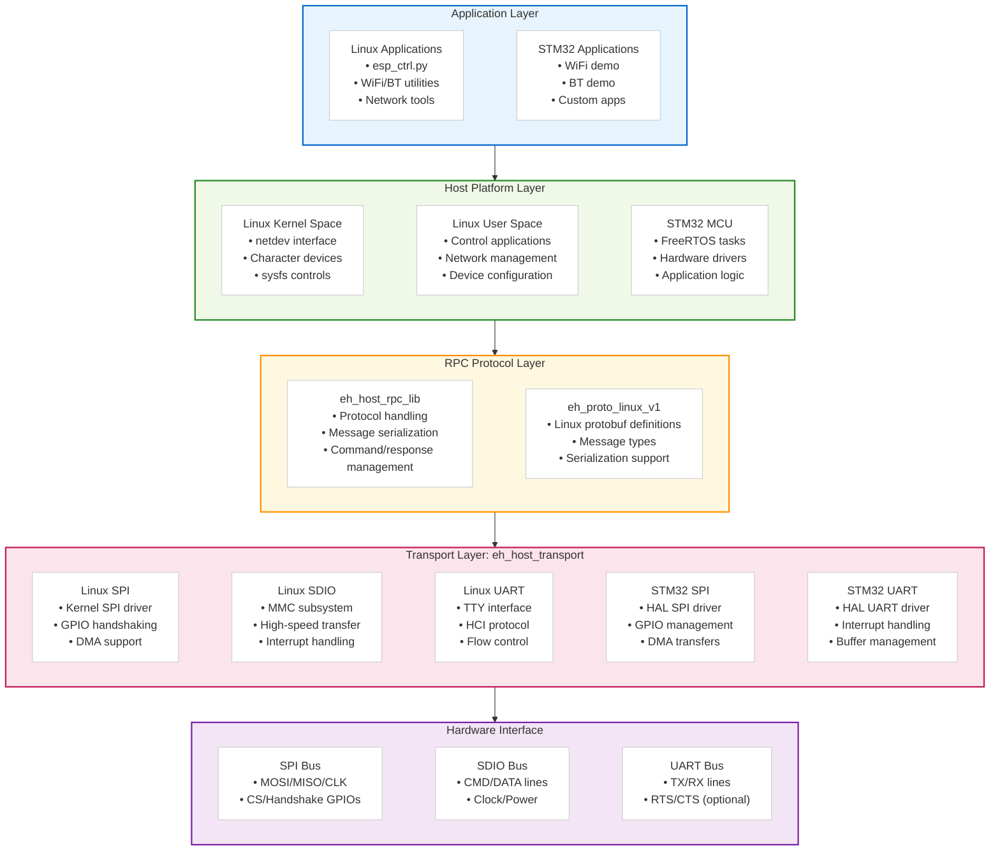

# ESP-Hosted Host

This directory contains the ESP-Hosted-FG host side implementations for different platforms. The host communicates with ESP coprocessors via SPI, SDIO, or UART interfaces to provide WiFi and Bluetooth functionality to the host system.

## Quick Start

### Linux Host Setup
```bash
# Build and install kernel modules
cd linux/kmod && make -j8 && sudo make install

# Load the transport driver (example for SPI)
sudo modprobe esp_hosted_transport_spi

# Run host applications
cd linux/user_space && python3 esp_ctrl.py
```

### STM32 Host Setup
```bash
# Open STM32CubeIDE project
cd stm32/proj/ESP_Hosted_STM32_MCU

# Build and flash to STM32 board
# Configure transport pins in proj/ESP_Hosted_STM32_MCU/Core/Inc/transport_config.h
```

## Directory Structure

```
host/
├── components/                          # Shared host components
│   ├── eh_host_transport/       # Host transport abstraction layer
│   ├── eh_host_rpc_lib/              # RPC protocol library
│   ├── eh_proto_linux_v1/       # Linux FG protobuf definitions
│   └── esp_queue/                       # Queue utilities
├── linux/                              # Linux host implementation
│   ├── kmod/                           # Kernel modules (netdev, transport drivers)
│   ├── user_space/                     # User space control applications
│   └── scripts/                        # Installation and setup scripts
└── stm32/                              # STM32 host implementation
    ├── app/                            # STM32 application code
    ├── driver/                         # STM32 transport drivers
    ├── common/                         # Common STM32 utilities
    ├── port/                           # Platform abstraction layer
    └── proj/                           # STM32CubeIDE projects
```

## Architecture Overview



## Platform Support

### Linux Host

| Feature | SPI | SDIO | UART |
|---------|-----|------|------|
| **WiFi** | ✅ | ✅ | ❌ |
| **Bluetooth** | ✅ | ✅ | ✅ |
| **Network Interface** | netdev | netdev | HCI only |
| **Control Interface** | sysfs + char dev | sysfs + char dev | HCI commands |
| **Performance** | Moderate | High | Low (BT only) |

#### Linux Kernel Modules
- **esp_hosted_transport_spi**: SPI transport driver with GPIO handshaking
- **esp_hosted_transport_sdio**: SDIO transport driver with MMC integration
- **esp_hosted_transport_uart**: UART transport driver for Bluetooth HCI

### STM32 Host

| Feature | SPI | UART |
|---------|-----|------|
| **WiFi** | ✅ | ❌ |
| **Bluetooth** | ✅ | ✅ |
| **RTOS** | FreeRTOS | FreeRTOS |
| **Memory** | Dynamic/Static | Dynamic/Static |
| **Performance** | Moderate | Low (BT only) |

#### STM32 Implementation
- **Bare metal + FreeRTOS**: Real-time operation with task-based architecture
- **HAL drivers**: STM32 HAL for SPI/UART hardware abstraction
- **Memory management**: Configurable heap and buffer management
- **GPIO control**: Hardware handshaking and interrupt handling

## Transport Interfaces

### SPI (Recommended for General Use)
- **Linux**: Kernel SPI driver with GPIO handshaking
- **STM32**: HAL SPI with DMA support
- **Throughput**: ~10-15 Mbps
- **Wiring**: 6-7 pins (MOSI, MISO, CLK, CS, Handshake, Reset, optional Boot)

### SDIO (High Performance - Linux Only)
- **Linux**: MMC subsystem integration
- **Throughput**: ~20-40 Mbps
- **Wiring**: 6 pins (CMD, DATA0-3, CLK)
- **Limitation**: Linux hosts only, requires SDIO-capable hardware

### UART (Bluetooth Focused)
- **Linux**: TTY interface with HCI protocol
- **STM32**: HAL UART with interrupt handling
- **Use case**: Bluetooth-only applications
- **Throughput**: ~1-2 Mbps

## Components

### Shared Components

**[eh_host_transport](components/eh_host_transport/)**
- Host-side transport abstraction layer
- Platform-specific transport implementations
- Unified API for Linux and STM32 platforms
- Transport configuration and management

**[eh_host_rpc_lib](components/eh_host_rpc_lib/)**
- RPC protocol implementation
- Command/response handling
- Message serialization/deserialization
- Cross-platform RPC support

### Platform-Specific Implementation

**Linux Platform**
- **Kernel modules**: Transport drivers integrated with Linux subsystems
- **User space tools**: Control applications and utilities
- **Network integration**: netdev interface for WiFi, HCI for Bluetooth

**STM32 Platform**
- **FreeRTOS integration**: Task-based architecture
- **HAL drivers**: Hardware abstraction for peripherals
- **Memory management**: Efficient buffer and heap management

## Development Workflow

### Linux Host Development
1. **Setup**: Install kernel headers and build tools
2. **Build**: `cd linux/kmod && make && sudo make install`
3. **Load**: `sudo modprobe esp_hosted_transport_spi`
4. **Test**: `cd linux/user_space && python3 esp_ctrl.py`

### STM32 Host Development
1. **Setup**: Install STM32CubeIDE and configure project
2. **Configure**: Update transport pins in `transport_config.h`
3. **Build**: Compile project in STM32CubeIDE
4. **Flash**: Program STM32 board and connect ESP coprocessor

### Adding New Platform Support
1. **Transport layer**: Implement platform-specific transport drivers
2. **RPC integration**: Use `eh_host_rpc_lib` for protocol handling
3. **Application layer**: Build platform-specific applications
4. **Testing**: Validate with ESP coprocessor using standard examples

## Performance Considerations

### Linux Host
- **Kernel space**: Direct hardware access, minimal latency
- **DMA support**: Zero-copy transfers where possible
- **Interrupt handling**: Efficient GPIO and transport interrupts
- **Network stack**: Full Linux networking integration

### STM32 Host
- **Real-time**: FreeRTOS provides deterministic timing
- **Memory efficiency**: Configurable buffers and heap sizes
- **Power management**: Support for low-power modes
- **Direct hardware**: Minimal abstraction overhead

## Troubleshooting

### Common Issues
1. **Transport not detected**: Check GPIO connections and driver loading
2. **Poor performance**: Verify DMA configuration and buffer sizes
3. **Communication errors**: Check clock timing and signal integrity
4. **Memory issues**: Adjust buffer sizes and heap configuration

### Debug Tools
- **Linux**: `dmesg`, `/sys/kernel/debug/esp_hosted/`
- **STM32**: UART debug output, debugger integration
- **Protocol**: Enable RPC debug logging in both platforms