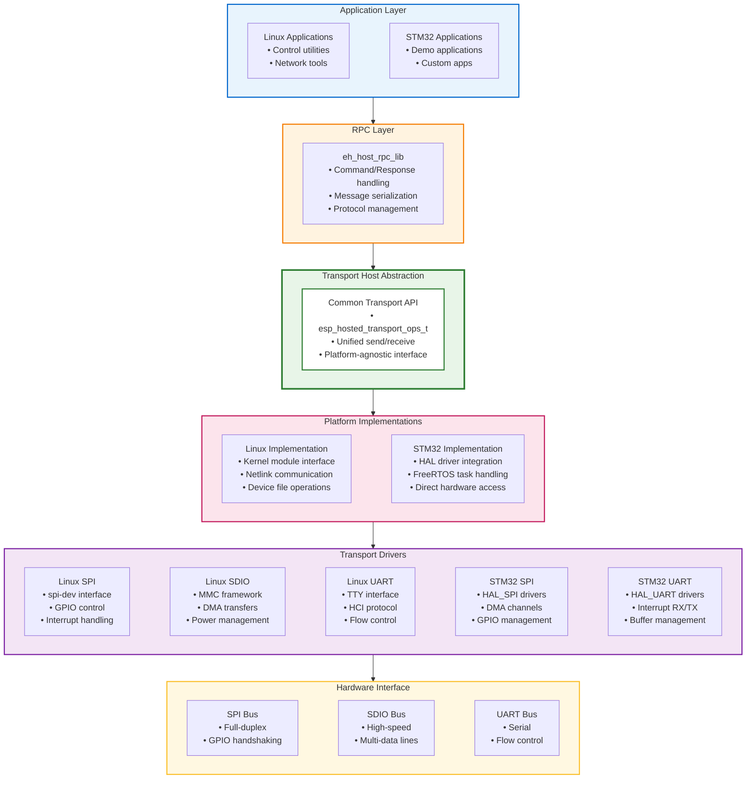

# ESP-Hosted Transport Host Component

This component provides the host-side transport abstraction layer for ESP-Hosted-FG, enabling communication between host systems (Linux, STM32) and ESP coprocessors via SPI, SDIO, or UART interfaces.

## Overview

The `eh_host_transport` component abstracts transport-specific details and provides a unified API for different host platforms to communicate with ESP coprocessors. It handles the low-level transport protocols while exposing a consistent interface to higher-level RPC and application layers.

## Architecture



## Directory Structure

```
eh_host_transport/
├── include/
│   ├── esp_hosted_transport.h           # Main public API
│   ├── esp_hosted_transport_config.h    # Configuration definitions
│   ├── linux/
│   │   └── esp_hosted_transport_linux.h # Linux-specific API
│   └── stm32/
│       └── esp_hosted_transport_stm32.h # STM32-specific API
├── private_include/
│   ├── esp_hosted_transport_internal.h  # Internal definitions
│   └── transport_utils.h                # Utility functions
├── src/
│   ├── esp_hosted_transport_common.c    # Common implementation
│   ├── linux/
│   │   ├── esp_hosted_transport_linux_spi.c   # Linux SPI transport
│   │   ├── esp_hosted_transport_linux_sdio.c  # Linux SDIO transport
│   │   └── esp_hosted_transport_linux_uart.c  # Linux UART transport
│   └── stm32/
│       ├── esp_hosted_transport_stm32_spi.c   # STM32 SPI transport
│       └── esp_hosted_transport_stm32_uart.c  # STM32 UART transport
├── CMakeLists.txt                       # Build configuration
├── Kconfig                              # Configuration options
└── README.md                           # This file
```

## API Reference

### Common Transport Operations

```c
// Transport operation structure
typedef struct {
    esp_err_t (*init)(esp_hosted_transport_config_t *config);
    esp_err_t (*deinit)(void);
    esp_err_t (*send)(const uint8_t *data, size_t len, uint32_t timeout_ms);
    esp_err_t (*receive)(uint8_t *buffer, size_t *len, uint32_t timeout_ms);
    esp_err_t (*reset)(void);
    esp_err_t (*set_power_mode)(esp_hosted_power_mode_t mode);
} esp_hosted_transport_ops_t;

// Transport configuration
typedef struct {
    esp_hosted_transport_type_t transport_type;
    union {
        esp_hosted_spi_config_t spi;
        esp_hosted_sdio_config_t sdio;
        esp_hosted_uart_config_t uart;
    } config;
    esp_hosted_transport_event_cb_t event_callback;
    void *user_data;
} esp_hosted_transport_config_t;
```

### Initialization and Setup

```c
// Initialize transport layer
esp_err_t esp_hosted_transport_init(esp_hosted_transport_config_t *config);

// Get transport operations
const esp_hosted_transport_ops_t* esp_hosted_transport_get_ops(void);

// Cleanup transport layer
esp_err_t esp_hosted_transport_deinit(void);
```

### Data Transfer

```c
// Send data to coprocessor
esp_err_t esp_hosted_transport_send(const uint8_t *data, size_t len, uint32_t timeout_ms);

// Receive data from coprocessor
esp_err_t esp_hosted_transport_receive(uint8_t *buffer, size_t *len, uint32_t timeout_ms);

// Check if data is available
bool esp_hosted_transport_data_available(void);
```

### Event Handling

```c
// Transport event types
typedef enum {
    ESP_HOSTED_TRANSPORT_EVENT_CONNECTED,
    ESP_HOSTED_TRANSPORT_EVENT_DISCONNECTED,
    ESP_HOSTED_TRANSPORT_EVENT_DATA_RECEIVED,
    ESP_HOSTED_TRANSPORT_EVENT_ERROR
} esp_hosted_transport_event_t;

// Event callback function
typedef void (*esp_hosted_transport_event_cb_t)(esp_hosted_transport_event_t event,
                                               void *event_data, void *user_data);
```

## Platform-Specific Implementation

### Linux Host Implementation

#### SPI Transport
- **Driver Interface**: Uses Linux spi-dev framework
- **GPIO Control**: libgpiod for handshaking pins
- **Interrupt Handling**: GPIO interrupts via sysfs or libgpiod
- **DMA Support**: Hardware DMA through SPI driver

```c
// Linux SPI configuration
typedef struct {
    const char *spi_device;          // e.g., "/dev/spidev0.0"
    uint32_t max_speed_hz;           // SPI clock frequency
    uint8_t bits_per_word;           // Usually 8
    uint32_t mode;                   // SPI mode (0-3)

    // GPIO pins for handshaking
    int handshake_gpio;              // Handshake pin number
    int reset_gpio;                  // Reset pin number
    int boot_gpio;                   // Boot mode pin (optional)
} esp_hosted_linux_spi_config_t;
```

#### SDIO Transport
- **MMC Framework**: Integrates with Linux MMC/SD subsystem
- **High Performance**: DMA transfers up to 40 Mbps
- **Power Management**: Linux PM framework integration
- **Interrupt Handling**: SDIO interrupt support

```c
// Linux SDIO configuration
typedef struct {
    const char *mmc_device;          // e.g., "/dev/mmcblk0"
    uint32_t max_clock_hz;           // Maximum SDIO clock
    uint8_t bus_width;               // 1 or 4-bit bus width
    bool high_speed;                 // High-speed mode enable

    // Power control
    int power_gpio;                  // Power control pin
    int reset_gpio;                  // Reset pin
} esp_hosted_linux_sdio_config_t;
```

#### UART Transport
- **TTY Interface**: Standard Linux TTY/serial interface
- **HCI Protocol**: Bluetooth HCI over UART
- **Flow Control**: Hardware (RTS/CTS) or software (XON/XOFF)
- **Baud Rate**: Configurable from 115200 to 3M baud

```c
// Linux UART configuration
typedef struct {
    const char *uart_device;         // e.g., "/dev/ttyUSB0"
    uint32_t baud_rate;              // UART baud rate
    uint8_t data_bits;               // Data bits (7 or 8)
    uint8_t stop_bits;               // Stop bits (1 or 2)
    esp_hosted_uart_parity_t parity; // Parity setting
    bool flow_control;               // Hardware flow control

    // Control pins
    int reset_gpio;                  // Reset pin
    int boot_gpio;                   // Boot mode pin
} esp_hosted_linux_uart_config_t;
```

### STM32 Host Implementation

#### SPI Transport
- **HAL Integration**: STM32 HAL SPI drivers
- **DMA Support**: DMA channels for efficient transfers
- **GPIO Management**: HAL GPIO for handshaking
- **FreeRTOS Integration**: Task-based operation

```c
// STM32 SPI configuration
typedef struct {
    SPI_HandleTypeDef *hspi;         // HAL SPI handle
    uint32_t max_speed_hz;           // SPI clock frequency

    // GPIO pins
    GPIO_TypeDef *handshake_port;    // Handshake GPIO port
    uint16_t handshake_pin;          // Handshake GPIO pin
    GPIO_TypeDef *reset_port;        // Reset GPIO port
    uint16_t reset_pin;              // Reset GPIO pin

    // DMA configuration
    DMA_HandleTypeDef *hdma_tx;      // TX DMA handle
    DMA_HandleTypeDef *hdma_rx;      // RX DMA handle

    // FreeRTOS synchronization
    SemaphoreHandle_t tx_semaphore;  // TX completion semaphore
    SemaphoreHandle_t rx_semaphore;  // RX completion semaphore
} esp_hosted_stm32_spi_config_t;
```

#### UART Transport
- **HAL Integration**: STM32 HAL UART drivers
- **Interrupt Handling**: UART RX/TX interrupts
- **Buffer Management**: Circular buffers for efficiency
- **Flow Control**: Hardware RTS/CTS support

```c
// STM32 UART configuration
typedef struct {
    UART_HandleTypeDef *huart;       // HAL UART handle
    uint32_t baud_rate;              // UART baud rate

    // Control pins
    GPIO_TypeDef *reset_port;        // Reset GPIO port
    uint16_t reset_pin;              // Reset GPIO pin

    // Buffer configuration
    uint8_t *rx_buffer;              // RX buffer pointer
    size_t rx_buffer_size;           // RX buffer size
    uint8_t *tx_buffer;              // TX buffer pointer
    size_t tx_buffer_size;           // TX buffer size

    // FreeRTOS synchronization
    QueueHandle_t rx_queue;          // RX data queue
    SemaphoreHandle_t tx_semaphore;  // TX completion semaphore
} esp_hosted_stm32_uart_config_t;
```

## Configuration Options

### Kconfig Parameters

```kconfig
# Transport type selection
choice ESP_HOSTED_TRANSPORT_TYPE
    prompt "Transport Interface"
    default ESP_HOSTED_TRANSPORT_SPI

config ESP_HOSTED_TRANSPORT_SPI
    bool "SPI"

config ESP_HOSTED_TRANSPORT_SDIO
    bool "SDIO"
    depends on PLATFORM_LINUX

config ESP_HOSTED_TRANSPORT_UART
    bool "UART"
endchoice

# Buffer configuration
config ESP_HOSTED_TRANSPORT_RX_BUFFER_SIZE
    int "RX Buffer Size"
    default 4096
    range 1024 16384

config ESP_HOSTED_TRANSPORT_TX_BUFFER_SIZE
    int "TX Buffer Size"
    default 4096
    range 1024 16384

# Timeout configuration
config ESP_HOSTED_TRANSPORT_TIMEOUT_MS
    int "Default Transport Timeout (ms)"
    default 5000
    range 1000 30000
```

## Performance Characteristics

### Linux Host Performance

| Transport | Throughput | Latency | CPU Usage | Power |
|-----------|------------|---------|-----------|-------|
| **SPI** | 10-15 Mbps | 1-2 ms | Low | Low |
| **SDIO** | 20-40 Mbps | 0.5-1 ms | Very Low | Medium |
| **UART** | 1-2 Mbps | 5-10 ms | Low | Very Low |

### STM32 Host Performance

| Transport | Throughput | Latency | Memory | Power |
|-----------|------------|---------|--------|-------|
| **SPI** | 8-12 Mbps | 2-3 ms | 8-16 KB | Low |
| **UART** | 0.5-1 Mbps | 10-15 ms | 4-8 KB | Very Low |

## Usage Examples

### Linux Host Example

```c
#include "esp_hosted_transport.h"

// Configure SPI transport
esp_hosted_transport_config_t config = {
    .transport_type = ESP_HOSTED_TRANSPORT_SPI,
    .config.spi = {
        .spi_device = "/dev/spidev0.0",
        .max_speed_hz = 10000000,
        .bits_per_word = 8,
        .mode = 0,
        .handshake_gpio = 25,
        .reset_gpio = 6,
        .boot_gpio = -1
    },
    .event_callback = transport_event_handler,
    .user_data = my_app_context
};

// Initialize transport
esp_err_t ret = esp_hosted_transport_init(&config);
if (ret != ESP_OK) {
    printf("Transport init failed: %s\n", esp_err_to_name(ret));
    return ret;
}

// Send data
uint8_t tx_data[] = {0x01, 0x02, 0x03, 0x04};
ret = esp_hosted_transport_send(tx_data, sizeof(tx_data), 1000);

// Receive data
uint8_t rx_buffer[1024];
size_t rx_len = sizeof(rx_buffer);
ret = esp_hosted_transport_receive(rx_buffer, &rx_len, 5000);
```

### STM32 Host Example

```c
#include "esp_hosted_transport.h"

extern SPI_HandleTypeDef hspi1;
extern DMA_HandleTypeDef hdma_spi1_tx;
extern DMA_HandleTypeDef hdma_spi1_rx;

// Configure SPI transport
esp_hosted_transport_config_t config = {
    .transport_type = ESP_HOSTED_TRANSPORT_SPI,
    .config.spi = {
        .hspi = &hspi1,
        .max_speed_hz = 10000000,
        .handshake_port = GPIOA,
        .handshake_pin = GPIO_PIN_4,
        .reset_port = GPIOA,
        .reset_pin = GPIO_PIN_5,
        .hdma_tx = &hdma_spi1_tx,
        .hdma_rx = &hdma_spi1_rx,
        .tx_semaphore = NULL,  // Will be created internally
        .rx_semaphore = NULL   // Will be created internally
    },
    .event_callback = transport_event_handler,
    .user_data = NULL
};

// Initialize transport
esp_err_t ret = esp_hosted_transport_init(&config);
if (ret != ESP_OK) {
    printf("Transport init failed\r\n");
    return ret;
}

// Send data in FreeRTOS task
void transport_task(void *parameters) {
    uint8_t tx_data[] = {0x01, 0x02, 0x03, 0x04};
    esp_err_t ret = esp_hosted_transport_send(tx_data, sizeof(tx_data), 1000);

    if (ret == ESP_OK) {
        printf("Data sent successfully\r\n");
    }

    vTaskDelete(NULL);
}
```

## Error Handling

### Common Error Codes

- **ESP_ERR_INVALID_ARG**: Invalid configuration parameters
- **ESP_ERR_INVALID_STATE**: Transport not initialized or in wrong state
- **ESP_ERR_TIMEOUT**: Operation timed out
- **ESP_ERR_NO_MEM**: Insufficient memory for operation
- **ESP_ERR_NOT_SUPPORTED**: Operation not supported on current platform
- **ESP_FAIL**: General transport failure

### Debugging and Troubleshooting

1. **Enable Debug Logging**: Set log level to debug in menuconfig
2. **Check GPIO Connections**: Verify handshaking and control pins
3. **Verify Clock Settings**: Ensure SPI/UART clock configuration is correct
4. **Monitor Buffer Usage**: Check for buffer overruns or underruns
5. **Test Signal Integrity**: Use oscilloscope to verify signal quality

## Integration with ESP-Hosted Components

This transport component integrates seamlessly with:

- **eh_host_rpc_lib**: Provides transport layer for RPC communication
- **Linux kernel modules**: Used by kernel-space transport drivers
- **STM32 applications**: Direct integration with STM32 HAL and FreeRTOS
- **Cross-platform applications**: Unified API for different host platforms