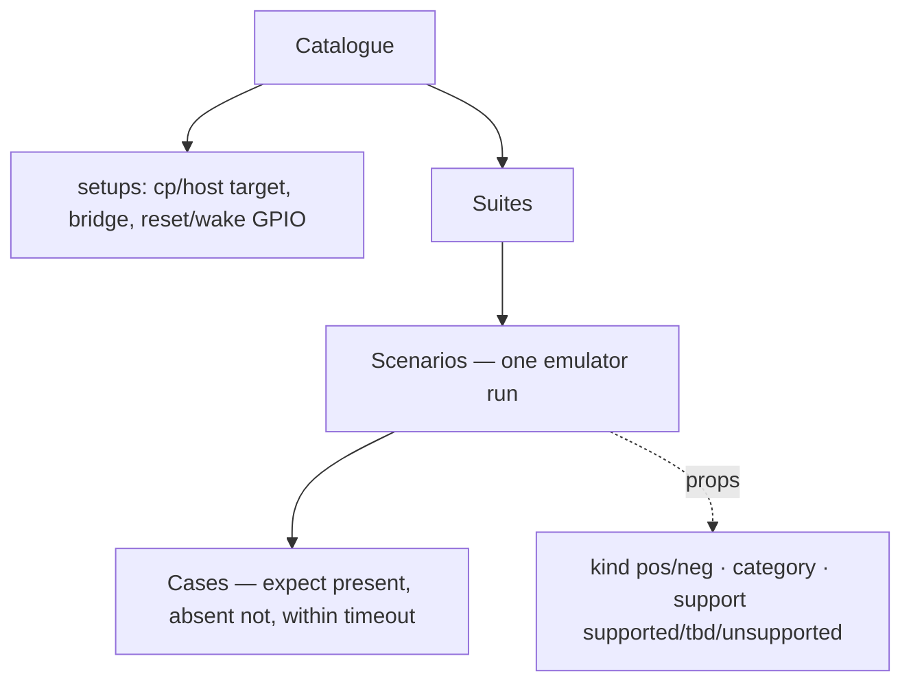
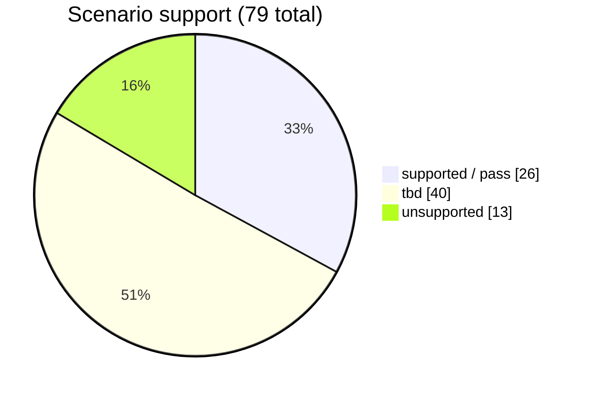
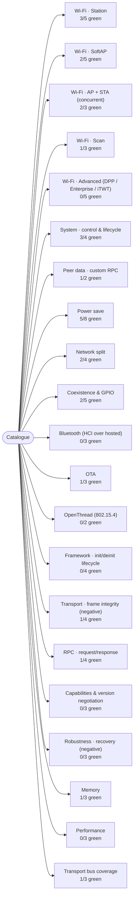

# ESP-Hosted Test Catalogue

Bench: **C6 esp32c6 ⇄ P4 esp32p4** over SDIO (esp-emulator). Generated by `runner.py catalog` from `tests.json` — single source of truth for the CLI and the UI.

## Summary

| Status | Scenarios | Meaning |
|---|---:|---|
| ✅ supported (pass) | 26 | runs on the bench; passing in the last verified sweep (0 failing) |
| 🟡 tbd | 40 | catalogued; needs a bench/harness/emulator capability first (reason given) |
| ⚪ unsupported | 13 | needs external HW/infra the emulator inherently lacks (reason given) |
| **total** | **79** | across **21** suites · **89** assertion cases |

## Entity model

## Status at a glance

## Suites

## Scenarios & cases

### Wi-Fi · Station  &nbsp;`wifi_sta`

| Scenario | Kind | Category | Status | Cases (assertions) | Reason / note |
|---|---|---|---|---|---|
| `sta_connect` | positive | functional | ✅ pass | `got_ip` — "got ip:" `cp_assoc` — "connected with myssid" | all cases verified on the bench |
| `sta_wrong_password` | negative | functional | ✅ pass | `connect_fails` — "connect to the AP fail" | all cases verified on the bench |
| `sta_no_ap` | negative | functional | ✅ pass | `connect_fails` — "connect to the AP fail" | all cases verified on the bench |
| `sta_wpa3` | positive | functional | 🟡 tbd | `got_ip` — "got ip:" | emulator AP is WPA2-PSK only |
| `sta_disconnect_reconnect` | negative | recovery | 🟡 tbd | `reconnect` — "got ip:" | needs a runtime hook to drop/restore the emulator AP mid-run |

### Wi-Fi · SoftAP  &nbsp;`wifi_softap`

| Scenario | Kind | Category | Status | Cases (assertions) | Reason / note |
|---|---|---|---|---|---|
| `softap_up` | positive | functional | ✅ pass | `ap_up` — "wifi_init_softap finished" | all cases verified on the bench |
| `softap_open_auth` | positive | functional | ✅ pass | `ap_up` — "wifi_init_softap finished" | all cases verified on the bench |
| `softap_client_assoc` | positive | functional | 🟡 tbd | `client_join` — "station" & "join" | emulator has no second virtual STA client to associate |
| `softap_client_wrong_password` | negative | functional | ⚪ unsupported | `no_join` — "wifi_init_softap finished" | no second virtual STA client in the emulator to attempt a join |
| `softap_max_clients` | negative | functional | ⚪ unsupported | `limit` — "wifi_init_softap finished" | no virtual STA clients in the emulator to saturate the AP |

### Wi-Fi · AP + STA (concurrent)  &nbsp;`wifi_apsta`

| Scenario | Kind | Category | Status | Cases (assertions) | Reason / note |
|---|---|---|---|---|---|
| `apsta_sta_ip` | positive | functional | ✅ pass | `sta_ip` — "Got IP:" | all cases verified on the bench |
| `apsta_upstream_fail` | negative | functional | ✅ pass | `ap_survives` — "wifi_init_softap finished" | all cases verified on the bench |
| `apsta_client_join` | positive | functional | 🟡 tbd | `join` — "join" | needs a virtual STA client to join the SoftAP half |

### Wi-Fi · Scan  &nbsp;`wifi_scan`

| Scenario | Kind | Category | Status | Cases (assertions) | Reason / note |
|---|---|---|---|---|---|
| `scan_finds_ap` | positive | functional | ✅ pass | `aps` — "Total APs scanned" | all cases verified on the bench |
| `scan_empty` | negative | functional | 🟡 tbd | `zero_aps` — "Total APs scanned = 0" | emulator AP is always present; cannot present an empty RF environment yet |
| `scan_buffer_truncation` | negative | functional | 🟡 tbd | `truncated` — "Total APs scanned" | emulator cannot present more APs than the list size to force truncation |

### Wi-Fi · Advanced (DPP / Enterprise / iTWT)  &nbsp;`wifi_advanced`

| Scenario | Kind | Category | Status | Cases (assertions) | Reason / note |
|---|---|---|---|---|---|
| `dpp_idle_listen` | negative | functional | 🟡 tbd | `listening` — "Started listening for DPP Authentication" | esp_supp_dpp_init() fails in the emulated CP environment, so the enrollee never reaches the listening state |
| `sta_dpp` | positive | functional | ⚪ unsupported | `connected` — "Successfully connected to the AP" | needs an external DPP configurator device |
| `sta_enterprise` | positive | functional | ⚪ unsupported | `got_ip` — "got ip:" | needs a RADIUS/EAP server + client certs |
| `itwt_legacy_ap_rejected` | negative | functional | 🟡 tbd | `needs_he` — "11ax mode" | iTWT example aborts during early HE/TWT setup in the emulated environment before the 11ax-mode check is reached |
| `sta_itwt` | positive | functional | ⚪ unsupported | `twt_setup` — "ITWT_SETUP" | needs an 802.11ax/HE-capable AP |

### System · control & lifecycle  &nbsp;`system`

| Scenario | Kind | Category | Status | Cases (assertions) | Reason / note |
|---|---|---|---|---|---|
| `fw_version` | positive | functional | ✅ pass | `version` — "CP firmware" | all cases verified on the bench |
| `hosted_events` | positive | functional | ✅ pass | `ready` — "ESP-Hosted is ready" `heartbeat` — "Heartbeat" | all cases verified on the bench |
| `transport_config` | positive | functional | ✅ pass | `cfg` — "Current transport configuration" | all cases verified on the bench |
| `fw_version_mismatch` | negative | functional | 🟡 tbd | `mismatch` — "version" | needs a CP image built with a deliberately divergent version to compare against |

### Peer data · custom RPC  &nbsp;`peer_data`

| Scenario | Kind | Category | Status | Cases (assertions) | Reason / note |
|---|---|---|---|---|---|
| `echo` | positive | functional | ✅ pass | `verified` — "Verified, all OK!" `ghost_rejected` — "GHOST" | all cases verified on the bench |
| `peer_unregistered_msgid` | negative | functional | 🟡 tbd | `no_crash` — "Custom RPC Echo Test" | needs a host variant that sends a msg_id the CP has no callback for |

### Power save  &nbsp;`power_save`

| Scenario | Kind | Category | Status | Cases (assertions) | Reason / note |
|---|---|---|---|---|---|
| `host_deep_sleep_cp_wake` | positive | functional | ✅ pass | `held` — "holding; awaiting external wake" `cp_registers` — "Host Sleep" `woke` — "Wake source asserted" `wake_reason` — "PMU_SYS_PWR_DOWN_RESET" | all cases verified on the bench |
| `cp_shutdown_cycle` | positive | functional | ✅ pass | `ready` — "Transport is ready" `reconnect` — "Got IP address" | all cases verified on the bench |
| `cp_shutdown_heap_stable` | positive | memory | 🟡 tbd | `stable` — "Got IP address" | needs heap-trend sampling/parsing across cycles, not just a single reading |
| `host_deep_sleep_timer` | positive | functional | 🟡 tbd | `timer_wake` — "Wake up from timer" | repo example wakes via CP GPIO, not a self-timer; covered generically by the emulator's own deep_sleep test |
| `wake_gpio_polarity_mismatch` | negative | recovery | 🟡 tbd | `stays_asleep` — "holding; awaiting external wake" | asserting a never-happens wake needs a bounded negative-wait hook in the bench |
| `cp_light_sleep` | positive | functional | ✅ pass | `configured` — "Light sleep initialized successfully" & "Integration ready" | all cases verified on the bench |
| `cp_light_sleep_wake_on_packet` | positive | functional | ✅ pass | `connected` — "IP_EVENT_STA_GOT_IP" `cp_sleeps` — "Host power save active - entering light sleep" & "Light sleep ENABLED" `woke` — "Wakeup needed" & "Light sleep DISABLED" & "Host power save off - device fully ready" | all cases verified on the bench |
| `cp_light_sleep_non_priority_pkt_no_wake` | negative | functional | ✅ pass | `dropped` — "host pkt dropped in power save (dst 50000" | all cases verified on the bench |

### Network split  &nbsp;`network_split`

| Scenario | Kind | Category | Status | Cases (assertions) | Reason / note |
|---|---|---|---|---|---|
| `nw_split_station` | positive | functional | ✅ pass | `got_ip` — "got ip:" | all cases verified on the bench |
| `nw_split_iperf_connect` | positive | functional | ✅ pass | `got_ip` — "got ip:" | all cases verified on the bench |
| `nw_split_no_cp_feature` | negative | functional | 🟡 tbd | `netif_down` — "ESP-Hosted Network Split Example" | needs a CP image built with CONFIG_ESP_HOSTED_CP_FEAT_NW_SPLIT disabled |
| `nw_split_port_routing` | positive | functional | 🟡 tbd | `routed` — "got ip:" | needs a traffic generator hitting both port ranges through the bench |

### Coexistence & GPIO  &nbsp;`peripherals`

| Scenario | Kind | Category | Status | Cases (assertions) | Reason / note |
|---|---|---|---|---|---|
| `ext_coex` | positive | functional | ✅ pass | `configured` — "successful" | all cases verified on the bench |
| `ext_coex_invalid_gpio` | negative | functional | 🟡 tbd | `rejected` — "failed" | example uses fixed valid pins; needs an overlay/variant that passes an invalid pin to observe the reject log |
| `gpio_expander` | positive | functional | ✅ pass | `demos` — "demos completed successfully" | all cases verified on the bench |
| `gpio_invalid_pin` | negative | functional | 🟡 tbd | `config_fails` — "GPIO config failed" | example only drives valid pins; needs a variant passing an out-of-range pin to see 'GPIO config failed' |
| `sdmmc_combined` | positive | functional | ⚪ unsupported | `card` — "Card unmounted" | emulator models only the hosted SDIO peer, not a second SD card on the slot |

### Bluetooth (HCI over hosted)  &nbsp;`bluetooth`

| Scenario | Kind | Category | Status | Cases (assertions) | Reason / note |
|---|---|---|---|---|---|
| `ble_adv_vhci` | positive | functional | 🟡 tbd | `advertising` — "advertising started" | host BLE stack + VHCI bridge over SDIO not yet wired in the bench (emulator has a bumble HCI path to leverage) |
| `bt_hci_uart` | positive | functional | ⚪ unsupported | `hci_up` — "HCI" | emulator does not model a separate UART HCI stream independent of the SDIO RPC bridge |
| `wifi_ble_coex` | positive | functional | ⚪ unsupported | `both` — "advertising started" | no 2.4GHz radio PHY or SW-coex arbitration modelled in the emulator |

### OTA  &nbsp;`ota`

| Scenario | Kind | Category | Status | Cases (assertions) | Reason / note |
|---|---|---|---|---|---|
| `coprocessor_ota` | positive | functional | ✅ pass | `begun` — "OTA update started" `completed` — "OTA completed successfully" | all cases verified on the bench |
| `ota_boots_new_image` | positive | functional | 🟡 tbd | `rebooted` — "OTA updated successful" | guest bootloader does read otadata/ota_0/ota_1 on the bench, but proving the new slot booted needs a version-distinct CP image + asserting the activate→reboot→new-image cycle |
| `ota_bad_image` | negative | functional | 🟡 tbd | `aborts` — "OTA failed" | needs a deliberately-corrupted image embedded in a second LittleFS slot to drive the failure path |

### OpenThread (802.15.4)  &nbsp;`openthread`

| Scenario | Kind | Category | Status | Cases (assertions) | Reason / note |
|---|---|---|---|---|---|
| `ot_cli` | positive | functional | ⚪ unsupported | `cli` — "OpenThread" | 802.15.4 radio PHY not modelled in the emulator |
| `ot_border_router` | positive | functional | ⚪ unsupported | `br` — "Border" | 802.15.4 radio + external AP backhaul not modelled |

### Framework · init/deinit lifecycle  &nbsp;`lifecycle`

| Scenario | Kind | Category | Status | Cases (assertions) | Reason / note |
|---|---|---|---|---|---|
| `double_init_idempotent` | negative | functional | 🟡 tbd | `ok` — "CP firmware" | needs a dedicated harness app — no example calls eh_host_init() twice |
| `use_before_init_rejected` | negative | functional | 🟡 tbd | `einval` — "INVALID" | needs a harness app that calls connect_to_slave() with no prior init |
| `deinit_reinit` | positive | recovery | 🟡 tbd | `back` — "CP firmware" | needs a harness app exercising a deinit/reinit cycle |
| `bringup_timeout_no_cp` | negative | recovery | 🟡 tbd | `timeout` — "fail" | needs a host-only setup variant that starts the host without the CP slave |

### Transport · frame integrity (negative)  &nbsp;`transport_integrity`

| Scenario | Kind | Category | Status | Cases (assertions) | Reason / note |
|---|---|---|---|---|---|
| `oversized_frame_rejected` | negative | security | 🟡 tbd | `toobig` — "Verified, all OK!" | needs a raw-frame injection hook on the SDIO bridge |
| `checksum_mismatch_rejected` | negative | security | 🟡 tbd | `corrupt` — "Verified, all OK!" | needs a raw-frame injection hook to corrupt the checksum byte |
| `truncated_frame_rejected` | negative | security | 🟡 tbd | `invalid` — "Verified, all OK!" | needs a raw-frame injection hook to send a truncated header |
| `large_payload_roundtrip` | positive | functional | ✅ pass | `verified` — "Verified, all OK!" | all cases verified on the bench |

### RPC · request/response  &nbsp;`rpc`

| Scenario | Kind | Category | Status | Cases (assertions) | Reason / note |
|---|---|---|---|---|---|
| `rpc_roundtrip` | positive | functional | ✅ pass | `resp` — "CP firmware" | all cases verified on the bench |
| `rpc_timeout_cp_hung` | negative | recovery | 🟡 tbd | `timeout` — "timeout" | needs a fault-injection hook to wedge the CP mid-RPC |
| `rpc_concurrent` | positive | functional | 🟡 tbd | `all` — "CP firmware" | needs a multi-request harness; emulator threading model to confirm |
| `rpc_unknown_opcode` | negative | security | 🟡 tbd | `dropped` — "CP firmware" | needs a raw-frame injection hook to craft an out-of-range msg_id |

### Capabilities & version negotiation  &nbsp;`capabilities`

| Scenario | Kind | Category | Status | Cases (assertions) | Reason / note |
|---|---|---|---|---|---|
| `caps_version_match` | positive | functional | 🟡 tbd | `agree` — "ESP-Hosted is ready" | needs an introspection hook to read the negotiated caps version |
| `caps_version_mismatch` | negative | functional | 🟡 tbd | `flagged` — "caps" | needs a CP image built with a deliberately drifted caps hash |
| `feature_gating_absent_cap` | negative | functional | 🟡 tbd | `gated` — "ESP-Hosted is ready" | needs a CP image with a specific feature cap compiled out |

### Robustness · recovery (negative)  &nbsp;`recovery`

| Scenario | Kind | Category | Status | Cases (assertions) | Reason / note |
|---|---|---|---|---|---|
| `cp_reset_recovery` | negative | recovery | 🟡 tbd | `reenumerate` — "got ip:" | needs a runtime trigger to pulse the CP reset mid-session |
| `bridge_drop` | negative | recovery | 🟡 tbd | `handled` — "Transport" | no fault-injection hook for a mid-session bridge drop yet |
| `heartbeat_timeout_recovery` | negative | recovery | 🟡 tbd | `reinit` — "Heartbeat" | needs a hook to stall the CP heartbeat mid-session |

### Memory  &nbsp;`memory`

| Scenario | Kind | Category | Status | Cases (assertions) | Reason / note |
|---|---|---|---|---|---|
| `heap_stable` | positive | memory | ✅ pass | `meminfo` — "Co-processor Mem Info" | all cases verified on the bench |
| `no_leak_reconnect` | positive | memory | 🟡 tbd | `stable` — "heap" | needs a reconnect-loop stimulus + heap sampling hook |
| `mempool_exhaustion` | negative | memory | 🟡 tbd | `graceful` — "Verified, all OK!" | needs a burst stimulus large enough to exhaust the pool on the emulator's heap |

### Performance  &nbsp;`performance`

| Scenario | Kind | Category | Status | Cases (assertions) | Reason / note |
|---|---|---|---|---|---|
| `throughput_iperf` | positive | performance | ⚪ unsupported | `tput` — "Mbits/sec" | emulator timing is not cycle-accurate; throughput numbers are not representative |
| `connect_latency` | positive | performance | 🟡 tbd | `latency` — "got ip:" | wall-clock latency in the emulator is not representative of silicon |
| `rpc_latency` | positive | performance | 🟡 tbd | `rtt` — "CP firmware" | emulator wall-clock RPC latency is not representative of silicon |

### Transport bus coverage  &nbsp;`transport_bus`

| Scenario | Kind | Category | Status | Cases (assertions) | Reason / note |
|---|---|---|---|---|---|
| `sdio_bridge` | positive | functional | ✅ pass | `rpc` — "Verified, all OK!" | all cases verified on the bench |
| `spi_transport` | positive | functional | ⚪ unsupported | `rpc` — "Verified, all OK!" | emulator models the SDIO bridge between instances, not SPI |
| `uart_transport` | positive | functional | ⚪ unsupported | `rpc` — "Verified, all OK!" | emulator models the SDIO bridge between instances, not UART |

